# 📖 Yomu App - Gamified Literacy Platform

### _Melatih Literasi dengan Pengalaman Belajar yang Menyenangkan_

Yomu adalah platform aplikasi pembelajaran berbasis gamifikasi yang dirancang untuk membantu masyarakat Indonesia membangun kebiasaan membaca saksama dan verifikasi informasi. Proyek ini menggunakan arsitektur **Microservices Polyrepo** yang modern, skalabel, dan tangguh.

---

## ⚡ Quick Start (Cara Menjalankan)

### 💻 1. Local Development (Di Laptop Anda)
Pastikan aplikasi **Docker Desktop** Anda sudah menyala, lalu jalankan command berikut di root folder:
```bash
docker compose up --build -d
```
Atau jika Anda ingin menjalankan Frontend-nya saja secara manual:
```bash
cd frontend
npm install
npm run dev
```

### ☁️ 2. Deployment EC2 (Server AWS)
Jika Anda sudah berada di dalam server AWS EC2 (misalnya menggunakan `t3.micro`), jalankan perintah berikut (pastikan menggunakan file yml khusus deploy):
```bash
docker compose -f docker-compose.deploy.yml up --build -d
```
*(Catatan: Jangan lupa membuat Swap 2GB seperti yang dibahas sebelumnya jika RAM server hanya 1GB).*

### 📊 3. Seeding Data (Untuk Keperluan Profiling)
Untuk melakukan *stress test* atau menunjukkan hasil *profiling* performa sistem, Anda bisa menyuntikkan (seeding) data *dummy* dalam jumlah besar secara otomatis menggunakan skrip yang sudah disediakan di folder root.

- **Bagi pengguna Windows (PowerShell):**
  ```powershell
  .\seed-all.ps1
  ```
- **Bagi pengguna Linux / Mac / WSL / EC2:**
  ```bash
  chmod +x *.sh
  ./seed-all.sh
  ```
*(Catatan: Anda juga bisa menjalankan skrip spesifik seperti `.\seed-komentar.ps1`, `.\seed-liga.ps1`, dsb sesuai dengan modul yang ingin di-*profile*).*

### 🧹 4. Maintenance EC2 (Docker Pruning)
Setiap kali Anda men-deploy atau mem-build ulang proyek di server (seperti EC2), Docker akan menyisakan sampah (image lama) yang lama-kelamaan akan membuat *storage* (disk) penuh dan server *crash*.

Lakukan pembersihan ini secara berkala di dalam EC2 Anda:
```bash
# Cek sisa disk space Anda
df -h

# Bersihkan image/cache Docker lama yang menumpuk
docker system prune -a
```

---

## Running tests (all backend services)

Each backend module is its own Gradle project (`./gradlew` inside that folder). There is no single root Gradle build for all services.

**Prerequisites:** Java 21, network for Maven Central on first run.

### 1. Publish `shared-lib` first (required)

Services depend on `shared-lib` via local Maven (`~/.m2`). Run this after any change in `shared-lib`:

```bash
cd shared-lib
./gradlew publishToMavenLocal --no-daemon
```

### 2. Run tests for all services (from repo root)

```bash
# Services with 80% JaCoCo coverage gate (instruction coverage on scoped code)
for service in service-auth service-clan service-learning service-achievements service-forum; do
  echo "=== ${service} ==="
  (cd "${service}" && ./gradlew test jacocoTestReport jacocoTestCoverageVerification --no-daemon) || exit 1
done

# Other backend modules (tests only, no 80% gate yet)
for service in shared-lib api-gateway service-notification; do
  echo "=== ${service} ==="
  (cd "${service}" && ./gradlew test jacocoTestReport --no-daemon) || exit 1
done
```

`service-notification` has no unit tests yet; `./gradlew test` should still succeed.

### 3. Run tests for one service

```bash
cd shared-lib && ./gradlew publishToMavenLocal --no-daemon   # if not done yet
cd service-forum   # example: auth, clan, learning, achievements, forum
./gradlew test jacocoTestReport jacocoTestCoverageVerification --no-daemon
```

Tests only (no coverage report):

```bash
cd service-clan && ./gradlew test --no-daemon
```

### 4. View coverage report (HTML)

```bash
open service-forum/build/reports/jacoco/test/html/index.html   # macOS
```

The five `service-*` modules above enforce **≥ 80% instruction coverage** on scoped production code (config, repositories, listeners, and application entrypoints are excluded). See [PLAN/TESTING.md](PLAN/TESTING.md) for conventions and details.

---

## 🏗️ Arsitektur Sistem

Yomu mengadopsi arsitektur microservices yang terdesentralisasi, di mana setiap layanan memiliki tanggung jawab tunggal (Single Responsibility) dan basis data sendiri.

### 🧩 Diagram Arsitektur

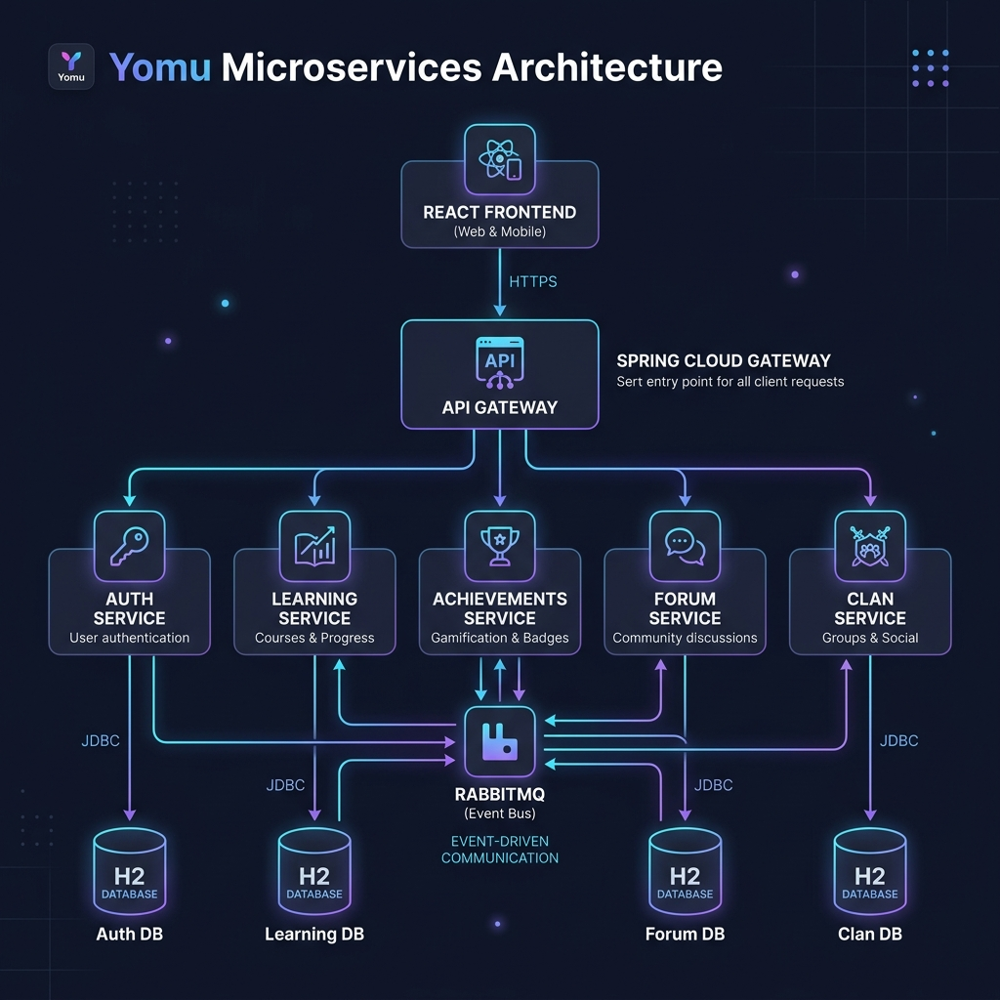

<details>
<summary>📐 Lihat Versi Mermaid (Jika didukung oleh Viewer Anda)</summary>

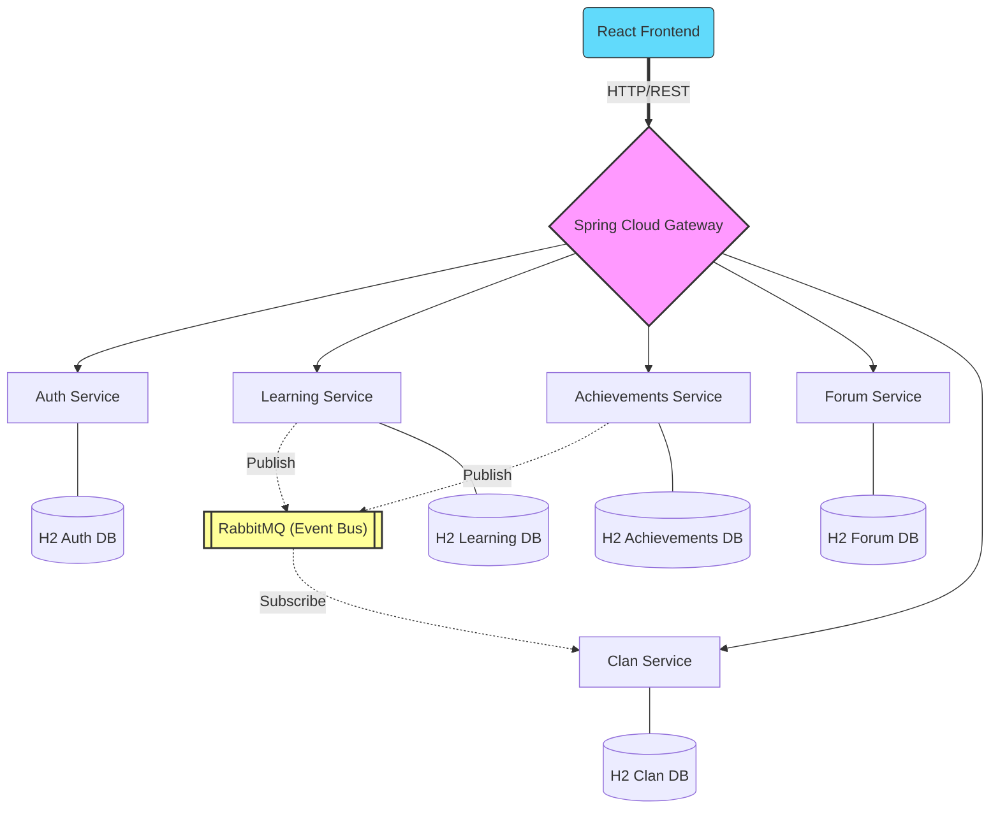
```mermaid
flowchart TD
    %% Nodes
    FE("React Frontend")
    GW{Spring Cloud Gateway}

    Auth["Auth Service"]
    Learning["Learning Service"]
    Achievements["Achievements Service"]
    Forum["Forum Service"]
    Clan["Clan Service"]

    MQ[["RabbitMQ (Event Bus)"]]

    DB_A[("H2 Auth DB")]
    DB_L[("H2 Learning DB")]
    DB_Ac[("H2 Achievements DB")]
    DB_F[("H2 Forum DB")]
    DB_C[("H2 Clan DB")]

    %% Connections
    FE ==>|HTTP/REST| GW

    GW --> Auth
    GW --> Learning
    GW --> Achievements
    GW --> Forum
    GW --> Clan

    %% Events
    Learning -.->|Publish| MQ
    Achievements -.->|Publish| MQ
    MQ -.->|Subscribe| Clan

    %% Persistence
    Auth --- DB_A
    Learning --- DB_L
    Achievements --- DB_Ac
    Forum --- DB_F
    Clan --- DB_C

    %% Styling
    style GW fill:#f9f,stroke:#333,stroke-width:2px
    style MQ fill:#ff9,stroke:#333,stroke-width:2px
    style FE fill:#61dafb,stroke:#333
```

</details>

---

## 🚀 Komponen Utama

### 1. 🌐 API Gateway (Port 8090)

Bertindak sebagai _Single Entry Point_. Menggunakan **Spring Cloud Gateway** untuk:

- **Routing**: Mengarahkan permintaan dari Frontend ke service yang tepat.
- **Authentication Filter**: Melakukan validasi awal JWT (Security Bypass dapat diaktifkan via environment).
- **Reactive Stack**: Dibangun di atas Spring WebFlux untuk performa tinggi.

### 2. 🔐 Auth Service (Port 8081)

Pusat keamanan aplikasi. Fitur utama:

- Registrasi & Login (JWT Based).
- Dukungan Google SSO.
- **Rate Limiting**: Melindungi endpoint sensitif dari brute force.
- RBAC (Role-Based Access Control).

### 3. 📚 Learning Service (Port 8082)

Inti dari konten edukasi:

- Manajemen Modul Bacaan.
- Sistem Kuis Interaktif.
- Publisher Event: Mengirimkan `QuizCompletedEvent` saat user menyelesaikan kuis.

### 4. 🏆 Achievements Service (Port 8083)

Mengelola sistem gamifikasi:

- Tracking Pencapaian (Badges/Medals).
- Misi Harian (Daily Missions).
- Publisher Event: Mengirimkan `AchievementUnlockedEvent` dan `DailyMissionCompletedEvent`.
Ruang diskusi komunitas:
- Thread-based discussions.
- Nested Comments (Komentar bersarang).
- Repositori berbasis JDBC untuk efisiensi query diskusi.

### 6. 🛡️ Clan Service (Port 8085)

Sistem kompetisi antar pengguna:

- **Strategy Pattern**: Implementasi sistem skor yang berbeda untuk setiap Tier (Bronze, Silver, Gold, Diamond).
- **Event Listener**: Mengonsumsi event dari `Learning` dan `Achievements` untuk mengupdate peringkat user secara real-time.

### 📦 Shared Library (`shared-lib`)

Komponen yang digunakan secara bersamaan oleh semua service untuk menjaga konsistensi:

- **Security**: JWT Service & Filters.
- **Events**: Definisi objek event (POJO) untuk RabbitMQ.
- **Exception Handling**: Global exception handler & standard error responses.

---

## 🛠️ Technology Stack

| Layer           | Technologies                                   |
| :-------------- | :--------------------------------------------- |
| **Frontend**    | React 19, Vite, Tailwind CSS, Lucide Icons     |
| **Backend**     | Java 21, Spring Boot 3.x, Spring Cloud Gateway |
| **Messaging**   | RabbitMQ (Topic Exchange)                      |
| **Persistence** | H2 Database (PostgreSQL Mode)                  |
| **Security**    | Spring Security, JSON Web Token (JWT)          |
| **DevOps**      | Docker, Docker Compose                         |
| **Build Tool**  | Gradle (Kotlin DSL)                            |

---

## 📡 Komunikasi Antar Service

### 🔄 Synchronous (REST)

Digunakan untuk komunikasi dari Frontend melalui API Gateway.

- Format: `JSON` over `HTTP`.
- Endpoint: `/api/auth/**`, `/api/learning/**`, dll.

### ⚡ Asynchronous (Event-Driven)

Menggunakan **RabbitMQ** dengan pola **Publish-Subscribe (Topic Exchange)**:

- **Exchange**: `yomu.events` (Topic)
- **Routing Keys**:
    - `yomu.quiz.completed`: Dipicu oleh Learning Service.
    - `yomu.achievement.unlocked`: Dipicu oleh Achievements Service.
    - `yomu.daily.mission.completed`: Dipicu oleh Achievements Service.

---

## 📦 Panduan Menjalankan Proyek

### 🐳 Menggunakan Docker Compose (Lingkungan Development)

Cara tercepat untuk menjalankan seluruh ekosistem Yomu di komputer lokal:

1. Pastikan semua repositori microservice berada dalam satu folder root.
2. Jalankan perintah:
    ```bash
    docker compose up --build
    ```
3. Akses:
    - **Frontend**: `http://localhost:5173`
    - **API Gateway**: `http://localhost:8090`
    - **RabbitMQ Dashboard**: `http://localhost:15672` (guest/guest)

### 🚀 Panduan Deployment ke Server (EC2) dari Awal

Jika Anda ingin melakukan deployment atau memindahkan proyek ke server AWS EC2 dari awal secara bersih (*clean build*), ikuti langkah-langkah berikut:

**1. Siapkan Kredensial di `.env` lokal**
Pastikan file `.env` sudah diisi dengan kredensial Google OAuth yang valid.
```env
GOOGLE_CLIENT_ID=client_id_anda
GOOGLE_CLIENT_SECRET=secret_anda
```

**2. Kompres Proyek Lokal**
Abaikan folder besar yang tidak diperlukan agar proses upload lebih cepat.
```bash
tar --exclude=node_modules --exclude=.git --exclude=.gradle --exclude=build --exclude=out --exclude=.idea --exclude=bin --exclude=frontend/dist -czvf yomu-app.tar.gz .
```

**3. Transfer ke Server (via SCP)**
Kirimkan file ke EC2 menggunakan SSH Key Anda.
```bash
scp -i path/to/key.pem yomu-app.tar.gz ubuntu@<IP_EC2>:~
```

**4. Masuk ke Server & Ekstrak**
```bash
ssh -i path/to/key.pem ubuntu@<IP_EC2>
mkdir -p yomu-app && cd yomu-app
tar -xzvf ../yomu-app.tar.gz
```

**5. Rebuild & Jalankan (Tanpa Cache)**
Agar kode terbaru benar-benar dikompilasi ulang dari nol:
```bash
# Hapus kontainer lama & bersihkan sistem Docker (Opsional)
docker compose -f docker-compose.deploy.yml down
docker system prune -a -f

# Build ulang secara bersih (Clean Build)
docker compose -f docker-compose.deploy.yml build --no-cache

# Jalankan semua layanan di latar belakang
docker compose -f docker-compose.deploy.yml up -d
```
Aplikasi kini dapat diakses melalui IP publik server pada port 80 (Frontend).

### 🛠️ Menjalankan Secara Manual

Jika ingin menjalankan service tertentu untuk pengembangan:

1. Pastikan RabbitMQ sudah berjalan.
2. Masuk ke folder service (misal `service-auth`):
    ```bash
    ./gradlew bootRun
    ```
3. Untuk Frontend:
    ```bash
    cd frontend && npm install && npm run dev
    ```

---

## 🛡️ Prinsip Desain & SOLID

Kami menerapkan prinsip rekayasa perangkat lunak yang ketat:

- **Single Responsibility (SRP)**: Setiap microservice menangani satu domain bisnis yang jelas.
- **Open/Closed (OCP)**: Sistem scoring di `service-clan` menggunakan Strategy Pattern, memungkinkan penambahan Tier baru tanpa mengubah logika inti.
- **Dependency Inversion (DIP)**: Penggunaan shared interfaces untuk event handling.
- **Loose Coupling**: Antar service tidak saling bergantung secara langsung (Sync), melainkan melalui Event Bus (Async).

---

- Akses aplikasi di `http://localhost:5173` (Vite default port) dan API Gateway di `http://localhost:8090`.

## 🔐 Keamanan

Sistem menggunakan **JSON Web Token (JWT)**. Setiap request dari frontend ke backend (melalui Gateway) akan divalidasi keabsahan tokennya oleh `JwtAuthenticationFilter` yang berada di dalam `shared-lib` dan diimpor oleh setiap service secara terpisah untuk memvalidasi otorisasi.


## MODULE 9 - GROUP DISCUSSION

## 🏗️ Arsitektur Sistem Saat Ini

Yomu mengadopsi arsitektur **Microservices Polyrepo** dengan komunikasi sinkron (REST via API Gateway) dan asinkron (Event-Driven via RabbitMQ). Berikut visualisasi arsitektur menggunakan **C4 Model** (ref: Module 09 — _Visualizing Software Architecture_).

---

### 📐 Context Diagram (C4 Level 1)

> **Scope**: Seluruh sistem Yomu.
> **Primary elements**: Yomu Platform sebagai satu kesatuan.
> **Supporting elements**: Aktor (Pelajar, Admin) dan sistem eksternal (Google OAuth, RabbitMQ).
> **Intended audience**: Semua orang, baik teknis maupun non-teknis.
>
> _(Ref: C4 Model — System Context Diagram, Module 09 hal. 115-116)_

Context Diagram menunjukkan **Yomu** sebagai satu kotak di tengah, dikelilingi oleh pengguna dan sistem eksternal yang berinteraksi dengannya. Detail teknis tidak penting di level ini — fokus pada _siapa_ yang menggunakan sistem dan _apa_ yang terhubung.

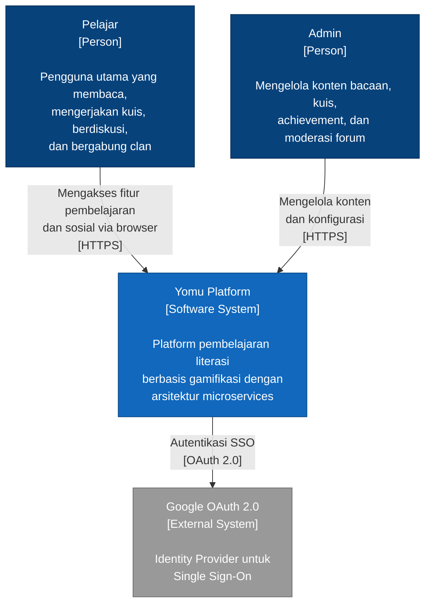
```mermaid
flowchart TD
    PELAJAR["Pelajar\n[Person]\n\nPengguna utama yang membaca,\nmengerjakan kuis, berdiskusi,\ndan bergabung clan"]

    ADMIN["Admin\n[Person]\n\nMengelola konten bacaan, kuis,\nachievement, dan moderasi forum"]

    YOMU["Yomu Platform\n[Software System]\n\nPlatform pembelajaran literasi\nberbasis gamifikasi dengan\narsitektur microservices"]

    GOOGLE["Google OAuth 2.0\n[External System]\n\nIdentity Provider untuk\nSingle Sign-On"]

    PELAJAR -->|"Mengakses fitur pembelajaran\ndan sosial via browser\n[HTTPS]"| YOMU
    ADMIN -->|"Mengelola konten\ndan konfigurasi\n[HTTPS]"| YOMU
    YOMU -->|"Autentikasi SSO\n[OAuth 2.0]"| GOOGLE

    style YOMU fill:#1168BD,stroke:#0B4884,color:#FFFFFF
    style PELAJAR fill:#08427B,stroke:#052E56,color:#FFFFFF
    style ADMIN fill:#08427B,stroke:#052E56,color:#FFFFFF
    style GOOGLE fill:#999999,stroke:#6B6B6B,color:#FFFFFF
```

---

### 📐 Container Diagram (C4 Level 2)

> **Scope**: Sistem Yomu secara internal.
> **Primary elements**: Container (aplikasi, data store, message broker) di dalam Yomu.
> **Supporting elements**: Aktor dan sistem eksternal yang terhubung.
> **Intended audience**: Tim teknis — software architect, developer, ops.
>
> _(Ref: C4 Model — Container Diagram, Module 09 hal. 117-118)_
> _Catatan: "Container" di C4 bukan Docker container, melainkan unit yang berjalan terpisah (aplikasi, database, message broker, dsb.)_

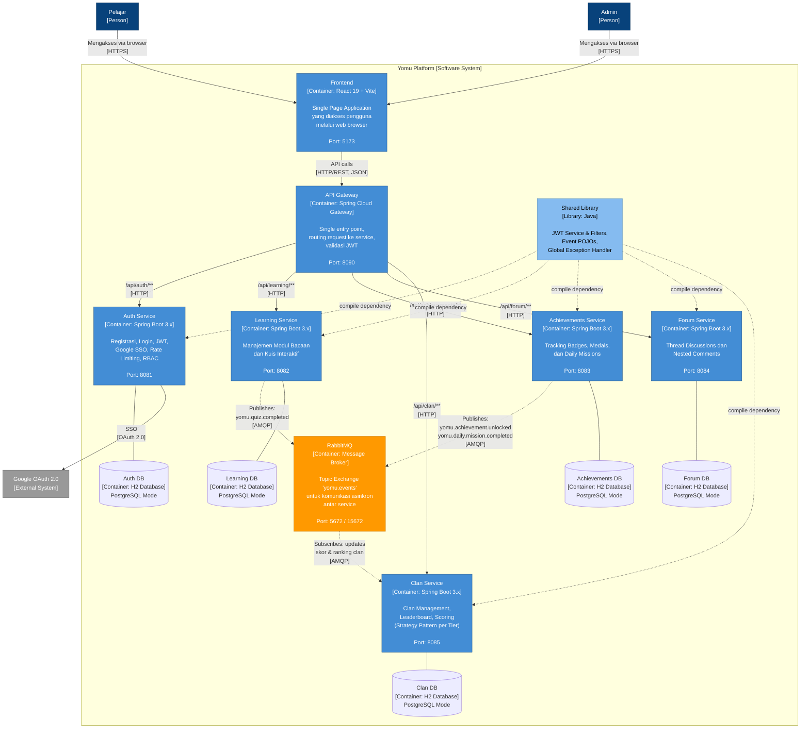
```mermaid
flowchart TD
    PELAJAR["Pelajar\n[Person]"]
    ADMIN["Admin\n[Person]"]

    subgraph boundary["Yomu Platform [Software System]"]
        direction TB

        FE["Frontend\n[Container: React 19 + Vite]\n\nSingle Page Application\nyang diakses pengguna\nmelalui web browser\n\nPort: 5173"]

        GW["API Gateway\n[Container: Spring Cloud Gateway]\n\nSingle entry point,\nrouting request ke service,\nvalidasi JWT\n\nPort: 8090"]

        AUTH["Auth Service\n[Container: Spring Boot 3.x]\n\nRegistrasi, Login, JWT,\nGoogle SSO, Rate Limiting, RBAC\n\nPort: 8081"]

        LEARN["Learning Service\n[Container: Spring Boot 3.x]\n\nManajemen Modul Bacaan\ndan Kuis Interaktif\n\nPort: 8082"]

        ACHIEV["Achievements Service\n[Container: Spring Boot 3.x]\n\nTracking Badges, Medals,\ndan Daily Missions\n\nPort: 8083"]

        FORUM["Forum Service\n[Container: Spring Boot 3.x]\n\nThread Discussions dan\nNested Comments\n\nPort: 8084"]

        CLAN["Clan Service\n[Container: Spring Boot 3.x]\n\nClan Management,\nLeaderboard, Scoring\n(Strategy Pattern per Tier)\n\nPort: 8085"]

        MQ["RabbitMQ\n[Container: Message Broker]\n\nTopic Exchange 'yomu.events'\nuntuk komunikasi asinkron\nantar service\n\nPort: 5672 / 15672"]

        DB_A[("Auth DB\n[Container: H2 Database]\nPostgreSQL Mode")]
        DB_L[("Learning DB\n[Container: H2 Database]\nPostgreSQL Mode")]
        DB_AC[("Achievements DB\n[Container: H2 Database]\nPostgreSQL Mode")]
        DB_F[("Forum DB\n[Container: H2 Database]\nPostgreSQL Mode")]
        DB_C[("Clan DB\n[Container: H2 Database]\nPostgreSQL Mode")]

        SHARED["Shared Library\n[Library: Java]\n\nJWT Service & Filters,\nEvent POJOs,\nGlobal Exception Handler"]
    end

    GOOGLE["Google OAuth 2.0\n[External System]"]

    %% User → Frontend
    PELAJAR -->|"Mengakses via browser\n[HTTPS]"| FE
    ADMIN -->|"Mengakses via browser\n[HTTPS]"| FE

    %% Frontend → Gateway
    FE -->|"API calls\n[HTTP/REST, JSON]"| GW

    %% Gateway → Services (Synchronous REST)
    GW -->|"/api/auth/**\n[HTTP]"| AUTH
    GW -->|"/api/learning/**\n[HTTP]"| LEARN
    GW -->|"/api/achievements/**\n[HTTP]"| ACHIEV
    GW -->|"/api/forum/**\n[HTTP]"| FORUM
    GW -->|"/api/clan/**\n[HTTP]"| CLAN

    %% Asynchronous Events via RabbitMQ
    LEARN -.->|"Publishes:\nyomu.quiz.completed\n[AMQP]"| MQ
    ACHIEV -.->|"Publishes:\nyomu.achievement.unlocked\nyomu.daily.mission.completed\n[AMQP]"| MQ
    MQ -.->|"Subscribes: updates\nskor & ranking clan\n[AMQP]"| CLAN

    %% Database per Service
    AUTH --- DB_A
    LEARN --- DB_L
    ACHIEV --- DB_AC
    FORUM --- DB_F
    CLAN --- DB_C

    %% External System
    AUTH -->|"SSO\n[OAuth 2.0]"| GOOGLE

    %% Shared Library (compile-time dependency)
    SHARED -.->|"compile dependency"| AUTH
    SHARED -.->|"compile dependency"| LEARN
    SHARED -.->|"compile dependency"| ACHIEV
    SHARED -.->|"compile dependency"| FORUM
    SHARED -.->|"compile dependency"| CLAN

    %% Styling
    style FE fill:#438DD5,stroke:#2E6295,color:#FFFFFF
    style GW fill:#438DD5,stroke:#2E6295,color:#FFFFFF
    style AUTH fill:#438DD5,stroke:#2E6295,color:#FFFFFF
    style LEARN fill:#438DD5,stroke:#2E6295,color:#FFFFFF
    style ACHIEV fill:#438DD5,stroke:#2E6295,color:#FFFFFF
    style FORUM fill:#438DD5,stroke:#2E6295,color:#FFFFFF
    style CLAN fill:#438DD5,stroke:#2E6295,color:#FFFFFF
    style MQ fill:#FF9900,stroke:#CC7A00,color:#FFFFFF
    style SHARED fill:#85BBF0,stroke:#5D95C4,color:#000000
    style GOOGLE fill:#999999,stroke:#6B6B6B,color:#FFFFFF
    style PELAJAR fill:#08427B,stroke:#052E56,color:#FFFFFF
    style ADMIN fill:#08427B,stroke:#052E56,color:#FFFFFF
```

**Keterangan:**

- **Garis solid (→)**: Komunikasi sinkron — REST over HTTP
- **Garis putus-putus (-.->)**: Komunikasi asinkron — Event via RabbitMQ (AMQP), atau compile dependency
- Setiap service memiliki **database H2 terpisah** sesuai prinsip _Database-per-Service_
- **Shared Library** adalah _compile-time dependency_, bukan runtime service

---

### 📐 Deployment Diagram

> **Scope**: Lingkungan deployment (development/staging).
> **Primary elements**: Deployment nodes, container instances.
> **Supporting elements**: Infrastructure nodes (Docker network).
> **Intended audience**: Tim teknis — architect, developer, ops.
>
> _(Ref: C4 Model — Deployment Diagram, Module 09 hal. 122)_

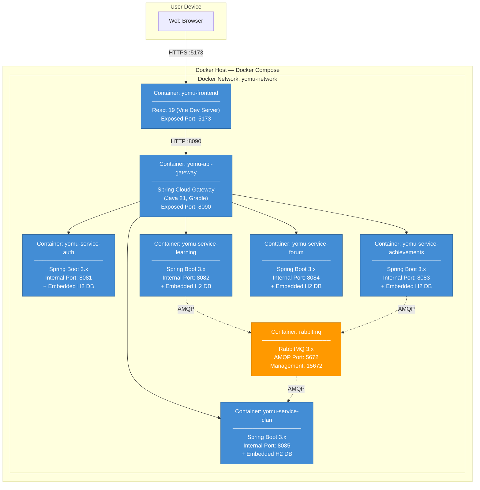
```mermaid
flowchart TD
    subgraph DEVICE["User Device"]
        BROWSER["Web Browser"]
    end

    subgraph DOCKER["Docker Host — Docker Compose"]
        subgraph NETWORK["Docker Network: yomu-network"]

            FE_NODE["Container: yomu-frontend\n─────────────────\nReact 19 (Vite Dev Server)\nExposed Port: 5173"]

            GW_NODE["Container: yomu-api-gateway\n─────────────────\nSpring Cloud Gateway\n(Java 21, Gradle)\nExposed Port: 8090"]

            AUTH_NODE["Container: yomu-service-auth\n─────────────────\nSpring Boot 3.x\nInternal Port: 8081\n+ Embedded H2 DB"]

            LEARN_NODE["Container: yomu-service-learning\n─────────────────\nSpring Boot 3.x\nInternal Port: 8082\n+ Embedded H2 DB"]

            ACHIEV_NODE["Container: yomu-service-achievements\n─────────────────\nSpring Boot 3.x\nInternal Port: 8083\n+ Embedded H2 DB"]

            FORUM_NODE["Container: yomu-service-forum\n─────────────────\nSpring Boot 3.x\nInternal Port: 8084\n+ Embedded H2 DB"]

            CLAN_NODE["Container: yomu-service-clan\n─────────────────\nSpring Boot 3.x\nInternal Port: 8085\n+ Embedded H2 DB"]

            MQ_NODE["Container: rabbitmq\n─────────────────\nRabbitMQ 3.x\nAMQP Port: 5672\nManagement: 15672"]
        end
    end

    BROWSER -->|"HTTPS :5173"| FE_NODE
    FE_NODE -->|"HTTP :8090"| GW_NODE
    GW_NODE --> AUTH_NODE
    GW_NODE --> LEARN_NODE
    GW_NODE --> ACHIEV_NODE
    GW_NODE --> FORUM_NODE
    GW_NODE --> CLAN_NODE
    LEARN_NODE -.->|"AMQP"| MQ_NODE
    ACHIEV_NODE -.->|"AMQP"| MQ_NODE
    MQ_NODE -.->|"AMQP"| CLAN_NODE

    style FE_NODE fill:#438DD5,stroke:#2E6295,color:#FFFFFF
    style GW_NODE fill:#438DD5,stroke:#2E6295,color:#FFFFFF
    style AUTH_NODE fill:#438DD5,stroke:#2E6295,color:#FFFFFF
    style LEARN_NODE fill:#438DD5,stroke:#2E6295,color:#FFFFFF
    style ACHIEV_NODE fill:#438DD5,stroke:#2E6295,color:#FFFFFF
    style FORUM_NODE fill:#438DD5,stroke:#2E6295,color:#FFFFFF
    style CLAN_NODE fill:#438DD5,stroke:#2E6295,color:#FFFFFF
    style MQ_NODE fill:#FF9900,stroke:#CC7A00,color:#FFFFFF
```

**Catatan Deployment:**

- Semua service berjalan dalam **satu Docker Compose** pada satu host
- Service backend **tidak di-expose** ke luar — hanya dapat diakses melalui API Gateway
- H2 database berjalan **embedded** di dalam proses setiap service (bukan container terpisah)
- Komunikasi antar container menggunakan **Docker internal network**

## 🔮 Arsitektur Masa Depan (Setelah Risk Storming)

### Skenario: Yomu Mengalami Kesuksesan Besar

Bayangkan Yomu telah berhasil diluncurkan dan mendapat adopsi massal dari sekolah-sekolah dan institusi pendidikan di seluruh Indonesia. Jumlah pengguna melonjak dari ratusan menjadi **ratusan ribu pengguna aktif harian**. Pada kondisi ini, kami menganalisis risiko arsitektur saat ini menggunakan teknik **Risk Storming** (ref: Module 09, Chapter 8 — _Analysing Architectural Risk_).

---

### 📊 Risk Matrix

Kami menggunakan **Architecture Risk Matrix** (ref: Module 09, Figure 20-1) dengan dua dimensi:

- **Overall Impact of Risk**: Low (1), Medium (2), High (3)
- **Likelihood of Risk Occurring**: Low (1), Medium (2), High (3)

Nilai risiko = **Impact × Likelihood**. Klasifikasi: 🟢 Low (1-2), 🟡 Medium (3-4), 🔴 High (6-9).

```
                    Likelihood of Risk Occurring
                    Low (1)     Medium (2)     High (3)
                 ┌──────────┬────────────┬────────────┐
    Low (1)      │  1 🟢    │   2 🟢     │   3 🟡     │
Impact           ├──────────┼────────────┼────────────┤
    Medium (2)   │  2 🟢    │   4 🟡     │   6 🔴     │
                 ├──────────┼────────────┼────────────┤
    High (3)     │  3 🟡    │   6 🔴     │   9 🔴     │
                 └──────────┴────────────┴────────────┘
```

---

### 🌪️ Risk Storming — Tahap 1: Identification (Individual, Non-Collaborative)

> _"Risk storming is a collaborative exercise used to determine architectural risk within a specific dimension."_
> — Module 09, hal. 99

Setiap anggota tim secara **individual** (tanpa diskusi) menganalisis arsitektur saat ini dan menempatkan "Post-it notes" virtual berwarna di area arsitektur yang dianggap berisiko. Dimensi risiko yang dianalisis: **availability, scalability, data integrity, dan security**.

Hasil identifikasi individual:

| Area Arsitektur                  | Anggota   | Dimensi        |   Impact   | Likelihood | Risk Score |   Level   |
| :------------------------------- | :-------- | :------------- | :--------: | :--------: | :--------: | :-------: |
| H2 Database (semua service)      | Tirta     | Data Integrity |  3 (High)  |  3 (High)  |   **9**    |  🔴 High  |
| H2 Database (semua service)      | Adella    | Availability   |  3 (High)  |  3 (High)  |   **9**    |  🔴 High  |
| H2 Database (semua service)      | Nathanael | Scalability    |  3 (High)  | 2 (Medium) |   **6**    |  🔴 High  |
| API Gateway (single instance)    | Yosua     | Availability   |  3 (High)  | 2 (Medium) |   **6**    |  🔴 High  |
| API Gateway (no circuit breaker) | Ali       | Availability   |  3 (High)  | 2 (Medium) |   **6**    |  🔴 High  |
| RabbitMQ (no DLQ)                | Tirta     | Data Integrity | 2 (Medium) | 2 (Medium) |   **4**    | 🟡 Medium |
| RabbitMQ (no DLQ)                | Yosua     | Availability   | 2 (Medium) | 2 (Medium) |   **4**    | 🟡 Medium |
| Frontend-Backend CORS            | Nathanael | Security       | 2 (Medium) |  3 (High)  |   **6**    |  🔴 High  |
| No Monitoring/Health Check       | Ali       | Availability   | 2 (Medium) |  3 (High)  |   **6**    |  🔴 High  |
| Non-idempotent Event Handlers    | Adella    | Data Integrity | 2 (Medium) | 2 (Medium) |   **4**    | 🟡 Medium |
| Shared Library coupling          | Nathanael | Scalability    |  1 (Low)   | 2 (Medium) |   **2**    |  🟢 Low   |

---

### 🤝 Risk Storming — Tahap 2: Consensus (Collaborative)

> _"The goal of this activity is to analyze the risk areas as a team and gain consensus in terms of the risk qualification."_
> — Module 09, hal. 102

Seluruh anggota tim berkumpul dan menempelkan "Post-it notes" mereka pada diagram arsitektur. Berikut hasil konsensus setelah diskusi:

**1. H2 Database — Semua sepakat: 🔴 HIGH RISK (9)**
Tiga anggota secara independen mengidentifikasi H2 sebagai area risiko tertinggi. H2 adalah database in-memory/embedded yang **kehilangan seluruh data saat restart**. Dalam skenario ratusan ribu pengguna, data achievement, progress belajar, dan histori clan yang hilang akan berdampak fatal. Semua anggota sepakat bahwa baik impact maupun likelihood sama-sama tinggi karena Docker container secara natural akan restart saat update atau scaling.

**2. API Gateway (Single Point of Failure) — Konsensus: 🔴 HIGH RISK (6)**
Dua anggota mengidentifikasi API Gateway sebagai risiko tinggi. Yosua menjelaskan bahwa jika API Gateway down, **seluruh sistem tidak dapat diakses** (impact = 3). Ali menambahkan bahwa tanpa circuit breaker, satu service yang lambat/down bisa menyebabkan _cascading failure_ yang menjatuhkan gateway. Setelah diskusi, semua sepakat likelihood = 2 (medium) karena Spring Cloud Gateway cukup stabil, tapi impact-nya sangat tinggi.

**3. Frontend-Backend CORS — Konsensus: 🔴 HIGH RISK (6)**
Nathanael mengidentifikasi masalah ini berdasarkan pengalaman langsung tim (terlihat dari chat bahwa frontend tidak bisa berkomunikasi dengan backend). Setelah diskusi, tim sepakat ini lebih merupakan masalah konfigurasi yang bisa diperbaiki di level gateway — bukan risiko arsitektural fundamental. Namun, **jika tidak ditangani dengan konfigurasi terpusat**, masalah ini akan terus berulang saat service baru ditambahkan.

**4. Tidak Ada Monitoring — Konsensus: 🔴 HIGH RISK (6)**
Ali menjelaskan bahwa tanpa health check dan monitoring, tim **baru menyadari ada masalah ketika pengguna sudah terdampak**. Dalam arsitektur microservices dengan 6+ service, ketiadaan observability membuat debugging sangat sulit. Semua sepakat.

**5. RabbitMQ tanpa DLQ — Konsensus: 🟡 MEDIUM RISK (4)**
Dua anggota mengidentifikasi ini secara independen. Tanpa Dead Letter Queue, event yang gagal diproses (misalnya `QuizCompletedEvent` yang gagal diproses oleh Clan Service) akan **hilang tanpa jejak**. Tim sepakat dampaknya medium karena data utama tidak hilang (hanya derived data seperti skor clan yang tidak terupdate).

**6. Non-idempotent Event Handlers — Konsensus: 🟡 MEDIUM RISK (4)**
Adella menjelaskan bahwa jika terjadi duplikasi pesan (umum di sistem distributed), event bisa diproses lebih dari sekali — menyebabkan achievement ter-trigger ganda atau skor clan dihitung dua kali. Tim sepakat ini medium karena likelihood-nya bergantung pada konfigurasi RabbitMQ.

**7. Shared Library Coupling — Konsensus: 🟢 LOW RISK (2)**
Hanya satu anggota yang mengidentifikasi ini. Setelah diskusi, tim sepakat bahwa shared library hanya berisi contracts (DTO, event POJO) yang jarang berubah, sehingga risiko coupling rendah.

---

### 🛠️ Risk Storming — Tahap 3: Mitigation (Collaborative)

> _"Mitigating risk within an architecture usually involves changes or enhancements to certain areas that otherwise might have been deemed perfect."_
> — Module 09, hal. 104

Berdasarkan konsensus, tim merancang mitigasi untuk setiap risiko:

| Risk Area               | Score | Mitigasi                                                                                                                                                                                                  | Cost/Effort |
| :---------------------- | :---: | :-------------------------------------------------------------------------------------------------------------------------------------------------------------------------------------------------------- | :---------: |
| H2 Database             | 9 🔴  | **Migrasi ke PostgreSQL** — satu instance PostgreSQL per service, berjalan sebagai Docker container terpisah. H2 sudah berjalan dalam PostgreSQL compatibility mode sehingga migrasi relatif smooth.      |   Medium    |
| API Gateway SPOF        | 6 🔴  | **Tambah Circuit Breaker (Resilience4j)** di gateway level. Jika sebuah service tidak merespons dalam batas waktu, circuit breaker membuka sirkuit dan mengembalikan fallback response.                   |     Low     |
| CORS Issue              | 6 🔴  | **Pusatkan konfigurasi CORS di API Gateway**. Semua allowed origins, methods, headers dikonfigurasi di satu tempat (gateway), bukan tersebar di setiap service.                                           |     Low     |
| No Monitoring           | 6 🔴  | **Tambah Spring Actuator + Prometheus + Grafana**. Setiap service mengekspos `/actuator/health` dan `/actuator/prometheus`. Prometheus meng-scrape metrics, Grafana memvisualisasikan dan mengirim alert. |   Medium    |
| RabbitMQ no DLQ         | 4 🟡  | **Tambah Dead Letter Queue + Retry Policy**. Event yang gagal diproses masuk DLQ untuk di-inspect dan di-retry (otomatis atau manual).                                                                    |     Low     |
| Non-idempotent Handlers | 4 🟡  | **Implementasi idempotent consumers**. Setiap event diberi unique ID; consumer menyimpan log event ID yang sudah diproses untuk mencegah double processing.                                               |     Low     |

---

### 📐 Context Diagram Baru (Setelah Mitigasi)

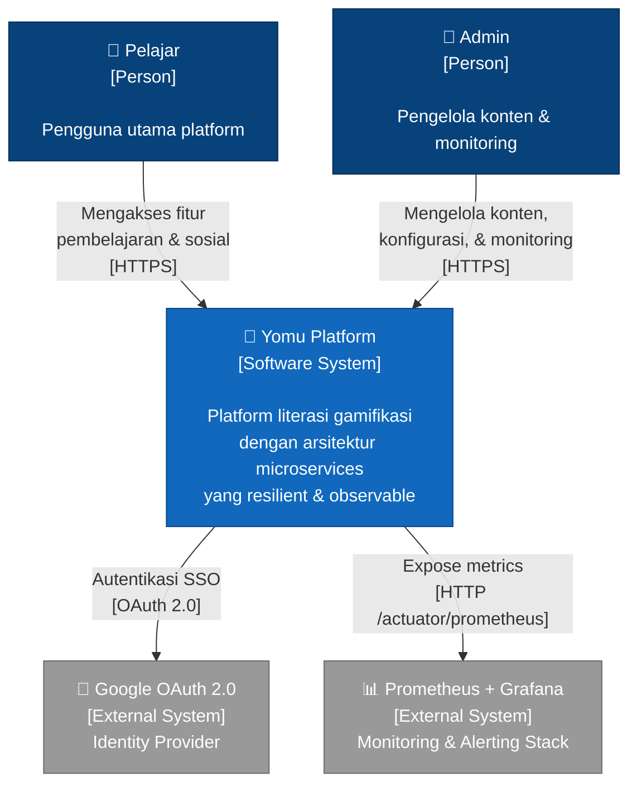
```mermaid
flowchart TD
    PELAJAR["👤 Pelajar\n[Person]\n\nPengguna utama platform"]
    ADMIN["👤 Admin\n[Person]\n\nPengelola konten & monitoring"]

    YOMU["📖 Yomu Platform\n[Software System]\n\nPlatform literasi gamifikasi\ndengan arsitektur microservices\nyang resilient & observable"]

    GOOGLE["🔗 Google OAuth 2.0\n[External System]\nIdentity Provider"]

    PROMETHEUS["📊 Prometheus + Grafana\n[External System]\nMonitoring & Alerting Stack"]

    PELAJAR -->|"Mengakses fitur\npembelajaran & sosial\n[HTTPS]"| YOMU
    ADMIN -->|"Mengelola konten,\nkonfigurasi, & monitoring\n[HTTPS]"| YOMU
    YOMU -->|"Autentikasi SSO\n[OAuth 2.0]"| GOOGLE
    YOMU -->|"Expose metrics\n[HTTP /actuator/prometheus]"| PROMETHEUS

    style YOMU fill:#1168BD,stroke:#0B4884,color:#FFFFFF
    style PELAJAR fill:#08427B,stroke:#052E56,color:#FFFFFF
    style ADMIN fill:#08427B,stroke:#052E56,color:#FFFFFF
    style GOOGLE fill:#999999,stroke:#6B6B6B,color:#FFFFFF
    style PROMETHEUS fill:#999999,stroke:#6B6B6B,color:#FFFFFF
```

---

### 📐 Container Diagram Baru (Setelah Mitigasi)

Perubahan ditandai dengan label **[NEW]** atau **[UPGRADED]**.

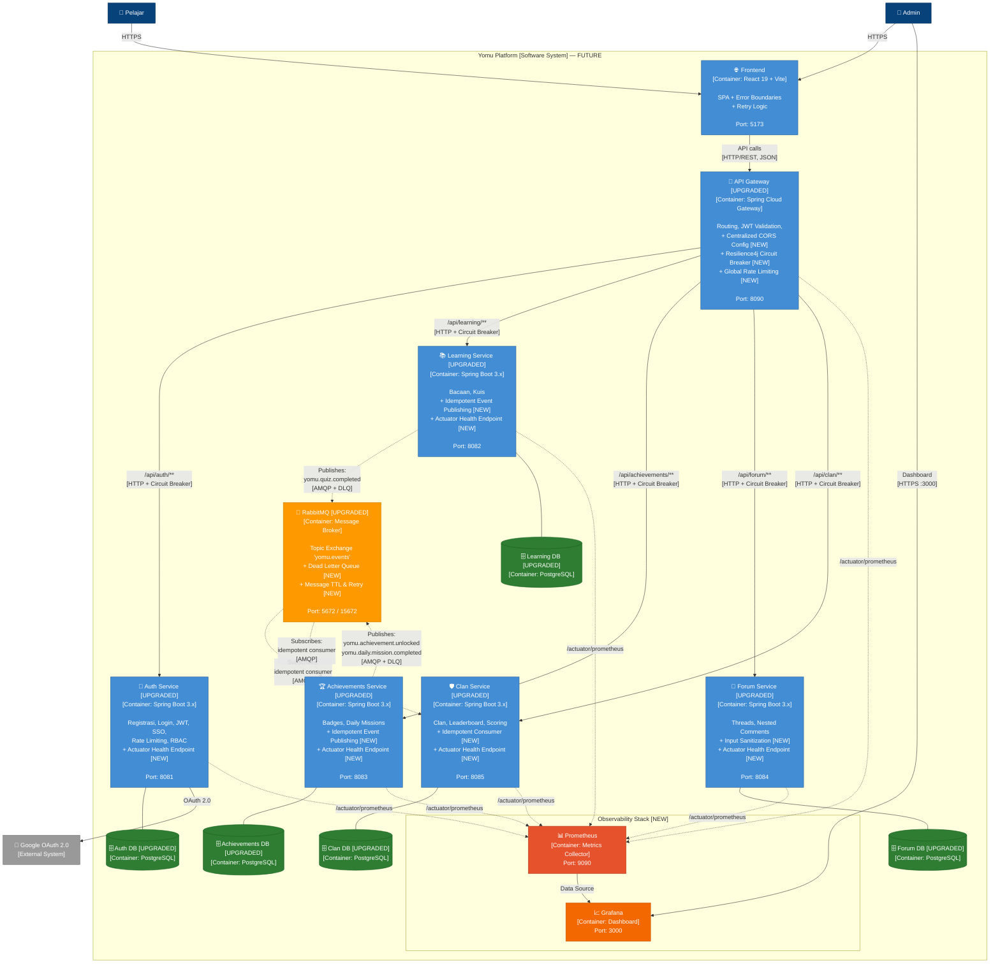
```mermaid
flowchart TD
    PELAJAR["👤 Pelajar"]
    ADMIN["👤 Admin"]

    subgraph boundary["Yomu Platform [Software System] — FUTURE"]
        direction TB

        FE["🌐 Frontend\n[Container: React 19 + Vite]\n\nSPA + Error Boundaries\n+ Retry Logic\n\nPort: 5173"]

        GW["🚪 API Gateway [UPGRADED]\n[Container: Spring Cloud Gateway]\n\nRouting, JWT Validation,\n+ Centralized CORS Config [NEW]\n+ Resilience4j Circuit Breaker [NEW]\n+ Global Rate Limiting [NEW]\n\nPort: 8090"]

        AUTH["🔐 Auth Service [UPGRADED]\n[Container: Spring Boot 3.x]\n\nRegistrasi, Login, JWT, SSO,\nRate Limiting, RBAC\n+ Actuator Health Endpoint [NEW]\n\nPort: 8081"]

        LEARN["📚 Learning Service [UPGRADED]\n[Container: Spring Boot 3.x]\n\nBacaan, Kuis\n+ Idempotent Event Publishing [NEW]\n+ Actuator Health Endpoint [NEW]\n\nPort: 8082"]

        ACHIEV["🏆 Achievements Service [UPGRADED]\n[Container: Spring Boot 3.x]\n\nBadges, Daily Missions\n+ Idempotent Event Publishing [NEW]\n+ Actuator Health Endpoint [NEW]\n\nPort: 8083"]

        FORUM["💬 Forum Service [UPGRADED]\n[Container: Spring Boot 3.x]\n\nThreads, Nested Comments\n+ Input Sanitization [NEW]\n+ Actuator Health Endpoint [NEW]\n\nPort: 8084"]

        CLAN["🛡️ Clan Service [UPGRADED]\n[Container: Spring Boot 3.x]\n\nClan, Leaderboard, Scoring\n+ Idempotent Consumer [NEW]\n+ Actuator Health Endpoint [NEW]\n\nPort: 8085"]

        MQ["📨 RabbitMQ [UPGRADED]\n[Container: Message Broker]\n\nTopic Exchange 'yomu.events'\n+ Dead Letter Queue [NEW]\n+ Message TTL & Retry [NEW]\n\nPort: 5672 / 15672"]

        DB_A[("🗄️ Auth DB [UPGRADED]\n[Container: PostgreSQL]")]
        DB_L[("🗄️ Learning DB [UPGRADED]\n[Container: PostgreSQL]")]
        DB_AC[("🗄️ Achievements DB [UPGRADED]\n[Container: PostgreSQL]")]
        DB_F[("🗄️ Forum DB [UPGRADED]\n[Container: PostgreSQL]")]
        DB_C[("🗄️ Clan DB [UPGRADED]\n[Container: PostgreSQL]")]

        subgraph observability["Observability Stack [NEW]"]
            PROM["📊 Prometheus\n[Container: Metrics Collector]\nPort: 9090"]
            GRAF["📈 Grafana\n[Container: Dashboard]\nPort: 3000"]
        end
    end

    GOOGLE["🔗 Google OAuth 2.0\n[External System]"]

    %% User → Frontend
    PELAJAR -->|"HTTPS"| FE
    ADMIN -->|"HTTPS"| FE
    ADMIN -->|"Dashboard\n[HTTPS :3000]"| GRAF

    %% Frontend → Gateway
    FE -->|"API calls\n[HTTP/REST, JSON]"| GW

    %% Gateway → Services (with Circuit Breaker)
    GW -->|"/api/auth/**\n[HTTP + Circuit Breaker]"| AUTH
    GW -->|"/api/learning/**\n[HTTP + Circuit Breaker]"| LEARN
    GW -->|"/api/achievements/**\n[HTTP + Circuit Breaker]"| ACHIEV
    GW -->|"/api/forum/**\n[HTTP + Circuit Breaker]"| FORUM
    GW -->|"/api/clan/**\n[HTTP + Circuit Breaker]"| CLAN

    %% Async Events (with DLQ & Retry)
    LEARN -.->|"Publishes:\nyomu.quiz.completed\n[AMQP + DLQ]"| MQ
    ACHIEV -.->|"Publishes:\nyomu.achievement.unlocked\nyomu.daily.mission.completed\n[AMQP + DLQ]"| MQ
    MQ -.->|"Subscribes:\nidempotent consumer\n[AMQP]"| CLAN
    MQ -.->|"Subscribes:\nidempotent consumer\n[AMQP]"| ACHIEV

    %% Database — NOW PostgreSQL
    AUTH --- DB_A
    LEARN --- DB_L
    ACHIEV --- DB_AC
    FORUM --- DB_F
    CLAN --- DB_C

    %% External
    AUTH -->|"OAuth 2.0"| GOOGLE

    %% Observability
    AUTH -.->|"/actuator/prometheus"| PROM
    LEARN -.->|"/actuator/prometheus"| PROM
    ACHIEV -.->|"/actuator/prometheus"| PROM
    FORUM -.->|"/actuator/prometheus"| PROM
    CLAN -.->|"/actuator/prometheus"| PROM
    GW -.->|"/actuator/prometheus"| PROM
    PROM -->|"Data Source"| GRAF

    %% Styling
    style FE fill:#438DD5,stroke:#2E6295,color:#FFFFFF
    style GW fill:#438DD5,stroke:#2E6295,color:#FFFFFF
    style AUTH fill:#438DD5,stroke:#2E6295,color:#FFFFFF
    style LEARN fill:#438DD5,stroke:#2E6295,color:#FFFFFF
    style ACHIEV fill:#438DD5,stroke:#2E6295,color:#FFFFFF
    style FORUM fill:#438DD5,stroke:#2E6295,color:#FFFFFF
    style CLAN fill:#438DD5,stroke:#2E6295,color:#FFFFFF
    style MQ fill:#FF9900,stroke:#CC7A00,color:#FFFFFF
    style GOOGLE fill:#999999,stroke:#6B6B6B,color:#FFFFFF
    style PELAJAR fill:#08427B,stroke:#052E56,color:#FFFFFF
    style ADMIN fill:#08427B,stroke:#052E56,color:#FFFFFF
    style PROM fill:#E6522C,stroke:#B33F1F,color:#FFFFFF
    style GRAF fill:#F46800,stroke:#C45300,color:#FFFFFF
    style DB_A fill:#2E7D32,stroke:#1B5E20,color:#FFFFFF
    style DB_L fill:#2E7D32,stroke:#1B5E20,color:#FFFFFF
    style DB_AC fill:#2E7D32,stroke:#1B5E20,color:#FFFFFF
    style DB_F fill:#2E7D32,stroke:#1B5E20,color:#FFFFFF
    style DB_C fill:#2E7D32,stroke:#1B5E20,color:#FFFFFF
```

**Ringkasan Perubahan Arsitektur:**

| Komponen       | Sebelum (Current)       | Sesudah (Future)                         | Risk Score |
| :------------- | :---------------------- | :--------------------------------------- | :--------: |
| Database       | H2 In-Memory (embedded) | PostgreSQL (dedicated container)         |   9 → 2    |
| API Gateway    | Routing + JWT saja      | + Circuit Breaker + CORS + Rate Limiting |   6 → 2    |
| Monitoring     | Tidak ada               | Prometheus + Grafana + Actuator          |   6 → 1    |
| Message Queue  | RabbitMQ basic          | + Dead Letter Queue + Retry Policy       |   4 → 1    |
| Event Handling | Basic pub/sub           | Idempotent consumers + event dedup       |   4 → 1    |

## 📝 Penjelasan Risk Storming & Justifikasi Modifikasi Arsitektur

### Mengapa Risk Storming Diterapkan?

Risk Storming diterapkan karena, sebagaimana dinyatakan dalam Module 09 (ref: Chapter 8, hal. 99), **"No architect can single-handedly determine the overall risk of a system."** Alasan utamanya ada dua: pertama, seorang arsitektur mungkin melewatkan atau tidak melihat suatu area risiko; kedua, sangat jarang ada satu orang yang memiliki pengetahuan penuh terhadap seluruh bagian sistem. Dalam konteks tim Yomu yang terdiri dari 5 anggota dengan masing-masing bertanggung jawab atas satu modul microservice, setiap anggota memiliki pemahaman mendalam terhadap service-nya sendiri namun mungkin tidak memahami risiko interaksi antar service secara keseluruhan. Dengan Risk Storming, kami memanfaatkan perspektif kolektif seluruh anggota tim untuk mendapatkan gambaran risiko yang lebih lengkap dan akurat daripada analisis yang dilakukan oleh satu orang saja.

### Proses Risk Storming yang Diterapkan

Proses Risk Storming kami mengikuti tiga tahapan yang diajarkan dalam Module 09 (ref: hal. 99-105). **Tahap pertama — Identification** — adalah aktivitas **individual dan non-kolaboratif**. Setiap anggota tim secara mandiri menganalisis diagram arsitektur (Container Diagram dari Commit 1) dan mengklasifikasikan risiko menggunakan Risk Matrix (Impact × Likelihood) ke dalam kategori Low (1-2), Medium (3-4), atau High (6-9). Tahap non-kolaboratif ini **esensial** agar peserta tidak saling mempengaruhi atau mengalihkan perhatian dari area tertentu. Hasilnya, kami menemukan bahwa tiga anggota secara independen mengidentifikasi H2 Database sebagai risiko tertinggi (score 9), yang memvalidasi bahwa ini adalah area yang benar-benar kritis — bukan opini satu orang. Yang menarik, masalah seperti CORS dan ketiadaan monitoring hanya diidentifikasi oleh anggota yang pernah mengalami langsung masalah tersebut, menunjukkan betapa pentingnya keragaman perspektif dalam risk storming.

**Tahap kedua — Consensus** — adalah aktivitas **kolaboratif** di mana seluruh anggota tim berkumpul, masing-masing menempelkan "Post-it notes" virtual mereka pada diagram arsitektur, dan mendiskusikan perbedaan penilaian risiko. Tahap ini menghasilkan beberapa insight penting yang tidak muncul di tahap individual. Misalnya, analogi dengan contoh dalam Module 09 (ref: hal. 103) — di mana seorang peserta menilai Redis cache sebagai risiko tinggi karena ia tidak mengenal teknologi tersebut — kami menemukan bahwa anggota yang mengidentifikasi masalah CORS sebagai high risk melakukannya berdasarkan pengalaman langsung gagal menghubungkan frontend ke backend (terlihat dari log chat grup kami). Tanpa proses konsensus, anggota lain yang tidak mengalami masalah ini mungkin menganggapnya tidak penting. Setelah diskusi, semua anggota sepakat bahwa CORS memang perlu ditangani secara arsitektural (dipusatkan di API Gateway), bukan ad-hoc di setiap service.

**Tahap ketiga — Mitigation** — adalah tahap terpenting di mana tim secara kolaboratif merancang perubahan arsitektur untuk mengurangi atau menghilangkan risiko yang telah diidentifikasi. Sebagaimana dinyatakan dalam Module 09 (ref: hal. 104), mitigasi risiko biasanya melibatkan perubahan atau peningkatan pada area arsitektur yang sebelumnya dianggap sudah sempurna, dan perubahan ini biasanya menimbulkan biaya tambahan. Tim kami menerapkan prinsip ini dengan merancang mitigasi yang proporsional terhadap tingkat risiko: untuk risiko tertinggi (H2 Database, score 9), kami merencanakan migrasi ke PostgreSQL yang memerlukan effort medium namun menyelesaikan masalah data integrity secara fundamental; untuk risiko medium (RabbitMQ tanpa DLQ, non-idempotent handlers), kami merancang solusi dengan effort rendah seperti konfigurasi Dead Letter Queue dan penambahan event ID tracking. Pendekatan ini mencerminkan trade-off antara biaya mitigasi dan tingkat risiko, serupa dengan negosiasi antara arsitek dan stakeholder yang digambarkan dalam Module 09 (ref: hal. 105) — kami tidak mencoba menyelesaikan semua risiko sekaligus, tetapi memprioritaskan berdasarkan risk score dan feasibility implementasi.

---

## 🧑‍💻 Individual Work — Tirta Rendy Siahaan (Achievement Service)

> **Component Diagram** (C4 Level 3) — Scope: Achievement Service container. Menunjukkan komponen internal beserta tanggung jawab dan teknologinya. Semua komponen berjalan dalam satu process space.
>
> **Code Diagram** (C4 Level 4) — Scope: masing-masing komponen. Menunjukkan class, interface, record, dan enum yang membentuk komponen tersebut.
>
> _(Ref: Module 09, hal. 119-120)_

---

### 📐 Component Diagram — Achievement Service (Port 8083)

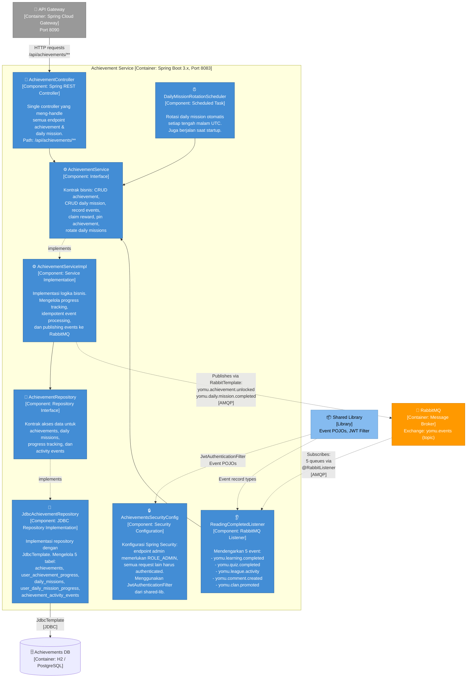
```mermaid
flowchart TD
    GW["🚪 API Gateway\n[Container: Spring Cloud Gateway]\nPort 8090"]
    MQ["📨 RabbitMQ\n[Container: Message Broker]\nExchange: yomu.events (topic)"]
    DB[("🗄️ Achievements DB\n[Container: H2 / PostgreSQL]")]
    SHARED["📦 Shared Library\n[Library]\nEvent POJOs, JWT Filter"]

    subgraph ACHIEV["Achievement Service [Container: Spring Boot 3.x, Port 8083]"]
        direction TB

        CTRL["🎯 AchievementController\n[Component: Spring REST Controller]\n\nSingle controller yang meng-handle\nsemua endpoint achievement &\ndaily mission.\nPath: /api/achievements/**"]

        SVC_IF["⚙️ AchievementService\n[Component: Interface]\n\nKontrak bisnis: CRUD achievement,\nCRUD daily mission, record events,\nclaim reward, pin achievement,\nrotate daily missions"]

        SVC_IMPL["⚙️ AchievementServiceImpl\n[Component: Service Implementation]\n\nImplementasi logika bisnis.\nMengelola progress tracking,\nidempotent event processing,\ndan publishing events ke RabbitMQ"]

        LISTENER["👂 ReadingCompletedListener\n[Component: RabbitMQ Listener]\n\nMendengarkan 5 event:\n- yomu.learning.completed\n- yomu.quiz.completed\n- yomu.league.activity\n- yomu.comment.created\n- yomu.clan.promoted"]

        REPO_IF["💾 AchievementRepository\n[Component: Repository Interface]\n\nKontrak akses data untuk\nachievements, daily missions,\nprogress tracking, dan\nactivity events"]

        REPO_IMPL["💾 JdbcAchievementRepository\n[Component: JDBC Repository Implementation]\n\nImplementasi repository dengan\nJdbcTemplate. Mengelola 5 tabel:\nachievements, user_achievement_progress,\ndaily_missions, user_daily_mission_progress,\nachievement_activity_events"]

        SCHEDULER["⏰ DailyMissionRotationScheduler\n[Component: Scheduled Task]\n\nRotasi daily mission otomatis\nsetiap tengah malam UTC.\nJuga berjalan saat startup."]

        SEC["🔒 AchievementsSecurityConfig\n[Component: Security Configuration]\n\nKonfigurasi Spring Security:\nendpoint admin memerlukan ROLE_ADMIN,\nsemua request lain harus authenticated.\nMenggunakan JwtAuthenticationFilter\ndari shared-lib."]
    end

    %% External → Controller
    GW -->|"HTTP requests\n/api/achievements/**"| CTRL

    %% Controller → Service
    CTRL --> SVC_IF

    %% Interface → Implementation
    SVC_IF -.->|"implements"| SVC_IMPL

    %% Listener → Service
    LISTENER --> SVC_IF

    %% Scheduler → Service
    SCHEDULER --> SVC_IF

    %% Service → Repository
    SVC_IMPL --> REPO_IF

    %% Service → RabbitMQ (publish)
    SVC_IMPL -.->|"Publishes via RabbitTemplate:\nyomu.achievement.unlocked\nyomu.daily.mission.completed\n[AMQP]"| MQ

    %% Repository Interface → Implementation
    REPO_IF -.->|"implements"| REPO_IMPL

    %% Repository → Database
    REPO_IMPL -->|"JdbcTemplate\n[JDBC]"| DB

    %% Listener ← RabbitMQ (subscribe)
    MQ -.->|"Subscribes:\n5 queues via\n@RabbitListener\n[AMQP]"| LISTENER

    %% Shared lib
    SHARED -.->|"JwtAuthenticationFilter\nEvent POJOs"| SEC
    SHARED -.->|"Event record types"| LISTENER

    %% Styling
    style CTRL fill:#438DD5,stroke:#2E6295,color:#FFFFFF
    style SVC_IF fill:#438DD5,stroke:#2E6295,color:#FFFFFF
    style SVC_IMPL fill:#438DD5,stroke:#2E6295,color:#FFFFFF
    style LISTENER fill:#438DD5,stroke:#2E6295,color:#FFFFFF
    style REPO_IF fill:#438DD5,stroke:#2E6295,color:#FFFFFF
    style REPO_IMPL fill:#438DD5,stroke:#2E6295,color:#FFFFFF
    style SCHEDULER fill:#438DD5,stroke:#2E6295,color:#FFFFFF
    style SEC fill:#438DD5,stroke:#2E6295,color:#FFFFFF
    style GW fill:#999999,stroke:#6B6B6B,color:#FFFFFF
    style MQ fill:#FF9900,stroke:#CC7A00,color:#FFFFFF
    style SHARED fill:#85BBF0,stroke:#5D95C4,color:#000000
```

---

### 📐 Code Diagram 1 — Domain Model (Records & Enum)

Menunjukkan elemen kode di dalam komponen model: semua menggunakan Java `record` (immutable data class) dan satu `enum`.

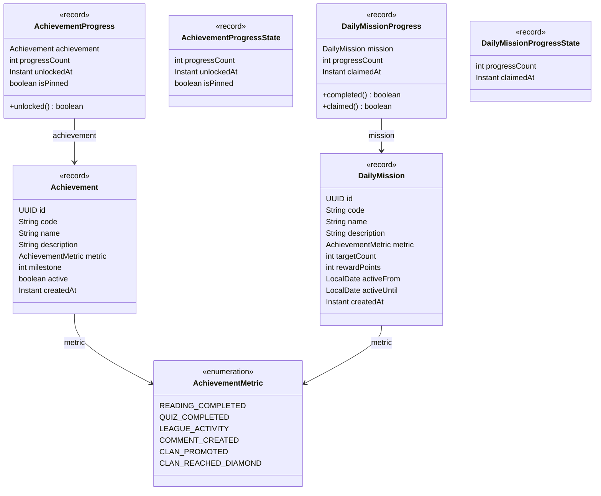
```mermaid
classDiagram
    class Achievement {
        <<record>>
        UUID id
        String code
        String name
        String description
        AchievementMetric metric
        int milestone
        boolean active
        Instant createdAt
    }

    class AchievementMetric {
        <<enumeration>>
        READING_COMPLETED
        QUIZ_COMPLETED
        LEAGUE_ACTIVITY
        COMMENT_CREATED
        CLAN_PROMOTED
        CLAN_REACHED_DIAMOND
    }

    class AchievementProgress {
        <<record>>
        Achievement achievement
        int progressCount
        Instant unlockedAt
        boolean isPinned
        +unlocked() boolean
    }

    class AchievementProgressState {
        <<record>>
        int progressCount
        Instant unlockedAt
        boolean isPinned
    }

    class DailyMission {
        <<record>>
        UUID id
        String code
        String name
        String description
        AchievementMetric metric
        int targetCount
        int rewardPoints
        LocalDate activeFrom
        LocalDate activeUntil
        Instant createdAt
    }

    class DailyMissionProgress {
        <<record>>
        DailyMission mission
        int progressCount
        Instant claimedAt
        +completed() boolean
        +claimed() boolean
    }

    class DailyMissionProgressState {
        <<record>>
        int progressCount
        Instant claimedAt
    }

    Achievement --> AchievementMetric : metric
    AchievementProgress --> Achievement : achievement
    DailyMission --> AchievementMetric : metric
    DailyMissionProgress --> DailyMission : mission
```

---

### 📐 Code Diagram 2 — Service Layer (Interface + Implementation)

Menunjukkan kontrak `AchievementService` dan implementasinya `AchievementServiceImpl`, beserta dependency-nya.

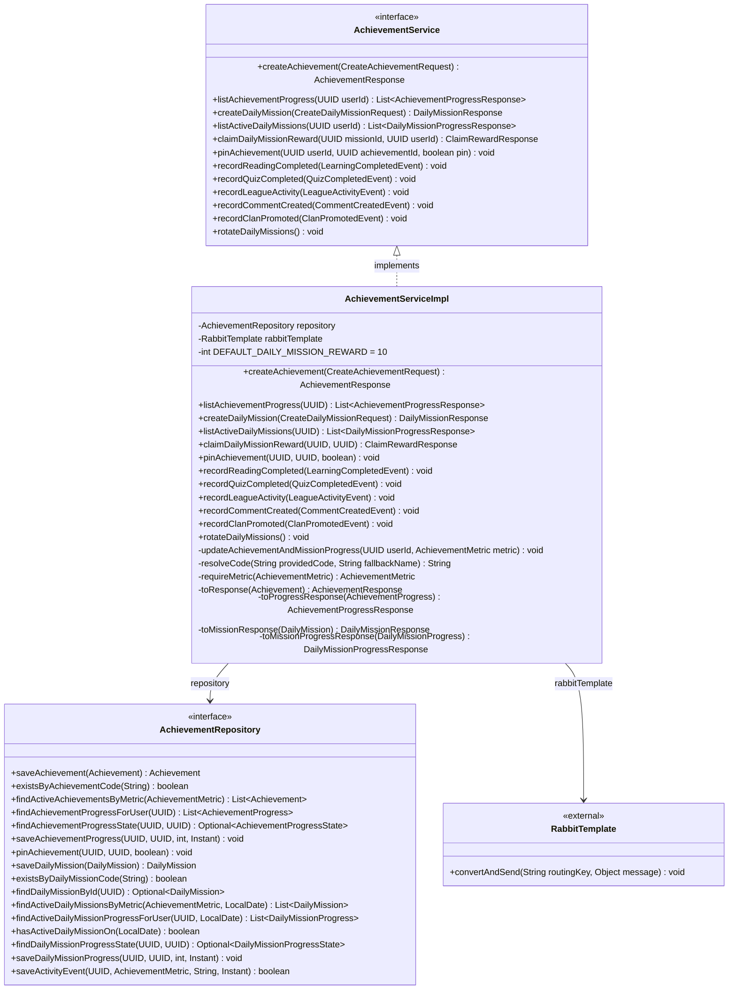
```mermaid
classDiagram
    class AchievementService {
        <<interface>>
        +createAchievement(CreateAchievementRequest) AchievementResponse
        +listAchievementProgress(UUID userId) List~AchievementProgressResponse~
        +createDailyMission(CreateDailyMissionRequest) DailyMissionResponse
        +listActiveDailyMissions(UUID userId) List~DailyMissionProgressResponse~
        +claimDailyMissionReward(UUID missionId, UUID userId) ClaimRewardResponse
        +pinAchievement(UUID userId, UUID achievementId, boolean pin) void
        +recordReadingCompleted(LearningCompletedEvent) void
        +recordQuizCompleted(QuizCompletedEvent) void
        +recordLeagueActivity(LeagueActivityEvent) void
        +recordCommentCreated(CommentCreatedEvent) void
        +recordClanPromoted(ClanPromotedEvent) void
        +rotateDailyMissions() void
    }

    class AchievementServiceImpl {
        -AchievementRepository repository
        -RabbitTemplate rabbitTemplate
        -int DEFAULT_DAILY_MISSION_REWARD = 10
        +createAchievement(CreateAchievementRequest) AchievementResponse
        +listAchievementProgress(UUID) List~AchievementProgressResponse~
        +createDailyMission(CreateDailyMissionRequest) DailyMissionResponse
        +listActiveDailyMissions(UUID) List~DailyMissionProgressResponse~
        +claimDailyMissionReward(UUID, UUID) ClaimRewardResponse
        +pinAchievement(UUID, UUID, boolean) void
        +recordReadingCompleted(LearningCompletedEvent) void
        +recordQuizCompleted(QuizCompletedEvent) void
        +recordLeagueActivity(LeagueActivityEvent) void
        +recordCommentCreated(CommentCreatedEvent) void
        +recordClanPromoted(ClanPromotedEvent) void
        +rotateDailyMissions() void
        -updateAchievementAndMissionProgress(UUID userId, AchievementMetric metric) void
        -resolveCode(String providedCode, String fallbackName) String
        -requireMetric(AchievementMetric) AchievementMetric
        -toResponse(Achievement) AchievementResponse
        -toProgressResponse(AchievementProgress) AchievementProgressResponse
        -toMissionResponse(DailyMission) DailyMissionResponse
        -toMissionProgressResponse(DailyMissionProgress) DailyMissionProgressResponse
    }

    class AchievementRepository {
        <<interface>>
        +saveAchievement(Achievement) Achievement
        +existsByAchievementCode(String) boolean
        +findActiveAchievementsByMetric(AchievementMetric) List~Achievement~
        +findAchievementProgressForUser(UUID) List~AchievementProgress~
        +findAchievementProgressState(UUID, UUID) Optional~AchievementProgressState~
        +saveAchievementProgress(UUID, UUID, int, Instant) void
        +pinAchievement(UUID, UUID, boolean) void
        +saveDailyMission(DailyMission) DailyMission
        +existsByDailyMissionCode(String) boolean
        +findDailyMissionById(UUID) Optional~DailyMission~
        +findActiveDailyMissionsByMetric(AchievementMetric, LocalDate) List~DailyMission~
        +findActiveDailyMissionProgressForUser(UUID, LocalDate) List~DailyMissionProgress~
        +hasActiveDailyMissionOn(LocalDate) boolean
        +findDailyMissionProgressState(UUID, UUID) Optional~DailyMissionProgressState~
        +saveDailyMissionProgress(UUID, UUID, int, Instant) void
        +saveActivityEvent(UUID, AchievementMetric, String, Instant) boolean
    }

    class RabbitTemplate {
        <<external>>
        +convertAndSend(String routingKey, Object message) void
    }

    AchievementService <|.. AchievementServiceImpl : implements
    AchievementServiceImpl --> AchievementRepository : repository
    AchievementServiceImpl --> RabbitTemplate : rabbitTemplate
```

---

### 📐 Code Diagram 3 — Event Listener, Scheduler & Shared Events

Menunjukkan `ReadingCompletedListener` yang mengkonsumsi event dari service lain, `DailyMissionRotationScheduler` yang menjalankan rotasi otomatis, serta event objects dari shared-lib.


```mermaid
classDiagram
    class ReadingCompletedListener {
        -AchievementService achievementService
        +onLearningCompleted(LearningCompletedEvent) void
        +onQuizCompleted(QuizCompletedEvent) void
        +onLeagueActivity(LeagueActivityEvent) void
        +onCommentCreated(CommentCreatedEvent) void
        +onClanPromoted(ClanPromotedEvent) void
    }
    note for ReadingCompletedListener "Setiap method di-annotasi dengan\n@RabbitListener yang bind ke\nqueue dan routing key masing-masing\npada exchange yomu.events (topic)"

    class DailyMissionRotationScheduler {
        -AchievementService achievementService
        +ensureDailyMissionOnStartup() void
        +rotateDailyMissionAtMidnight() void
    }
    note for DailyMissionRotationScheduler "@EventListener(ApplicationReadyEvent)\n@Scheduled(cron='0 0 0 * * *', zone='UTC')"

    class LearningCompletedEvent {
        <<record / shared-lib>>
        UUID userId
        UUID bacaanId
        Instant occurredAt
    }

    class QuizCompletedEvent {
        <<record / shared-lib>>
        UUID userId
        UUID quizId
        Instant occurredAt
    }

    class LeagueActivityEvent {
        <<record / shared-lib>>
        UUID userId
        UUID activityId
        Instant occurredAt
    }

    class CommentCreatedEvent {
        <<record / shared-lib>>
        String userId
        String commentId
        Instant timestamp
    }

    class ClanPromotedEvent {
        <<record / shared-lib>>
        UUID userId
        UUID clanId
        UUID seasonId
        String newTier
        Instant occurredAt
    }

    class AchievementUnlockedEvent {
        <<record / shared-lib>>
        UUID userId
        String achievementCode
        String achievementName
        Instant unlockedAt
    }

    class DailyMissionCompletedEvent {
        <<record / shared-lib>>
        UUID userId
        UUID missionId
        String missionName
        Instant completedAt
    }

    ReadingCompletedListener ..> LearningCompletedEvent : consumes
    ReadingCompletedListener ..> QuizCompletedEvent : consumes
    ReadingCompletedListener ..> LeagueActivityEvent : consumes
    ReadingCompletedListener ..> CommentCreatedEvent : consumes
    ReadingCompletedListener ..> ClanPromotedEvent : consumes
    ReadingCompletedListener --> AchievementService : delegates to

    DailyMissionRotationScheduler --> AchievementService : delegates to

    AchievementServiceImpl ..> AchievementUnlockedEvent : publishes
    AchievementServiceImpl ..> DailyMissionCompletedEvent : publishes
```

## 🧑‍💻 Individual Work — Nathanael Leander Herdanatra (Forum Service)

> **Component Diagram** (C4 Level 3) — Scope: Forum Service container. Menunjukkan komponen internal beserta tanggung jawab dan teknologinya. Semua komponen berjalan dalam satu process space.
>
> **Code Diagram** (C4 Level 4) — Scope: masing-masing komponen. Menunjukkan class, interface, record, dan entity yang membentuk komponen tersebut.
>
> _(Ref: Module 09, hal. 119-120)_

---

### 📐 Component Diagram — Forum Service (Port 8084)

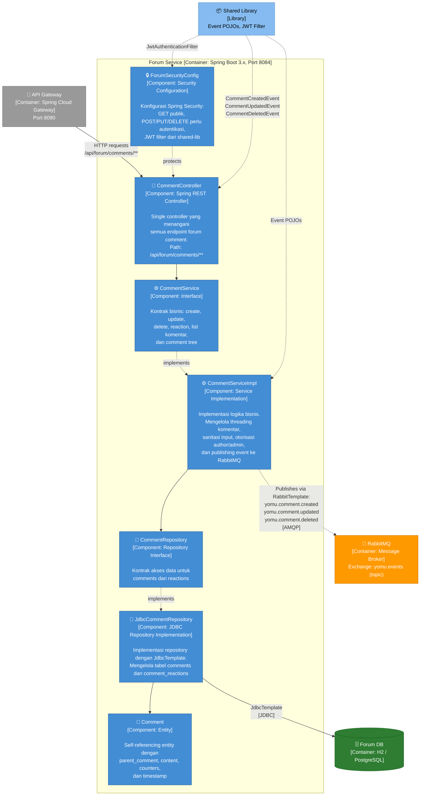
```mermaid
flowchart TD
    GW["🚪 API Gateway\n[Container: Spring Cloud Gateway]\nPort 8090"]
    MQ["📨 RabbitMQ\n[Container: Message Broker]\nExchange: yomu.events (topic)"]
    DB[("🗄️ Forum DB\n[Container: H2 / PostgreSQL]")]
    SHARED["📦 Shared Library\n[Library]\nEvent POJOs, JWT Filter"]

    subgraph FORUM["Forum Service [Container: Spring Boot 3.x, Port 8084]"]
        direction TB

        CTRL["🎯 CommentController\n[Component: Spring REST Controller]\n\nSingle controller yang menangani\nsemua endpoint forum comment.\nPath: /api/forum/comments/**"]

        SVC_IF["⚙️ CommentService\n[Component: Interface]\n\nKontrak bisnis: create, update,\ndelete, reaction, list komentar,\ndan comment tree"]

        SVC_IMPL["⚙️ CommentServiceImpl\n[Component: Service Implementation]\n\nImplementasi logika bisnis.\nMengelola threading komentar,\nsanitasi input, otorisasi author/admin,\ndan publishing event ke RabbitMQ"]

        REPO_IF["💾 CommentRepository\n[Component: Repository Interface]\n\nKontrak akses data untuk\ncomments dan reactions"]

        REPO_IMPL["💾 JdbcCommentRepository\n[Component: JDBC Repository Implementation]\n\nImplementasi repository dengan JdbcTemplate.\nMengelola tabel comments dan comment_reactions"]

        MODEL["🧱 Comment\n[Component: Entity]\n\nSelf-referencing entity dengan\nparent_comment, content, counters,\ndan timestamp"]

        SEC["🔒 ForumSecurityConfig\n[Component: Security Configuration]\n\nKonfigurasi Spring Security:\nGET publik, POST/PUT/DELETE perlu autentikasi,\nJWT filter dari shared-lib"]
    end

    %% External → Controller
    GW -->|"HTTP requests\n/api/forum/comments/**"| CTRL

    %% Controller → Service
    CTRL --> SVC_IF

    %% Interface → Implementation
    SVC_IF -.->|"implements"| SVC_IMPL

    %% Security
    SHARED -.->|"JwtAuthenticationFilter"| SEC
    SEC -.->|"protects"| CTRL

    %% Service → Repository
    SVC_IMPL --> REPO_IF

    %% Repository Interface → Implementation
    REPO_IF -.->|"implements"| REPO_IMPL

    %% Repository → Entity
    REPO_IMPL --> MODEL

    %% Repository → Database
    REPO_IMPL -->|"JdbcTemplate\n[JDBC]"| DB

    %% Service → RabbitMQ (publish)
    SVC_IMPL -.->|"Publishes via RabbitTemplate:\nyomu.comment.created\nyomu.comment.updated\nyomu.comment.deleted\n[AMQP]"| MQ

    %% Shared lib
    SHARED -.->|"CommentCreatedEvent\nCommentUpdatedEvent\nCommentDeletedEvent"| CTRL
    SHARED -.->|"Event POJOs"| SVC_IMPL

    %% Styling
    style CTRL fill:#438DD5,stroke:#2E6295,color:#FFFFFF
    style SVC_IF fill:#438DD5,stroke:#2E6295,color:#FFFFFF
    style SVC_IMPL fill:#438DD5,stroke:#2E6295,color:#FFFFFF
    style REPO_IF fill:#438DD5,stroke:#2E6295,color:#FFFFFF
    style REPO_IMPL fill:#438DD5,stroke:#2E6295,color:#FFFFFF
    style MODEL fill:#438DD5,stroke:#2E6295,color:#FFFFFF
    style SEC fill:#438DD5,stroke:#2E6295,color:#FFFFFF
    style GW fill:#999999,stroke:#6B6B6B,color:#FFFFFF
    style MQ fill:#FF9900,stroke:#CC7A00,color:#FFFFFF
    style SHARED fill:#85BBF0,stroke:#5D95C4,color:#000000
    style DB fill:#2E7D32,stroke:#1B5E20,color:#FFFFFF
```

---

### 📐 Code Diagram 1 — Domain Model & DTOs

Menunjukkan model data forum yang dipakai untuk komentar bersarang, reaction, dan response API.


```mermaid
classDiagram
    class Comment {
        <<entity>>
        String id
        String userId
        String bacaanId
        String parentComment
        String content
        LocalDateTime createdAt
        int upvotes
        int downvotes
        int reactionThumbsUp
        int reactionHeart
        int reactionLaugh
        int reactionSurprise
        int reactionSad
    }

    class CreateCommentRequest {
        <<record>>
        String userId
        String bacaanId
        String commentContent
        String parentComment
    }

    class UpdateCommentRequest {
        <<record>>
        String commentContent
    }

    class ReactionRequest {
        <<record>>
        String reactionType
    }

    class CommentResponse {
        <<record>>
        String id
        String userId
        String bacaanId
        String parentComment
        String content
        Instant createdAt
        int upvotes
        int downvotes
        int thumbsUp
        int heart
        int laugh
        int surprise
        int sad
    }

    class CommentTreeResponse {
        <<record>>
        String id
        String userId
        String bacaanId
        String parentComment
        String content
        Instant createdAt
        int upvotes
        int downvotes
        int thumbsUp
        int heart
        int laugh
        int surprise
        int sad
        List~CommentTreeResponse~ replies
    }

    CommentResponse --> Comment : maps from
    CommentTreeResponse --> Comment : maps from
    CommentTreeResponse --> CommentTreeResponse : replies
```

### 📐 Code Diagram 2 — Service Layer (Forum Service)

Menunjukkan kontrak `CommentService` dan implementasinya `CommentServiceImpl`, beserta dependency utamanya.

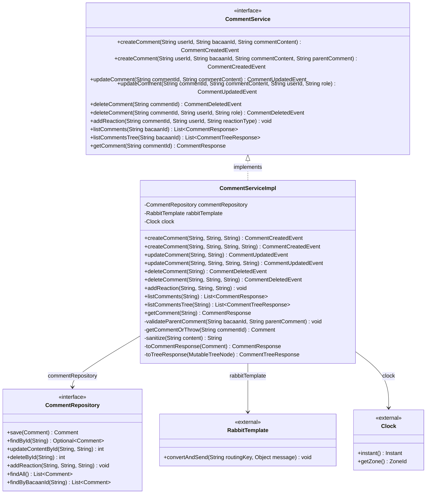
```mermaid
classDiagram
    class CommentService {
        <<interface>>
        +createComment(String userId, String bacaanId, String commentContent) CommentCreatedEvent
        +createComment(String userId, String bacaanId, String commentContent, String parentComment) CommentCreatedEvent
        +updateComment(String commentId, String commentContent) CommentUpdatedEvent
        +updateComment(String commentId, String commentContent, String userId, String role) CommentUpdatedEvent
        +deleteComment(String commentId) CommentDeletedEvent
        +deleteComment(String commentId, String userId, String role) CommentDeletedEvent
        +addReaction(String commentId, String userId, String reactionType) void
        +listComments(String bacaanId) List~CommentResponse~
        +listCommentsTree(String bacaanId) List~CommentTreeResponse~
        +getComment(String commentId) CommentResponse
    }

    class CommentServiceImpl {
        -CommentRepository commentRepository
        -RabbitTemplate rabbitTemplate
        -Clock clock
        +createComment(String, String, String) CommentCreatedEvent
        +createComment(String, String, String, String) CommentCreatedEvent
        +updateComment(String, String) CommentUpdatedEvent
        +updateComment(String, String, String, String) CommentUpdatedEvent
        +deleteComment(String) CommentDeletedEvent
        +deleteComment(String, String, String) CommentDeletedEvent
        +addReaction(String, String, String) void
        +listComments(String) List~CommentResponse~
        +listCommentsTree(String) List~CommentTreeResponse~
        +getComment(String) CommentResponse
        -validateParentComment(String bacaanId, String parentComment) void
        -getCommentOrThrow(String commentId) Comment
        -sanitize(String content) String
        -toCommentResponse(Comment) CommentResponse
        -toTreeResponse(MutableTreeNode) CommentTreeResponse
    }

    class CommentRepository {
        <<interface>>
        +save(Comment) Comment
        +findById(String) Optional~Comment~
        +updateContentById(String, String) int
        +deleteById(String) int
        +addReaction(String, String, String) void
        +findAll() List~Comment~
        +findByBacaanId(String) List~Comment~
    }

    class RabbitTemplate {
        <<external>>
        +convertAndSend(String routingKey, Object message) void
    }

    class Clock {
        <<external>>
        +instant() Instant
        +getZone() ZoneId
    }

    CommentService <|.. CommentServiceImpl : implements
    CommentServiceImpl --> CommentRepository : commentRepository
    CommentServiceImpl --> RabbitTemplate : rabbitTemplate
    CommentServiceImpl --> Clock : clock
```

---

### 📐 Code Diagram 3 — Controller, Repository & Security (Forum Service)

Menunjukkan alur request REST, otorisasi berbasis JWT, dan implementasi repository JDBC.

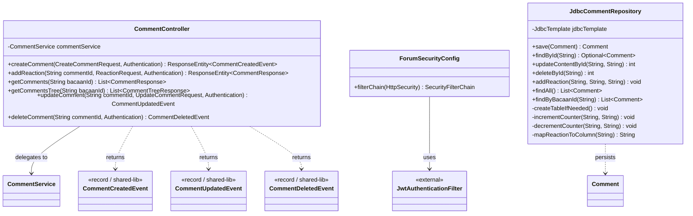
```mermaid
classDiagram
    class CommentController {
        -CommentService commentService
        +createComment(CreateCommentRequest, Authentication) ResponseEntity~CommentCreatedEvent~
        +addReaction(String commentId, ReactionRequest, Authentication) ResponseEntity~CommentResponse~
        +getComments(String bacaanId) List~CommentResponse~
        +getCommentsTree(String bacaanId) List~CommentTreeResponse~
        +updateComment(String commentId, UpdateCommentRequest, Authentication) CommentUpdatedEvent
        +deleteComment(String commentId, Authentication) CommentDeletedEvent
    }

    class ForumSecurityConfig {
        +filterChain(HttpSecurity) SecurityFilterChain
    }

    class JdbcCommentRepository {
        -JdbcTemplate jdbcTemplate
        +save(Comment) Comment
        +findById(String) Optional~Comment~
        +updateContentById(String, String) int
        +deleteById(String) int
        +addReaction(String, String, String) void
        +findAll() List~Comment~
        +findByBacaanId(String) List~Comment~
        -createTableIfNeeded() void
        -incrementCounter(String, String) void
        -decrementCounter(String, String) void
        -mapReactionToColumn(String) String
    }

    class JwtAuthenticationFilter {
        <<external>>
    }

    class CommentCreatedEvent {
        <<record / shared-lib>>
    }

    class CommentUpdatedEvent {
        <<record / shared-lib>>
    }

    class CommentDeletedEvent {
        <<record / shared-lib>>
    }

    CommentController --> CommentService : delegates to
    ForumSecurityConfig --> JwtAuthenticationFilter : uses
    CommentController ..> CommentCreatedEvent : returns
    CommentController ..> CommentUpdatedEvent : returns
    CommentController ..> CommentDeletedEvent : returns
    JdbcCommentRepository ..> Comment : persists
```

---

## Individual Work — Ali Akbar Murtadha Service-Clan

> **Component Diagram** (C4 Level 3) — Scope: Service-Clan container. Menunjukkan komponen internal beserta tanggung jawab dan teknologinya. Semua komponen berjalan dalam satu process space.
>
> **Code Diagram** (C4 Level 4) — Scope: masing-masing lapisan (domain, API, service, scoring, persistence, events, security). Menunjukkan class, interface, record, enum, dan hubungan utama antar elemen kode.
>
> _(Ref: Module 09, hal. 119-120)_

---

### Component Diagram — Service-Clan (Port 8085)

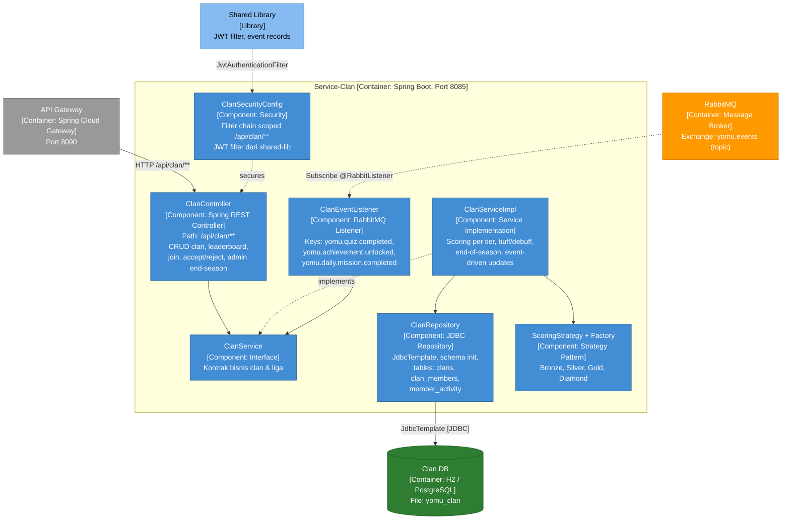
```mermaid
flowchart TD
    GW["API Gateway\n[Container: Spring Cloud Gateway]\nPort 8090"]
    MQ["RabbitMQ\n[Container: Message Broker]\nExchange: yomu.events (topic)"]
    DB[("Clan DB\n[Container: H2 / PostgreSQL]\nFile: yomu_clan")]
    SHARED["Shared Library\n[Library]\nJWT filter, event records"]

    subgraph CLAN["Service-Clan [Container: Spring Boot, Port 8085]"]
        direction TB

        CTRL["ClanController\n[Component: Spring REST Controller]\nPath: /api/clan/**\nCRUD clan, leaderboard,\njoin, accept/reject, admin end-season"]

        SVC_IF["ClanService\n[Component: Interface]\nKontrak bisnis clan & liga"]

        SVC_IMPL["ClanServiceImpl\n[Component: Service Implementation]\nScoring per tier, buff/debuff,\nend-of-season, event-driven updates"]

        REPO["ClanRepository\n[Component: JDBC Repository]\nJdbcTemplate, schema init,\ntables: clans, clan_members,\nmember_activity"]

        LISTENER["ClanEventListener\n[Component: RabbitMQ Listener]\nKeys: yomu.quiz.completed,\nyomu.achievement.unlocked,\nyomu.daily.mission.completed"]

        SCORING["ScoringStrategy + Factory\n[Component: Strategy Pattern]\nBronze, Silver, Gold, Diamond"]

        SEC["ClanSecurityConfig\n[Component: Security]\nFilter chain scoped /api/clan/**\nJWT filter dari shared-lib"]
    end

    GW -->|"HTTP /api/clan/**"| CTRL
    CTRL --> SVC_IF
    SVC_IMPL -.->|implements| SVC_IF
    SVC_IMPL --> REPO
    SVC_IMPL --> SCORING
    REPO -->|"JdbcTemplate [JDBC]"| DB
    MQ -.->|"Subscribe @RabbitListener"| LISTENER
    LISTENER --> SVC_IF
    SHARED -.->|"JwtAuthenticationFilter"| SEC
    SEC -.->|"secures"| CTRL

    style CTRL fill:#438DD5,stroke:#2E6295,color:#FFFFFF
    style SVC_IF fill:#438DD5,stroke:#2E6295,color:#FFFFFF
    style SVC_IMPL fill:#438DD5,stroke:#2E6295,color:#FFFFFF
    style REPO fill:#438DD5,stroke:#2E6295,color:#FFFFFF
    style LISTENER fill:#438DD5,stroke:#2E6295,color:#FFFFFF
    style SCORING fill:#438DD5,stroke:#2E6295,color:#FFFFFF
    style SEC fill:#438DD5,stroke:#2E6295,color:#FFFFFF
    style GW fill:#999999,stroke:#6B6B6B,color:#FFFFFF
    style MQ fill:#FF9900,stroke:#CC7A00,color:#FFFFFF
    style SHARED fill:#85BBF0,stroke:#5D95C4,color:#000000
    style DB fill:#2E7D32,stroke:#1B5E20,color:#FFFFFF
```

---

### Code Diagram 1 — Domain Model and DTOs

Model domain clan/member dan record request untuk pembuatan clan.

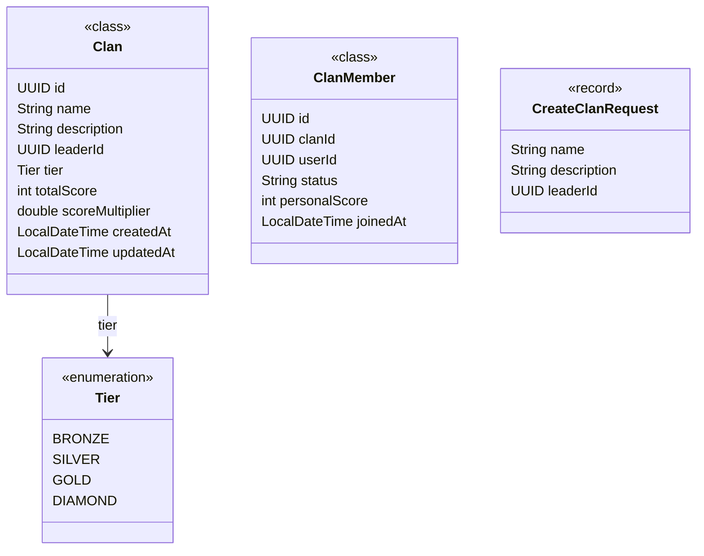
```mermaid
classDiagram
    class Clan {
        <<class>>
        UUID id
        String name
        String description
        UUID leaderId
        Tier tier
        int totalScore
        double scoreMultiplier
        LocalDateTime createdAt
        LocalDateTime updatedAt
    }

    class ClanMember {
        <<class>>
        UUID id
        UUID clanId
        UUID userId
        String status
        int personalScore
        LocalDateTime joinedAt
    }

    class Tier {
        <<enumeration>>
        BRONZE
        SILVER
        GOLD
        DIAMOND
    }

    class CreateClanRequest {
        <<record>>
        String name
        String description
        UUID leaderId
    }

    Clan --> Tier : tier
```

---

### Code Diagram 2 — REST API Layer

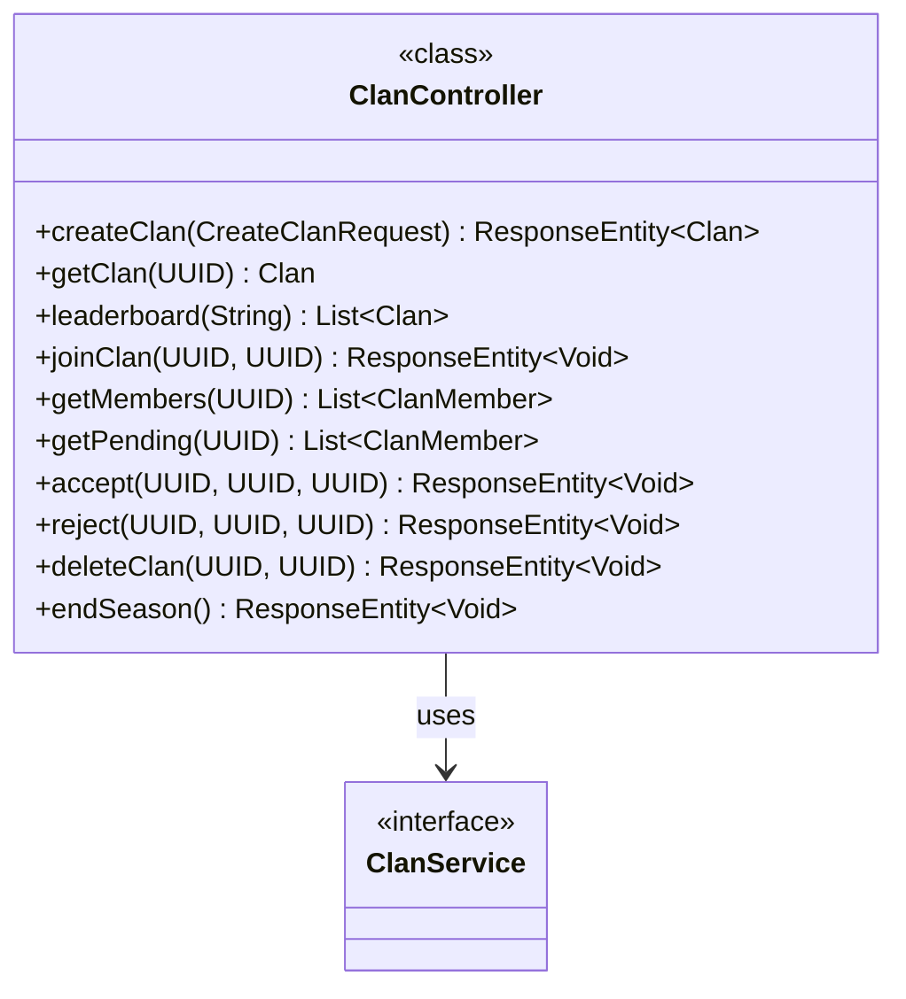
```mermaid
classDiagram
    class ClanController {
        <<class>>
        +createClan(CreateClanRequest) ResponseEntity~Clan~
        +getClan(UUID) Clan
        +leaderboard(String) List~Clan~
        +joinClan(UUID, UUID) ResponseEntity~Void~
        +getMembers(UUID) List~ClanMember~
        +getPending(UUID) List~ClanMember~
        +accept(UUID, UUID, UUID) ResponseEntity~Void~
        +reject(UUID, UUID, UUID) ResponseEntity~Void~
        +deleteClan(UUID, UUID) ResponseEntity~Void~
        +endSeason() ResponseEntity~Void~
    }

    class ClanService {
        <<interface>>
    }

    ClanController --> ClanService : uses
```

---

### Code Diagram 3 — Service Layer

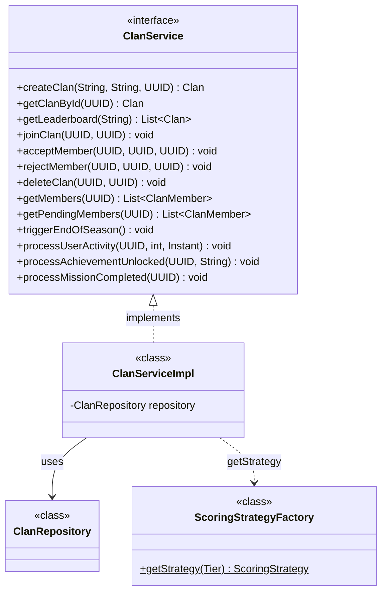
```mermaid
classDiagram
    class ClanService {
        <<interface>>
        +createClan(String, String, UUID) Clan
        +getClanById(UUID) Clan
        +getLeaderboard(String) List~Clan~
        +joinClan(UUID, UUID) void
        +acceptMember(UUID, UUID, UUID) void
        +rejectMember(UUID, UUID, UUID) void
        +deleteClan(UUID, UUID) void
        +getMembers(UUID) List~ClanMember~
        +getPendingMembers(UUID) List~ClanMember~
        +triggerEndOfSeason() void
        +processUserActivity(UUID, int, Instant) void
        +processAchievementUnlocked(UUID, String) void
        +processMissionCompleted(UUID) void
    }

    class ClanServiceImpl {
        <<class>>
        -ClanRepository repository
    }

    class ClanRepository {
        <<class>>
    }

    class ScoringStrategyFactory {
        <<class>>
        +getStrategy(Tier)$ ScoringStrategy
    }

    ClanService <|.. ClanServiceImpl : implements
    ClanServiceImpl --> ClanRepository : uses
    ClanServiceImpl ..> ScoringStrategyFactory : getStrategy
```

---

### Code Diagram 4 — Scoring Strategy Pattern

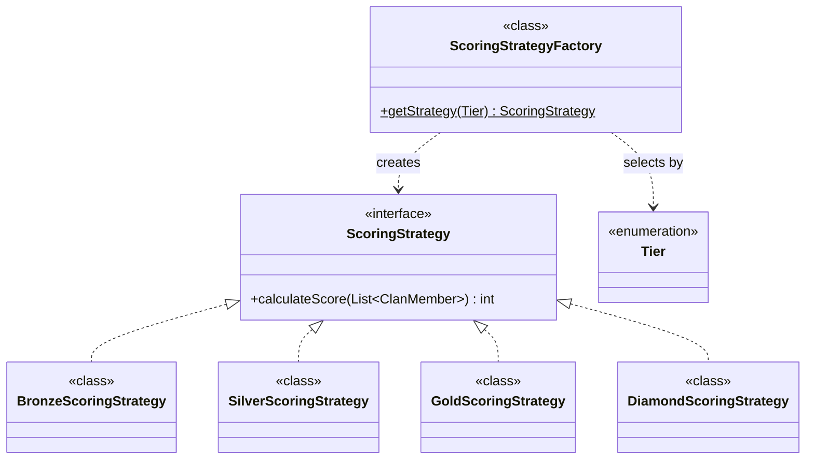
```mermaid
classDiagram
    class ScoringStrategy {
        <<interface>>
        +calculateScore(List~ClanMember~) int
    }

    class ScoringStrategyFactory {
        <<class>>
        +getStrategy(Tier)$ ScoringStrategy
    }

    class BronzeScoringStrategy {
        <<class>>
    }

    class SilverScoringStrategy {
        <<class>>
    }

    class GoldScoringStrategy {
        <<class>>
    }

    class DiamondScoringStrategy {
        <<class>>
    }

    class Tier {
        <<enumeration>>
    }

    ScoringStrategy <|.. BronzeScoringStrategy
    ScoringStrategy <|.. SilverScoringStrategy
    ScoringStrategy <|.. GoldScoringStrategy
    ScoringStrategy <|.. DiamondScoringStrategy
    ScoringStrategyFactory ..> Tier : selects by
    ScoringStrategyFactory ..> ScoringStrategy : creates
```

---

### Code Diagram 5 — Persistence (ClanRepository)

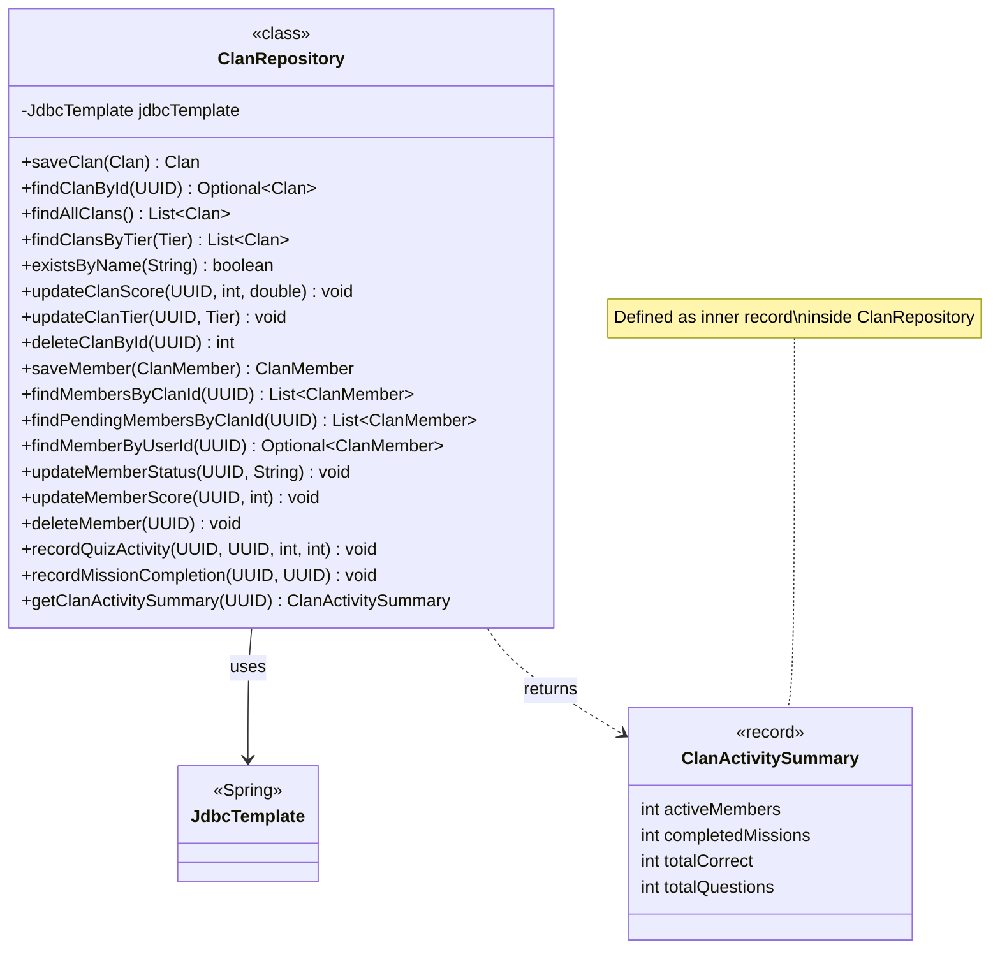
```mermaid
classDiagram
    class ClanRepository {
        <<class>>
        -JdbcTemplate jdbcTemplate
        +saveClan(Clan) Clan
        +findClanById(UUID) Optional~Clan~
        +findAllClans() List~Clan~
        +findClansByTier(Tier) List~Clan~
        +existsByName(String) boolean
        +updateClanScore(UUID, int, double) void
        +updateClanTier(UUID, Tier) void
        +deleteClanById(UUID) int
        +saveMember(ClanMember) ClanMember
        +findMembersByClanId(UUID) List~ClanMember~
        +findPendingMembersByClanId(UUID) List~ClanMember~
        +findMemberByUserId(UUID) Optional~ClanMember~
        +updateMemberStatus(UUID, String) void
        +updateMemberScore(UUID, int) void
        +deleteMember(UUID) void
        +recordQuizActivity(UUID, UUID, int, int) void
        +recordMissionCompletion(UUID, UUID) void
        +getClanActivitySummary(UUID) ClanActivitySummary
    }

    class JdbcTemplate {
        <<Spring>>
    }

    class ClanActivitySummary {
        <<record>>
        int activeMembers
        int completedMissions
        int totalCorrect
        int totalQuestions
    }

    ClanRepository --> JdbcTemplate : uses
    ClanRepository ..> ClanActivitySummary : returns

    note for ClanActivitySummary "Defined as inner record\ninside ClanRepository"
```

---

### Code Diagram 6 — Event Integration (ClanEventListener)

```mermaid
classDiagram
    class ClanEventListener {
        <<class>>
        +onQuizCompleted(QuizCompletedEvent) void
        +onAchievementUnlocked(AchievementUnlockedEvent) void
        +onMissionCompleted(DailyMissionCompletedEvent) void
    }

    class QuizCompletedEvent {
        <<record>>
    }

    class AchievementUnlockedEvent {
        <<record>>
    }

    class DailyMissionCompletedEvent {
        <<record>>
    }

    class ClanService {
        <<interface>>
    }

    ClanEventListener --> ClanService : delegates
    ClanEventListener ..> QuizCompletedEvent : consumes
    ClanEventListener ..> AchievementUnlockedEvent : consumes
    ClanEventListener ..> DailyMissionCompletedEvent : consumes
```

---

### Code Diagram 7 — Security (ClanSecurityConfig)

```mermaid
classDiagram
    class ClanSecurityConfig {
        <<class>>
        +clanSecurityFilterChain(HttpSecurity) SecurityFilterChain
    }

    class JwtAuthenticationFilter {
        <<class>>
    }

    class SecurityFilterChain {
        <<Spring Security>>
    }

    ClanSecurityConfig ..> JwtAuthenticationFilter : inserts before auth
    ClanSecurityConfig ..> SecurityFilterChain : builds
```

---

### 👤 Christna Yosua Rotinsulu — Auth Service & API Gateway

Dalam pengembangan Yomu-App, saya bertanggung jawab penuh atas dua komponen kritikal yang menjaga integritas dan keamanan seluruh ekosistem: **API Gateway (`api-gateway`)** dan **Auth Service (`service-auth`)**. API Gateway berperan sebagai benteng terdepan (_first line of defense_) yang mengatur arus lalu lintas permintaan, sedangkan Auth Service adalah otak di balik manajemen identitas dan hak akses pengguna.

#### 🏗️ Container Diagram — Aliran Autentikasi & Keamanan

Diagram berikut menggambarkan bagaimana saya merancang interaksi sistem saat pengguna mencoba mengakses data sensitif. Permintaan dari _Frontend_ tidak pernah langsung menyentuh _Microservice_ internal; semuanya harus melewati filter ketat di API Gateway yang saya kembangkan.

```mermaid
flowchart TD
    PELAJAR["👤 Pengguna\n(Pelajar / Admin)"]
    FE["🌐 Frontend\n[React 19 + Vite]"]

    subgraph GW["API Gateway (Port 8090)"]
        direction TB
        G_FILTER["GatewayAuthFilter\n(JWT Validator)"]
        G_SEC["SecurityConfig\n(Reactive WebFlux)"]
    end

    subgraph AUTH["Auth Service (Port 8081)"]
        direction TB
        A_RATE["RateLimitFilter\n(Anti Brute-Force)"]
        A_CORE["AuthService\n(Identity Logic)"]
    end

    DB_A[("🗄️ PostgreSQL\n(Auth Database)")]
    MQ["📨 RabbitMQ\n(User Events)"]
    GOOGLE["🔗 Google SSO\n(External Identity)"]

    PELAJAR --> FE
    FE -->|"HTTP + JWT Header"| GW
    GW -->|"Validate Token"| G_FILTER
    G_FILTER -->|"Forward if Valid"| AUTH
    AUTH --> A_RATE
    A_RATE --> A_CORE
    A_CORE --> DB_A
    A_CORE -.->|"Publish UserRegistered"| MQ
    A_CORE -.->|"Verify"| GOOGLE

    style GW fill:#438DD5,stroke:#2E6295,color:#FFFFFF
    style AUTH fill:#438DD5,stroke:#2E6295,color:#FFFFFF
    style DB_A fill:#2E7D32,stroke:#1B5E20,color:#FFFFFF
    style MQ fill:#FF9900,stroke:#CC7A00,color:#FFFFFF
```

#### 🧩 Component Diagram — Arsitektur Internal

Saya memecah tanggung jawab di setiap layanan menggunakan prinsip _Clean Architecture_. Di **API Gateway**, saya mengimplementasikan konfigurasi rute yang dinamis. Di **Auth Service**, saya menerapkan perlindungan berlapis, mulai dari filter keamanan hingga logika bisnis yang terisolasi.

```mermaid
flowchart LR
    subgraph GATEWAY["API Gateway Component"]
        direction TB
        R1["GatewayConfig\n(Route Definitions)"]
        R2["GatewayAuthFilter\n(Global JWT Interceptor)"]
        R3["CorsConfig\n(Global Policy)"]
    end

    subgraph AUTH_COMP["Auth Service Component"]
        direction TB
        C1["AuthController\n(REST Interface)"]
        C2["AuthRateLimitFilter\n(Brute-Force Protection)"]
        C3["AuthServiceImpl\n(Business Logic)"]
        C4["UserRepository\n(Data Access Layer)"]
    end

    GATEWAY -->|"/api/auth/**"| AUTH_COMP
    C1 --> C2
    C2 --> C3
    C3 --> C4

    style GATEWAY fill:#f8f9fa,stroke:#438DD5,stroke-width:2px
    style AUTH_COMP fill:#f8f9fa,stroke:#438DD5,stroke-width:2px
```

#### 💻 Code Highlight & Logic Explanation

##### 1. Perlindungan Brute-Force di Auth Service

Saya menyadari bahwa keamanan akun pengguna sangat krusial. Oleh karena itu, saya mengimplementasikan `AuthRateLimitFilter` untuk membatasi jumlah permintaan login yang masuk dari alamat IP yang sama.

```java
// Contoh potongan kode AuthRateLimitFilter yang saya buat
String key = request.getRequestURI() + ":" + clientIp(request);
WindowCounter counter = counters.compute(key, (ignored, current) -> {
    long now = Instant.now().getEpochSecond();
    if (current == null || now - current.windowStartedAt() >= WINDOW_SECONDS) {
        return new WindowCounter(now, 1);
    }
    return new WindowCounter(current.windowStartedAt(), current.count() + 1);
});

if (counter.count() > MAX_REQUESTS_PER_WINDOW) {
    response.setStatus(HttpStatus.TOO_MANY_REQUESTS.value());
    return; // Request ditolak
}
```

##### 2. Gateway Authentication Filter

Di sisi Gateway, saya menciptakan `GatewayAuthFilter` yang mampu membedakan rute publik (seperti login/register) dan rute privat secara cerdas menggunakan `isPublicRequest` logic.

```java
// Cuplikan logika penanganan request publik yang saya rancang
private boolean isPublicRequest(ServerHttpRequest request) {
    String path = request.getURI().getPath();
    // Bypass autentikasi untuk endpoint tertentu
    if (path.equals("/api/auth/register") || path.equals("/api/auth/login")) {
        return true;
    }
    // Izinkan akses baca (GET) pada konten pembelajaran tanpa login
    return HttpMethod.GET.equals(request.getMethod()) && path.startsWith("/api/learning/bacaan");
}
```

#### 📊 Code Diagrams

##### Code Diagram 1: Auth Service Core Structure

Saya memisahkan antarmuka `AuthService` dengan implementasinya (`AuthServiceImpl`) untuk memudahkan pengujian unit (_Unit Testing_) dan menjaga fleksibilitas kode.

```mermaid
classDiagram
    class AuthController {
        +login(LoginRequest)
        +register(RegisterRequest)
        +googleSsoLogin(GoogleSsoRequest)
    }
    class AuthService {
        <<interface>>
        +login()
        +register()
    }
    class AuthServiceImpl {
        -UserRepository repo
        -JwtService jwt
        -RabbitTemplate rabbit
        +login()
        +register()
    }
    class UserRepository {
        <<interface>>
        +findByEmail()
        +save()
    }

    AuthController --> AuthService : delegates
    AuthService <|.. AuthServiceImpl : implements
    AuthServiceImpl --> UserRepository : uses
```

##### Code Diagram 2: Gateway Security Mechanism

Mekanisme ini menjamin bahwa setiap permintaan yang memerlukan otorisasi akan diverifikasi keabsahan tokennya sebelum diteruskan ke layanan tujuan.

```mermaid
classDiagram
    class GatewayAuthFilter {
        -JwtService jwtService
        +filter(exchange, chain) Mono~Void~
        -isPublicRequest(request) boolean
    }
    class GlobalFilter { <<interface>> }
    class Ordered { <<interface>> }

    GatewayAuthFilter ..|> GlobalFilter
    GatewayAuthFilter ..|> Ordered
    GatewayAuthFilter --> JwtService : validates token
```

#### 🌟 Bonus: Structural Pattern Implementation (Auth Facade)

Untuk memenuhi standar arsitektur yang bersih, saya mengimplementasikan **Facade Pattern** melalui `AuthFacade`. Komponen ini bertugas sebagai pintu masuk tunggal bagi layanan internal lain yang membutuhkan data pengguna atau validasi token tanpa harus terpapar langsung pada kompleksitas `UserRepository` atau `AuthService`.

```mermaid
classDiagram
    class AuthFacade {
        -UserRepository userRepository
        -JwtService jwtService
        +getUserById(UUID): Optional~UserDto~
        +isTokenValid(String): boolean
    }
    AuthFacade --> UserRepository
    AuthFacade --> JwtService
```

Pola ini saya terapkan untuk memastikan bahwa perubahan pada internal _Auth Service_ tidak akan merusak integritas komponen lain yang mengonsumsinya.

---

## Individual Work — M. Adella Fathir Supriadi (Learning Service)

> **Component Diagram** (C4 Level 3) — Scope: Learning Service container. Menunjukkan komponen internal beserta tanggung jawab dan teknologinya. Semua komponen berjalan dalam satu process space.
>
> **Code Diagram** (C4 Level 4) — Scope: masing-masing komponen. Menunjukkan class, interface, record, dan enum yang membentuk komponen tersebut.
>
> *(Ref: Module 09, hal. 119-120)*

---

### 📐 Component Diagram — Learning Service (Port 8082)

```mermaid
flowchart TD
    GW["🚪 API Gateway\n[Container: Spring Cloud Gateway]\nPort 8090"]
    MQ["📨 RabbitMQ\n[Container: Message Broker]\nExchange: yomu.events (topic)"]
    DB[("🗄️ Learning DB\n[Container: H2 / PostgreSQL]")]
    SHARED["📦 Shared Library\n[Library]\nEvent POJOs, JWT Filter"]

    subgraph LEARN["Learning Service [Container: Spring Boot 3.x, Port 8082]"]
        direction TB

        CTRL["🎯 BacaanController\n[Component: Spring REST Controller]\n\nSingle controller yang meng-handle\nsemua endpoint bacaan, pertanyaan,\nkuis, dan statistik user.\nPath: /api/learning/**"]

        SVC_IF["⚙️ BacaanService\n[Component: Interface]\n\nKontrak bisnis: CRUD bacaan,\nCRUD pertanyaan, submit kuis,\npengecekan status kuis,\ndan statistik user"]

        SVC_IMPL["⚙️ BacaanServiceImpl\n[Component: Service Implementation]\n\nImplementasi logika bisnis.\nPenilaian kuis, validasi kepemilikan,\ndan publishing events ke RabbitMQ"]

        REPO["💾 BacaanRepository\n[Component: JDBC Repository]\n\nAkses data via JdbcTemplate.\nMengelola 3 tabel:\nbacaan, questions, quiz_attempts.\nMembuat tabel via @PostConstruct"]

        SEC["🔒 LearningSecurityConfig\n[Component: Security Configuration]\n\nKonfigurasi Spring Security:\nendpoint admin memerlukan ROLE_ADMIN,\nendpoint publik untuk bacaan & kuis.\nMenggunakan JwtAuthenticationFilter\ndari shared-lib."]

        EX["⚠️ GlobalExceptionHandler\n[Component: Exception Handler]\n\nMenangani AccessDeniedException (403),\nResponseStatusException, dan\ngeneric Exception (500).\nMengembalikan ErrorResponse standar."]
    end

    %% External → Controller
    GW -->|"HTTP requests\n/api/learning/**"| CTRL

    %% Controller → Service
    CTRL --> SVC_IF

    %% Interface → Implementation
    SVC_IF -.->|"implements"| SVC_IMPL

    %% Service → Repository
    SVC_IMPL --> REPO

    %% Service → RabbitMQ (publish)
    SVC_IMPL -.->|"Publishes via RabbitTemplate:\nyomu.learning.completed\nyomu.quiz.completed\n[AMQP]"| MQ

    %% Repository → Database
    REPO -->|"JdbcTemplate\n[JDBC]"| DB

    %% Shared lib
    SHARED -.->|"JwtAuthenticationFilter\nEvent POJOs"| SEC
    SHARED -.->|"LearningCompletedEvent\nQuizCompletedEvent"| SVC_IMPL

    %% Styling
    style CTRL fill:#438DD5,stroke:#2E6295,color:#FFFFFF
    style SVC_IF fill:#438DD5,stroke:#2E6295,color:#FFFFFF
    style SVC_IMPL fill:#438DD5,stroke:#2E6295,color:#FFFFFF
    style REPO fill:#438DD5,stroke:#2E6295,color:#FFFFFF
    style SEC fill:#438DD5,stroke:#2E6295,color:#FFFFFF
    style EX fill:#438DD5,stroke:#2E6295,color:#FFFFFF
    style GW fill:#999999,stroke:#6B6B6B,color:#FFFFFF
    style MQ fill:#FF9900,stroke:#CC7A00,color:#FFFFFF
    style SHARED fill:#85BBF0,stroke:#5D95C4,color:#000000
```

---

### 📐 Code Diagram 1 — Domain Model (Entities & DTOs)

Menunjukkan elemen kode di dalam komponen model: entity class untuk domain objek dan DTO untuk request/response.

```mermaid
classDiagram
    class Bacaan {
        UUID id
        String title
        String content
        String category
        UUID createdByUserId
        Instant createdAt
        Instant updatedAt
    }

    class Question {
        UUID id
        UUID bacaanId
        String questionText
        String optionA
        String optionB
        String optionC
        String optionD
        String correctOption
        Instant createdAt
    }

    class QuizAttempt {
        UUID id
        UUID userId
        UUID bacaanId
        int score
        int totalQuestions
        Instant completedAt
    }

    class CreateBacaanRequest {
        String title
        String content
        String category
    }

    class CreateQuestionRequest {
        UUID bacaanId
        String questionText
        String optionA
        String optionB
        String optionC
        String optionD
        String correctOption
    }

    class SubmitQuizRequest {
        UUID userId
        List~AnswerEntry~ answers
    }

    class AnswerEntry {
        UUID questionId
        String selectedOption
    }

    class QuizQuestionResponse {
        <<record>>
        UUID id
        UUID bacaanId
        String questionText
        String optionA
        String optionB
        String optionC
        String optionD
    }

    class QuizStatsResponse {
        int quizCompleted
        double accuracy
        List~QuizAttempt~ recentAttempts
    }

    class ErrorResponse {
        String message
        String errorCode
        Instant timestamp
        int status
    }

    Question --> Bacaan : bacaanId
    QuizAttempt --> Bacaan : bacaanId
    SubmitQuizRequest --> AnswerEntry : answers
```

---

### 📐 Code Diagram 2 — Service Layer (Interface + Implementation + Repository)

Menunjukkan kontrak `BacaanService` dan implementasinya `BacaanServiceImpl`, beserta `BacaanRepository` dan dependency-nya.

```mermaid
classDiagram
    class BacaanService {
        <<interface>>
        +createBacaan(CreateBacaanRequest, UUID createdBy) Bacaan
        +listBacaan(String category) List~Bacaan~
        +getBacaanById(UUID id) Bacaan
        +updateBacaan(UUID id, CreateBacaanRequest) Bacaan
        +deleteBacaan(UUID id) void
        +addQuestion(CreateQuestionRequest) Question
        +getQuestionsByBacaanId(UUID bacaanId) List~QuizQuestionResponse~
        +deleteQuestion(UUID questionId) void
        +submitQuiz(UUID bacaanId, SubmitQuizRequest) QuizAttempt
        +hasCompletedQuiz(UUID userId, UUID bacaanId) boolean
        +getUserStats(UUID userId) QuizStatsResponse
    }

    class BacaanServiceImpl {
        -BacaanRepository bacaanRepository
        -RabbitTemplate rabbitTemplate
        +createBacaan(CreateBacaanRequest, UUID) Bacaan
        +listBacaan(String) List~Bacaan~
        +getBacaanById(UUID) Bacaan
        +updateBacaan(UUID, CreateBacaanRequest) Bacaan
        +deleteBacaan(UUID) void
        +addQuestion(CreateQuestionRequest) Question
        +getQuestionsByBacaanId(UUID) List~QuizQuestionResponse~
        +deleteQuestion(UUID) void
        +submitQuiz(UUID, SubmitQuizRequest) QuizAttempt
        +hasCompletedQuiz(UUID, UUID) boolean
        +getUserStats(UUID) QuizStatsResponse
        -scoreQuiz(List~Question~, List~AnswerEntry~) int
        -validateQuizOwner(UUID requestUserId, UUID tokenUserId) void
    }

    class BacaanRepository {
        -JdbcTemplate jdbcTemplate
        +saveBacaan(Bacaan) Bacaan
        +findAllBacaan() List~Bacaan~
        +findBacaanByCategory(String) List~Bacaan~
        +findBacaanById(UUID) Optional~Bacaan~
        +deleteBacaanById(UUID) void
        +saveQuestion(Question) Question
        +findQuestionsByBacaanId(UUID) List~Question~
        +deleteQuestionById(UUID) void
        +saveQuizAttempt(QuizAttempt) QuizAttempt
        +hasUserCompletedQuiz(UUID userId, UUID bacaanId) boolean
        +findAttemptsByUserId(UUID) List~QuizAttempt~
        +getStatsByUserId(UUID) QuizStats
    }

    class RabbitTemplate {
        <<external>>
        +convertAndSend(String routingKey, Object message) void
    }

    BacaanService <|.. BacaanServiceImpl : implements
    BacaanServiceImpl --> BacaanRepository : bacaanRepository
    BacaanServiceImpl --> RabbitTemplate : rabbitTemplate
```

---

### 📐 Code Diagram 3 — Controller, Security & Published Events

Menunjukkan `BacaanController` sebagai entry point REST, `LearningSecurityConfig` untuk keamanan, `GlobalExceptionHandler` untuk penanganan error terpusat, serta event objects dari shared-lib yang dipublish oleh service.

```mermaid
classDiagram
    class BacaanController {
        -BacaanService bacaanService
        +createBacaan(CreateBacaanRequest, Principal) ResponseEntity~Bacaan~
        +listBacaan(String category) ResponseEntity~List~Bacaan~~
        +getBacaanById(UUID) ResponseEntity~Bacaan~
        +updateBacaan(UUID, CreateBacaanRequest) ResponseEntity~Bacaan~
        +deleteBacaan(UUID) ResponseEntity~Void~
        +addQuestion(CreateQuestionRequest) ResponseEntity~Question~
        +getQuestions(UUID bacaanId) ResponseEntity~List~QuizQuestionResponse~~
        +deleteQuestion(UUID) ResponseEntity~Void~
        +submitQuiz(UUID bacaanId, SubmitQuizRequest) ResponseEntity~QuizAttempt~
        +checkQuizStatus(UUID bacaanId, UUID userId) ResponseEntity~Boolean~
        +getUserStats(UUID userId) ResponseEntity~QuizStatsResponse~
    }
    note for BacaanController "Admin endpoints (@PreAuthorize hasRole ADMIN):\ncreateBacaan, updateBacaan, deleteBacaan,\naddQuestion, deleteQuestion\n\nPublic endpoints (no auth required):\nlistBacaan, getBacaanById, getQuestions,\ncheckQuizStatus"

    class LearningSecurityConfig {
        +SecurityFilterChain filterChain(HttpSecurity) SecurityFilterChain
        +JwtAuthenticationFilter jwtAuthenticationFilter() JwtAuthenticationFilter
    }
    note for LearningSecurityConfig "Permitted tanpa auth:\n/api/learning/bacaan/**\n/api/learning/*/questions\n/api/learning/*/quiz/status\nSession stateless (JWT)"

    class GlobalExceptionHandler {
        +handleAccessDenied(AccessDeniedException) ResponseEntity~ErrorResponse~
        +handleResponseStatus(ResponseStatusException) ResponseEntity~ErrorResponse~
        +handleGeneric(Exception) ResponseEntity~ErrorResponse~
    }

    class LearningCompletedEvent {
        <<record / shared-lib>>
        UUID userId
        UUID bacaanId
        Instant occurredAt
    }

    class QuizCompletedEvent {
        <<record / shared-lib>>
        UUID userId
        UUID quizId
        Instant occurredAt
    }

    BacaanController --> BacaanService : delegates to
    BacaanServiceImpl ..> LearningCompletedEvent : publishes
    BacaanServiceImpl ..> QuizCompletedEvent : publishes
```

---


---

### 📊 System Performance & Quality Metrics

Berikut adalah ringkasan hasil pengukuran kinerja (*profiling*) untuk sistem *backend* dan hasil audit performa UI *frontend*.

#### Backend Apdex Score

Berdasarkan *profiling evidence* (dengan batas waktu tunggu request `T = 500 ms`), skor rata-rata untuk backend services adalah:

- **Apdex Score**: **0.9996** (`99.96%` - *Excellent*)
- Total Requests (*Sample*): 1113
- Satisfied (`<= 500 ms`): 1112
- Tolerating (`> 500 ms and <= 2 s`): 1

*(Catatan: Rincian perhitungan lengkap tersedia pada berkas [project-apdex.md](docs/project-apdex.md))*

#### Frontend Lighthouse Audit

Berdasarkan audit Google Lighthouse pada aplikasi web *frontend* berjalan (`React + Vite`), metrik berikut dicapai:

- ⚡ **Performance**: **98 / 100**
- ♿ **Accessibility**: **79 / 100**
- 💡 **Best Practices**: **96 / 100**
- 🔍 **SEO**: **82 / 100**

---

_Dibuat dengan ❤️ oleh Tim Yomu — Kelompok A15, Advanced Programming 2026_
_Referensi utama: Module 09 — Software Architectures (Ade Azurat, Fasilkom UI)_
