# 📖 Yomu App - Gamified Literacy Platform
### *Melatih Literasi dengan Pengalaman Belajar yang Menyenangkan*

Yomu adalah platform aplikasi pembelajaran berbasis gamifikasi yang dirancang untuk membantu masyarakat Indonesia membangun kebiasaan membaca saksama dan verifikasi informasi. Proyek ini menggunakan arsitektur **Microservices Polyrepo** yang modern, skalabel, dan tangguh.

---

## 🏗️ Arsitektur Sistem

Yomu mengadopsi arsitektur microservices yang terdesentralisasi, di mana setiap layanan memiliki tanggung jawab tunggal (Single Responsibility) dan basis data sendiri.

### 🧩 Diagram Arsitektur


<details>
<summary>📐 Lihat Versi Mermaid (Jika didukung oleh Viewer Anda)</summary>

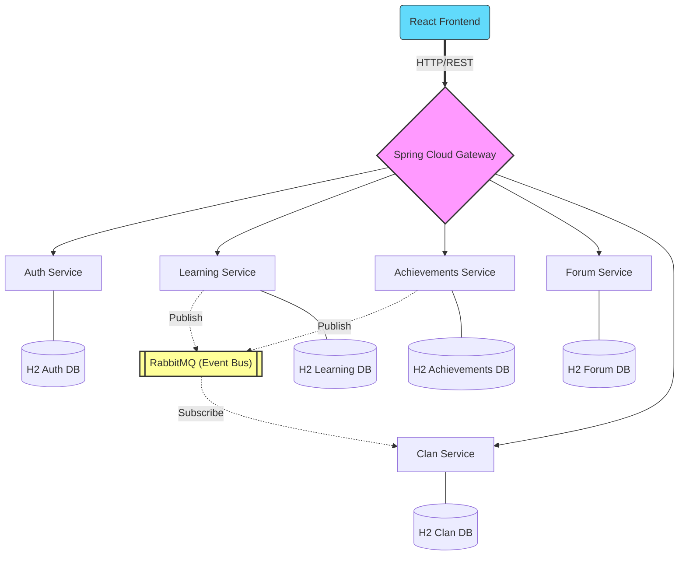
```mermaid
flowchart TD
    %% Nodes
    FE("React Frontend")
    GW{Spring Cloud Gateway}
    
    Auth["Auth Service"]
    Learning["Learning Service"]
    Achievements["Achievements Service"]
    Forum["Forum Service"]
    Clan["Clan Service"]
    
    MQ[["RabbitMQ (Event Bus)"]]
    
    DB_A[("H2 Auth DB")]
    DB_L[("H2 Learning DB")]
    DB_Ac[("H2 Achievements DB")]
    DB_F[("H2 Forum DB")]
    DB_C[("H2 Clan DB")]

    %% Connections
    FE ==>|HTTP/REST| GW
    
    GW --> Auth
    GW --> Learning
    GW --> Achievements
    GW --> Forum
    GW --> Clan
    
    %% Events
    Learning -.->|Publish| MQ
    Achievements -.->|Publish| MQ
    MQ -.->|Subscribe| Clan
    
    %% Persistence
    Auth --- DB_A
    Learning --- DB_L
    Achievements --- DB_Ac
    Forum --- DB_F
    Clan --- DB_C

    %% Styling
    style GW fill:#f9f,stroke:#333,stroke-width:2px
    style MQ fill:#ff9,stroke:#333,stroke-width:2px
    style FE fill:#61dafb,stroke:#333
```

</details>

---

## 🚀 Komponen Utama

### 1. 🌐 API Gateway (Port 8090)
Bertindak sebagai *Single Entry Point*. Menggunakan **Spring Cloud Gateway** untuk:
- **Routing**: Mengarahkan permintaan dari Frontend ke service yang tepat.
- **Authentication Filter**: Melakukan validasi awal JWT (Security Bypass dapat diaktifkan via environment).
- **Reactive Stack**: Dibangun di atas Spring WebFlux untuk performa tinggi.

### 2. 🔐 Auth Service (Port 8081)
Pusat keamanan aplikasi. Fitur utama:
- Registrasi & Login (JWT Based).
- Dukungan Google SSO.
- **Rate Limiting**: Melindungi endpoint sensitif dari brute force.
- RBAC (Role-Based Access Control).

### 3. 📚 Learning Service (Port 8082)
Inti dari konten edukasi:
- Manajemen Modul Bacaan.
- Sistem Kuis Interaktif.
- Publisher Event: Mengirimkan `QuizCompletedEvent` saat user menyelesaikan kuis.

### 4. 🏆 Achievements Service (Port 8083)
Mengelola sistem gamifikasi:
- Tracking Pencapaian (Badges/Medals).
- Misi Harian (Daily Missions).
- Publisher Event: Mengirimkan `AchievementUnlockedEvent` dan `DailyMissionCompletedEvent`.

### 5. 💬 Forum Service (Port 8084)
Ruang diskusi komunitas:
- Thread-based discussions.
- Nested Comments (Komentar bersarang).
- Repositori berbasis JDBC untuk efisiensi query diskusi.

### 6. 🛡️ Clan Service (Port 8085)
Sistem kompetisi antar pengguna:
- **Strategy Pattern**: Implementasi sistem skor yang berbeda untuk setiap Tier (Bronze, Silver, Gold, Diamond).
- **Event Listener**: Mengonsumsi event dari `Learning` dan `Achievements` untuk mengupdate peringkat user secara real-time.

### 📦 Shared Library (`shared-lib`)
Komponen yang digunakan secara bersamaan oleh semua service untuk menjaga konsistensi:
- **Security**: JWT Service & Filters.
- **Events**: Definisi objek event (POJO) untuk RabbitMQ.
- **Exception Handling**: Global exception handler & standard error responses.

---

## 🛠️ Technology Stack

| Layer | Technologies |
| :--- | :--- |
| **Frontend** | React 19, Vite, Tailwind CSS, Lucide Icons |
| **Backend** | Java 21, Spring Boot 3.x, Spring Cloud Gateway |
| **Messaging** | RabbitMQ (Topic Exchange) |
| **Persistence** | H2 Database (PostgreSQL Mode) |
| **Security** | Spring Security, JSON Web Token (JWT) |
| **DevOps** | Docker, Docker Compose |
| **Build Tool** | Gradle (Kotlin DSL) |

---

## 📡 Komunikasi Antar Service

### 🔄 Synchronous (REST)
Digunakan untuk komunikasi dari Frontend melalui API Gateway.
- Format: `JSON` over `HTTP`.
- Endpoint: `/api/auth/**`, `/api/learning/**`, dll.

### ⚡ Asynchronous (Event-Driven)
Menggunakan **RabbitMQ** dengan pola **Publish-Subscribe (Topic Exchange)**:
- **Exchange**: `yomu.events` (Topic)
- **Routing Keys**:
    - `yomu.quiz.completed`: Dipicu oleh Learning Service.
    - `yomu.achievement.unlocked`: Dipicu oleh Achievements Service.
    - `yomu.daily.mission.completed`: Dipicu oleh Achievements Service.

---

## 📦 Panduan Menjalankan Proyek

### 🐳 Menggunakan Docker Compose (Direkomendasikan)
Cara tercepat untuk menjalankan seluruh ekosistem Yomu:

1. Pastikan semua repositori microservice berada dalam satu folder root.
2. Jalankan perintah:
   ```bash
   docker compose up --build
   ```
3. Akses:
    - **Frontend**: `http://localhost:5173`
    - **API Gateway**: `http://localhost:8090`
    - **RabbitMQ Dashboard**: `http://localhost:15672` (guest/guest)

### 🛠️ Menjalankan Secara Manual
Jika ingin menjalankan service tertentu untuk pengembangan:
1. Pastikan RabbitMQ sudah berjalan.
2. Masuk ke folder service (misal `service-auth`):
   ```bash
   ./gradlew bootRun
   ```
3. Untuk Frontend:
   ```bash
   cd frontend && npm install && npm run dev
   ```

---

## 🛡️ Prinsip Desain & SOLID
Kami menerapkan prinsip rekayasa perangkat lunak yang ketat:
- **Single Responsibility (SRP)**: Setiap microservice menangani satu domain bisnis yang jelas.
- **Open/Closed (OCP)**: Sistem scoring di `service-clan` menggunakan Strategy Pattern, memungkinkan penambahan Tier baru tanpa mengubah logika inti.
- **Dependency Inversion (DIP)**: Penggunaan shared interfaces untuk event handling.
- **Loose Coupling**: Antar service tidak saling bergantung secara langsung (Sync), melainkan melalui Event Bus (Async).

---

- Akses aplikasi di `http://localhost:5173` (Vite default port) dan API Gateway di `http://localhost:8090`.

## 🔐 Keamanan

Sistem menggunakan **JSON Web Token (JWT)**. Setiap request dari frontend ke backend (melalui Gateway) akan divalidasi keabsahan tokennya oleh `JwtAuthenticationFilter` yang berada di dalam `shared-lib` dan diimpor oleh setiap service secara terpisah untuk memvalidasi otorisasi.

---

## MODULE 9 - GROUP DISCUSSION
## 🏗️ Arsitektur Sistem Saat Ini

Yomu mengadopsi arsitektur **Microservices Polyrepo** dengan komunikasi sinkron (REST via API Gateway) dan asinkron (Event-Driven via RabbitMQ). Berikut visualisasi arsitektur menggunakan **C4 Model** (ref: Module 09 — *Visualizing Software Architecture*).

---

### 📐 Context Diagram (C4 Level 1)

> **Scope**: Seluruh sistem Yomu.
> **Primary elements**: Yomu Platform sebagai satu kesatuan.
> **Supporting elements**: Aktor (Pelajar, Admin) dan sistem eksternal (Google OAuth, RabbitMQ).
> **Intended audience**: Semua orang, baik teknis maupun non-teknis.
>
> *(Ref: C4 Model — System Context Diagram, Module 09 hal. 115-116)*

Context Diagram menunjukkan **Yomu** sebagai satu kotak di tengah, dikelilingi oleh pengguna dan sistem eksternal yang berinteraksi dengannya. Detail teknis tidak penting di level ini — fokus pada *siapa* yang menggunakan sistem dan *apa* yang terhubung.

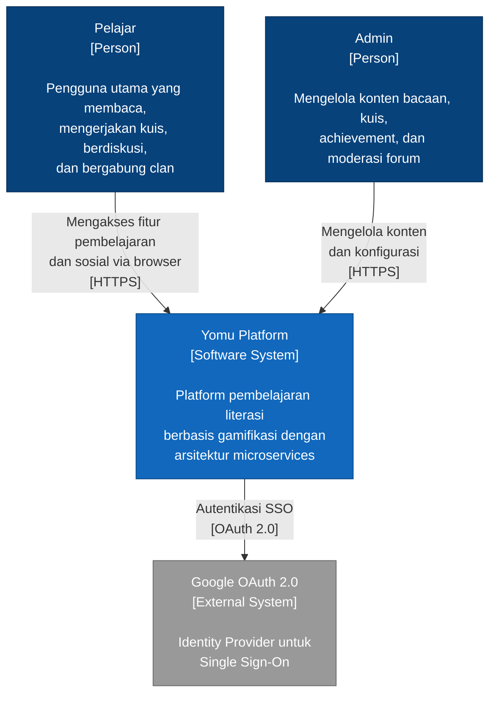
```mermaid
flowchart TD
    PELAJAR["Pelajar\n[Person]\n\nPengguna utama yang membaca,\nmengerjakan kuis, berdiskusi,\ndan bergabung clan"]

    ADMIN["Admin\n[Person]\n\nMengelola konten bacaan, kuis,\nachievement, dan moderasi forum"]

    YOMU["Yomu Platform\n[Software System]\n\nPlatform pembelajaran literasi\nberbasis gamifikasi dengan\narsitektur microservices"]

    GOOGLE["Google OAuth 2.0\n[External System]\n\nIdentity Provider untuk\nSingle Sign-On"]

    PELAJAR -->|"Mengakses fitur pembelajaran\ndan sosial via browser\n[HTTPS]"| YOMU
    ADMIN -->|"Mengelola konten\ndan konfigurasi\n[HTTPS]"| YOMU
    YOMU -->|"Autentikasi SSO\n[OAuth 2.0]"| GOOGLE

    style YOMU fill:#1168BD,stroke:#0B4884,color:#FFFFFF
    style PELAJAR fill:#08427B,stroke:#052E56,color:#FFFFFF
    style ADMIN fill:#08427B,stroke:#052E56,color:#FFFFFF
    style GOOGLE fill:#999999,stroke:#6B6B6B,color:#FFFFFF
```

---

### 📐 Container Diagram (C4 Level 2)

> **Scope**: Sistem Yomu secara internal.
> **Primary elements**: Container (aplikasi, data store, message broker) di dalam Yomu.
> **Supporting elements**: Aktor dan sistem eksternal yang terhubung.
> **Intended audience**: Tim teknis — software architect, developer, ops.
>
> *(Ref: C4 Model — Container Diagram, Module 09 hal. 117-118)*
> *Catatan: "Container" di C4 bukan Docker container, melainkan unit yang berjalan terpisah (aplikasi, database, message broker, dsb.)*

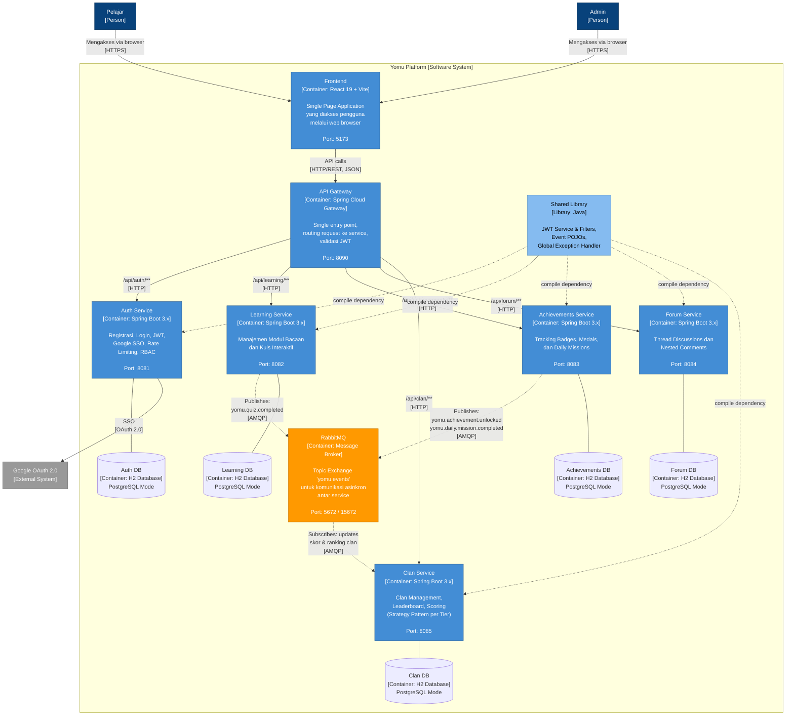
```mermaid
flowchart TD
    PELAJAR["Pelajar\n[Person]"]
    ADMIN["Admin\n[Person]"]

    subgraph boundary["Yomu Platform [Software System]"]
        direction TB

        FE["Frontend\n[Container: React 19 + Vite]\n\nSingle Page Application\nyang diakses pengguna\nmelalui web browser\n\nPort: 5173"]

        GW["API Gateway\n[Container: Spring Cloud Gateway]\n\nSingle entry point,\nrouting request ke service,\nvalidasi JWT\n\nPort: 8090"]

        AUTH["Auth Service\n[Container: Spring Boot 3.x]\n\nRegistrasi, Login, JWT,\nGoogle SSO, Rate Limiting, RBAC\n\nPort: 8081"]

        LEARN["Learning Service\n[Container: Spring Boot 3.x]\n\nManajemen Modul Bacaan\ndan Kuis Interaktif\n\nPort: 8082"]

        ACHIEV["Achievements Service\n[Container: Spring Boot 3.x]\n\nTracking Badges, Medals,\ndan Daily Missions\n\nPort: 8083"]

        FORUM["Forum Service\n[Container: Spring Boot 3.x]\n\nThread Discussions dan\nNested Comments\n\nPort: 8084"]

        CLAN["Clan Service\n[Container: Spring Boot 3.x]\n\nClan Management,\nLeaderboard, Scoring\n(Strategy Pattern per Tier)\n\nPort: 8085"]

        MQ["RabbitMQ\n[Container: Message Broker]\n\nTopic Exchange 'yomu.events'\nuntuk komunikasi asinkron\nantar service\n\nPort: 5672 / 15672"]

        DB_A[("Auth DB\n[Container: H2 Database]\nPostgreSQL Mode")]
        DB_L[("Learning DB\n[Container: H2 Database]\nPostgreSQL Mode")]
        DB_AC[("Achievements DB\n[Container: H2 Database]\nPostgreSQL Mode")]
        DB_F[("Forum DB\n[Container: H2 Database]\nPostgreSQL Mode")]
        DB_C[("Clan DB\n[Container: H2 Database]\nPostgreSQL Mode")]

        SHARED["Shared Library\n[Library: Java]\n\nJWT Service & Filters,\nEvent POJOs,\nGlobal Exception Handler"]
    end

    GOOGLE["Google OAuth 2.0\n[External System]"]

    %% User → Frontend
    PELAJAR -->|"Mengakses via browser\n[HTTPS]"| FE
    ADMIN -->|"Mengakses via browser\n[HTTPS]"| FE

    %% Frontend → Gateway
    FE -->|"API calls\n[HTTP/REST, JSON]"| GW

    %% Gateway → Services (Synchronous REST)
    GW -->|"/api/auth/**\n[HTTP]"| AUTH
    GW -->|"/api/learning/**\n[HTTP]"| LEARN
    GW -->|"/api/achievements/**\n[HTTP]"| ACHIEV
    GW -->|"/api/forum/**\n[HTTP]"| FORUM
    GW -->|"/api/clan/**\n[HTTP]"| CLAN

    %% Asynchronous Events via RabbitMQ
    LEARN -.->|"Publishes:\nyomu.quiz.completed\n[AMQP]"| MQ
    ACHIEV -.->|"Publishes:\nyomu.achievement.unlocked\nyomu.daily.mission.completed\n[AMQP]"| MQ
    MQ -.->|"Subscribes: updates\nskor & ranking clan\n[AMQP]"| CLAN

    %% Database per Service
    AUTH --- DB_A
    LEARN --- DB_L
    ACHIEV --- DB_AC
    FORUM --- DB_F
    CLAN --- DB_C

    %% External System
    AUTH -->|"SSO\n[OAuth 2.0]"| GOOGLE

    %% Shared Library (compile-time dependency)
    SHARED -.->|"compile dependency"| AUTH
    SHARED -.->|"compile dependency"| LEARN
    SHARED -.->|"compile dependency"| ACHIEV
    SHARED -.->|"compile dependency"| FORUM
    SHARED -.->|"compile dependency"| CLAN

    %% Styling
    style FE fill:#438DD5,stroke:#2E6295,color:#FFFFFF
    style GW fill:#438DD5,stroke:#2E6295,color:#FFFFFF
    style AUTH fill:#438DD5,stroke:#2E6295,color:#FFFFFF
    style LEARN fill:#438DD5,stroke:#2E6295,color:#FFFFFF
    style ACHIEV fill:#438DD5,stroke:#2E6295,color:#FFFFFF
    style FORUM fill:#438DD5,stroke:#2E6295,color:#FFFFFF
    style CLAN fill:#438DD5,stroke:#2E6295,color:#FFFFFF
    style MQ fill:#FF9900,stroke:#CC7A00,color:#FFFFFF
    style SHARED fill:#85BBF0,stroke:#5D95C4,color:#000000
    style GOOGLE fill:#999999,stroke:#6B6B6B,color:#FFFFFF
    style PELAJAR fill:#08427B,stroke:#052E56,color:#FFFFFF
    style ADMIN fill:#08427B,stroke:#052E56,color:#FFFFFF
```

**Keterangan:**
- **Garis solid (→)**: Komunikasi sinkron — REST over HTTP
- **Garis putus-putus (-.->)**: Komunikasi asinkron — Event via RabbitMQ (AMQP), atau compile dependency
- Setiap service memiliki **database H2 terpisah** sesuai prinsip *Database-per-Service*
- **Shared Library** adalah *compile-time dependency*, bukan runtime service

---

### 📐 Deployment Diagram

> **Scope**: Lingkungan deployment (development/staging).
> **Primary elements**: Deployment nodes, container instances.
> **Supporting elements**: Infrastructure nodes (Docker network).
> **Intended audience**: Tim teknis — architect, developer, ops.
>
> *(Ref: C4 Model — Deployment Diagram, Module 09 hal. 122)*

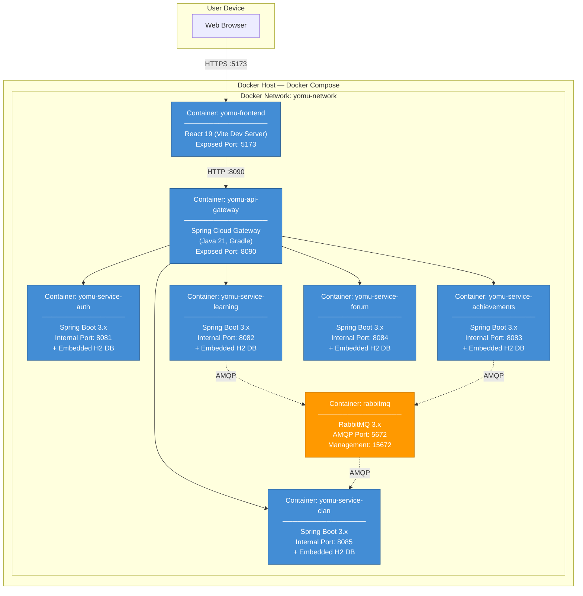
```mermaid
flowchart TD
    subgraph DEVICE["User Device"]
        BROWSER["Web Browser"]
    end

    subgraph DOCKER["Docker Host — Docker Compose"]
        subgraph NETWORK["Docker Network: yomu-network"]

            FE_NODE["Container: yomu-frontend\n─────────────────\nReact 19 (Vite Dev Server)\nExposed Port: 5173"]

            GW_NODE["Container: yomu-api-gateway\n─────────────────\nSpring Cloud Gateway\n(Java 21, Gradle)\nExposed Port: 8090"]

            AUTH_NODE["Container: yomu-service-auth\n─────────────────\nSpring Boot 3.x\nInternal Port: 8081\n+ Embedded H2 DB"]

            LEARN_NODE["Container: yomu-service-learning\n─────────────────\nSpring Boot 3.x\nInternal Port: 8082\n+ Embedded H2 DB"]

            ACHIEV_NODE["Container: yomu-service-achievements\n─────────────────\nSpring Boot 3.x\nInternal Port: 8083\n+ Embedded H2 DB"]

            FORUM_NODE["Container: yomu-service-forum\n─────────────────\nSpring Boot 3.x\nInternal Port: 8084\n+ Embedded H2 DB"]

            CLAN_NODE["Container: yomu-service-clan\n─────────────────\nSpring Boot 3.x\nInternal Port: 8085\n+ Embedded H2 DB"]

            MQ_NODE["Container: rabbitmq\n─────────────────\nRabbitMQ 3.x\nAMQP Port: 5672\nManagement: 15672"]
        end
    end

    BROWSER -->|"HTTPS :5173"| FE_NODE
    FE_NODE -->|"HTTP :8090"| GW_NODE
    GW_NODE --> AUTH_NODE
    GW_NODE --> LEARN_NODE
    GW_NODE --> ACHIEV_NODE
    GW_NODE --> FORUM_NODE
    GW_NODE --> CLAN_NODE
    LEARN_NODE -.->|"AMQP"| MQ_NODE
    ACHIEV_NODE -.->|"AMQP"| MQ_NODE
    MQ_NODE -.->|"AMQP"| CLAN_NODE

    style FE_NODE fill:#438DD5,stroke:#2E6295,color:#FFFFFF
    style GW_NODE fill:#438DD5,stroke:#2E6295,color:#FFFFFF
    style AUTH_NODE fill:#438DD5,stroke:#2E6295,color:#FFFFFF
    style LEARN_NODE fill:#438DD5,stroke:#2E6295,color:#FFFFFF
    style ACHIEV_NODE fill:#438DD5,stroke:#2E6295,color:#FFFFFF
    style FORUM_NODE fill:#438DD5,stroke:#2E6295,color:#FFFFFF
    style CLAN_NODE fill:#438DD5,stroke:#2E6295,color:#FFFFFF
    style MQ_NODE fill:#FF9900,stroke:#CC7A00,color:#FFFFFF
```

**Catatan Deployment:**
- Semua service berjalan dalam **satu Docker Compose** pada satu host
- Service backend **tidak di-expose** ke luar — hanya dapat diakses melalui API Gateway
- H2 database berjalan **embedded** di dalam proses setiap service (bukan container terpisah)
- Komunikasi antar container menggunakan **Docker internal network**


## 🔮 Arsitektur Masa Depan (Setelah Risk Storming)

### Skenario: Yomu Mengalami Kesuksesan Besar

Bayangkan Yomu telah berhasil diluncurkan dan mendapat adopsi massal dari sekolah-sekolah dan institusi pendidikan di seluruh Indonesia. Jumlah pengguna melonjak dari ratusan menjadi **ratusan ribu pengguna aktif harian**. Pada kondisi ini, kami menganalisis risiko arsitektur saat ini menggunakan teknik **Risk Storming** (ref: Module 09, Chapter 8 — *Analysing Architectural Risk*).

---

### 📊 Risk Matrix

Kami menggunakan **Architecture Risk Matrix** (ref: Module 09, Figure 20-1) dengan dua dimensi:
- **Overall Impact of Risk**: Low (1), Medium (2), High (3)
- **Likelihood of Risk Occurring**: Low (1), Medium (2), High (3)

Nilai risiko = **Impact × Likelihood**. Klasifikasi: 🟢 Low (1-2), 🟡 Medium (3-4), 🔴 High (6-9).

```
                    Likelihood of Risk Occurring
                    Low (1)     Medium (2)     High (3)
                 ┌──────────┬────────────┬────────────┐
    Low (1)      │  1 🟢    │   2 🟢     │   3 🟡     │
Impact           ├──────────┼────────────┼────────────┤
    Medium (2)   │  2 🟢    │   4 🟡     │   6 🔴     │
                 ├──────────┼────────────┼────────────┤
    High (3)     │  3 🟡    │   6 🔴     │   9 🔴     │
                 └──────────┴────────────┴────────────┘
```

---

### 🌪️ Risk Storming — Tahap 1: Identification (Individual, Non-Collaborative)

> *"Risk storming is a collaborative exercise used to determine architectural risk within a specific dimension."*
> — Module 09, hal. 99

Setiap anggota tim secara **individual** (tanpa diskusi) menganalisis arsitektur saat ini dan menempatkan "Post-it notes" virtual berwarna di area arsitektur yang dianggap berisiko. Dimensi risiko yang dianalisis: **availability, scalability, data integrity, dan security**.

Hasil identifikasi individual:

| Area Arsitektur | Anggota | Dimensi | Impact | Likelihood | Risk Score | Level |
|:---|:---|:---|:---:|:---:|:---:|:---:|
| H2 Database (semua service) | Tirta | Data Integrity | 3 (High) | 3 (High) | **9** | 🔴 High |
| H2 Database (semua service) | Adella | Availability | 3 (High) | 3 (High) | **9** | 🔴 High |
| H2 Database (semua service) | Nathanael | Scalability | 3 (High) | 2 (Medium) | **6** | 🔴 High |
| API Gateway (single instance) | Yosua | Availability | 3 (High) | 2 (Medium) | **6** | 🔴 High |
| API Gateway (no circuit breaker) | Ali | Availability | 3 (High) | 2 (Medium) | **6** | 🔴 High |
| RabbitMQ (no DLQ) | Tirta | Data Integrity | 2 (Medium) | 2 (Medium) | **4** | 🟡 Medium |
| RabbitMQ (no DLQ) | Yosua | Availability | 2 (Medium) | 2 (Medium) | **4** | 🟡 Medium |
| Frontend-Backend CORS | Nathanael | Security | 2 (Medium) | 3 (High) | **6** | 🔴 High |
| No Monitoring/Health Check | Ali | Availability | 2 (Medium) | 3 (High) | **6** | 🔴 High |
| Non-idempotent Event Handlers | Adella | Data Integrity | 2 (Medium) | 2 (Medium) | **4** | 🟡 Medium |
| Shared Library coupling | Nathanael | Scalability | 1 (Low) | 2 (Medium) | **2** | 🟢 Low |

---

### 🤝 Risk Storming — Tahap 2: Consensus (Collaborative)

> *"The goal of this activity is to analyze the risk areas as a team and gain consensus in terms of the risk qualification."*
> — Module 09, hal. 102

Seluruh anggota tim berkumpul dan menempelkan "Post-it notes" mereka pada diagram arsitektur. Berikut hasil konsensus setelah diskusi:

**1. H2 Database — Semua sepakat: 🔴 HIGH RISK (9)**
Tiga anggota secara independen mengidentifikasi H2 sebagai area risiko tertinggi. H2 adalah database in-memory/embedded yang **kehilangan seluruh data saat restart**. Dalam skenario ratusan ribu pengguna, data achievement, progress belajar, dan histori clan yang hilang akan berdampak fatal. Semua anggota sepakat bahwa baik impact maupun likelihood sama-sama tinggi karena Docker container secara natural akan restart saat update atau scaling.

**2. API Gateway (Single Point of Failure) — Konsensus: 🔴 HIGH RISK (6)**
Dua anggota mengidentifikasi API Gateway sebagai risiko tinggi. Yosua menjelaskan bahwa jika API Gateway down, **seluruh sistem tidak dapat diakses** (impact = 3). Ali menambahkan bahwa tanpa circuit breaker, satu service yang lambat/down bisa menyebabkan *cascading failure* yang menjatuhkan gateway. Setelah diskusi, semua sepakat likelihood = 2 (medium) karena Spring Cloud Gateway cukup stabil, tapi impact-nya sangat tinggi.

**3. Frontend-Backend CORS — Konsensus: 🔴 HIGH RISK (6)**
Nathanael mengidentifikasi masalah ini berdasarkan pengalaman langsung tim (terlihat dari chat bahwa frontend tidak bisa berkomunikasi dengan backend). Setelah diskusi, tim sepakat ini lebih merupakan masalah konfigurasi yang bisa diperbaiki di level gateway — bukan risiko arsitektural fundamental. Namun, **jika tidak ditangani dengan konfigurasi terpusat**, masalah ini akan terus berulang saat service baru ditambahkan.

**4. Tidak Ada Monitoring — Konsensus: 🔴 HIGH RISK (6)**
Ali menjelaskan bahwa tanpa health check dan monitoring, tim **baru menyadari ada masalah ketika pengguna sudah terdampak**. Dalam arsitektur microservices dengan 6+ service, ketiadaan observability membuat debugging sangat sulit. Semua sepakat.

**5. RabbitMQ tanpa DLQ — Konsensus: 🟡 MEDIUM RISK (4)**
Dua anggota mengidentifikasi ini secara independen. Tanpa Dead Letter Queue, event yang gagal diproses (misalnya `QuizCompletedEvent` yang gagal diproses oleh Clan Service) akan **hilang tanpa jejak**. Tim sepakat dampaknya medium karena data utama tidak hilang (hanya derived data seperti skor clan yang tidak terupdate).

**6. Non-idempotent Event Handlers — Konsensus: 🟡 MEDIUM RISK (4)**
Adella menjelaskan bahwa jika terjadi duplikasi pesan (umum di sistem distributed), event bisa diproses lebih dari sekali — menyebabkan achievement ter-trigger ganda atau skor clan dihitung dua kali. Tim sepakat ini medium karena likelihood-nya bergantung pada konfigurasi RabbitMQ.

**7. Shared Library Coupling — Konsensus: 🟢 LOW RISK (2)**
Hanya satu anggota yang mengidentifikasi ini. Setelah diskusi, tim sepakat bahwa shared library hanya berisi contracts (DTO, event POJO) yang jarang berubah, sehingga risiko coupling rendah.

---

### 🛠️ Risk Storming — Tahap 3: Mitigation (Collaborative)

> *"Mitigating risk within an architecture usually involves changes or enhancements to certain areas that otherwise might have been deemed perfect."*
> — Module 09, hal. 104

Berdasarkan konsensus, tim merancang mitigasi untuk setiap risiko:

| Risk Area | Score | Mitigasi | Cost/Effort |
|:---|:---:|:---|:---:|
| H2 Database | 9 🔴 | **Migrasi ke PostgreSQL** — satu instance PostgreSQL per service, berjalan sebagai Docker container terpisah. H2 sudah berjalan dalam PostgreSQL compatibility mode sehingga migrasi relatif smooth. | Medium |
| API Gateway SPOF | 6 🔴 | **Tambah Circuit Breaker (Resilience4j)** di gateway level. Jika sebuah service tidak merespons dalam batas waktu, circuit breaker membuka sirkuit dan mengembalikan fallback response. | Low |
| CORS Issue | 6 🔴 | **Pusatkan konfigurasi CORS di API Gateway**. Semua allowed origins, methods, headers dikonfigurasi di satu tempat (gateway), bukan tersebar di setiap service. | Low |
| No Monitoring | 6 🔴 | **Tambah Spring Actuator + Prometheus + Grafana**. Setiap service mengekspos `/actuator/health` dan `/actuator/prometheus`. Prometheus meng-scrape metrics, Grafana memvisualisasikan dan mengirim alert. | Medium |
| RabbitMQ no DLQ | 4 🟡 | **Tambah Dead Letter Queue + Retry Policy**. Event yang gagal diproses masuk DLQ untuk di-inspect dan di-retry (otomatis atau manual). | Low |
| Non-idempotent Handlers | 4 🟡 | **Implementasi idempotent consumers**. Setiap event diberi unique ID; consumer menyimpan log event ID yang sudah diproses untuk mencegah double processing. | Low |

---

### 📐 Context Diagram Baru (Setelah Mitigasi)

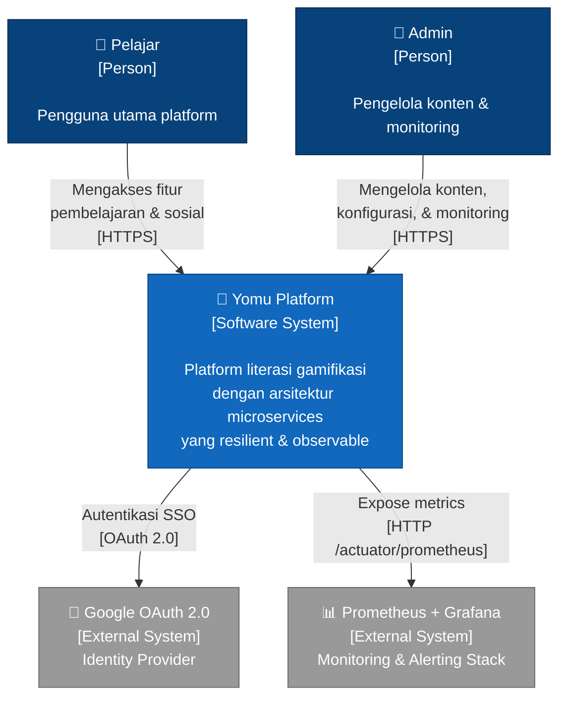
```mermaid
flowchart TD
    PELAJAR["👤 Pelajar\n[Person]\n\nPengguna utama platform"]
    ADMIN["👤 Admin\n[Person]\n\nPengelola konten & monitoring"]

    YOMU["📖 Yomu Platform\n[Software System]\n\nPlatform literasi gamifikasi\ndengan arsitektur microservices\nyang resilient & observable"]

    GOOGLE["🔗 Google OAuth 2.0\n[External System]\nIdentity Provider"]

    PROMETHEUS["📊 Prometheus + Grafana\n[External System]\nMonitoring & Alerting Stack"]

    PELAJAR -->|"Mengakses fitur\npembelajaran & sosial\n[HTTPS]"| YOMU
    ADMIN -->|"Mengelola konten,\nkonfigurasi, & monitoring\n[HTTPS]"| YOMU
    YOMU -->|"Autentikasi SSO\n[OAuth 2.0]"| GOOGLE
    YOMU -->|"Expose metrics\n[HTTP /actuator/prometheus]"| PROMETHEUS

    style YOMU fill:#1168BD,stroke:#0B4884,color:#FFFFFF
    style PELAJAR fill:#08427B,stroke:#052E56,color:#FFFFFF
    style ADMIN fill:#08427B,stroke:#052E56,color:#FFFFFF
    style GOOGLE fill:#999999,stroke:#6B6B6B,color:#FFFFFF
    style PROMETHEUS fill:#999999,stroke:#6B6B6B,color:#FFFFFF
```

---

### 📐 Container Diagram Baru (Setelah Mitigasi)

Perubahan ditandai dengan label **[NEW]** atau **[UPGRADED]**.

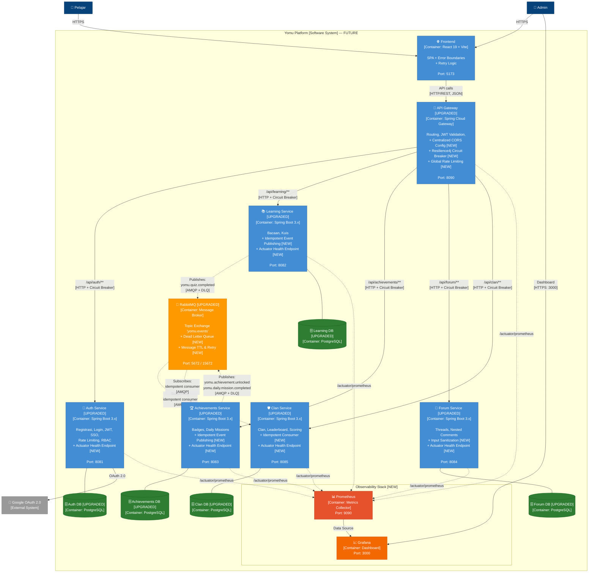
```mermaid
flowchart TD
    PELAJAR["👤 Pelajar"]
    ADMIN["👤 Admin"]

    subgraph boundary["Yomu Platform [Software System] — FUTURE"]
        direction TB

        FE["🌐 Frontend\n[Container: React 19 + Vite]\n\nSPA + Error Boundaries\n+ Retry Logic\n\nPort: 5173"]

        GW["🚪 API Gateway [UPGRADED]\n[Container: Spring Cloud Gateway]\n\nRouting, JWT Validation,\n+ Centralized CORS Config [NEW]\n+ Resilience4j Circuit Breaker [NEW]\n+ Global Rate Limiting [NEW]\n\nPort: 8090"]

        AUTH["🔐 Auth Service [UPGRADED]\n[Container: Spring Boot 3.x]\n\nRegistrasi, Login, JWT, SSO,\nRate Limiting, RBAC\n+ Actuator Health Endpoint [NEW]\n\nPort: 8081"]

        LEARN["📚 Learning Service [UPGRADED]\n[Container: Spring Boot 3.x]\n\nBacaan, Kuis\n+ Idempotent Event Publishing [NEW]\n+ Actuator Health Endpoint [NEW]\n\nPort: 8082"]

        ACHIEV["🏆 Achievements Service [UPGRADED]\n[Container: Spring Boot 3.x]\n\nBadges, Daily Missions\n+ Idempotent Event Publishing [NEW]\n+ Actuator Health Endpoint [NEW]\n\nPort: 8083"]

        FORUM["💬 Forum Service [UPGRADED]\n[Container: Spring Boot 3.x]\n\nThreads, Nested Comments\n+ Input Sanitization [NEW]\n+ Actuator Health Endpoint [NEW]\n\nPort: 8084"]

        CLAN["🛡️ Clan Service [UPGRADED]\n[Container: Spring Boot 3.x]\n\nClan, Leaderboard, Scoring\n+ Idempotent Consumer [NEW]\n+ Actuator Health Endpoint [NEW]\n\nPort: 8085"]

        MQ["📨 RabbitMQ [UPGRADED]\n[Container: Message Broker]\n\nTopic Exchange 'yomu.events'\n+ Dead Letter Queue [NEW]\n+ Message TTL & Retry [NEW]\n\nPort: 5672 / 15672"]

        DB_A[("🗄️ Auth DB [UPGRADED]\n[Container: PostgreSQL]")]
        DB_L[("🗄️ Learning DB [UPGRADED]\n[Container: PostgreSQL]")]
        DB_AC[("🗄️ Achievements DB [UPGRADED]\n[Container: PostgreSQL]")]
        DB_F[("🗄️ Forum DB [UPGRADED]\n[Container: PostgreSQL]")]
        DB_C[("🗄️ Clan DB [UPGRADED]\n[Container: PostgreSQL]")]

        subgraph observability["Observability Stack [NEW]"]
            PROM["📊 Prometheus\n[Container: Metrics Collector]\nPort: 9090"]
            GRAF["📈 Grafana\n[Container: Dashboard]\nPort: 3000"]
        end
    end

    GOOGLE["🔗 Google OAuth 2.0\n[External System]"]

    %% User → Frontend
    PELAJAR -->|"HTTPS"| FE
    ADMIN -->|"HTTPS"| FE
    ADMIN -->|"Dashboard\n[HTTPS :3000]"| GRAF

    %% Frontend → Gateway
    FE -->|"API calls\n[HTTP/REST, JSON]"| GW

    %% Gateway → Services (with Circuit Breaker)
    GW -->|"/api/auth/**\n[HTTP + Circuit Breaker]"| AUTH
    GW -->|"/api/learning/**\n[HTTP + Circuit Breaker]"| LEARN
    GW -->|"/api/achievements/**\n[HTTP + Circuit Breaker]"| ACHIEV
    GW -->|"/api/forum/**\n[HTTP + Circuit Breaker]"| FORUM
    GW -->|"/api/clan/**\n[HTTP + Circuit Breaker]"| CLAN

    %% Async Events (with DLQ & Retry)
    LEARN -.->|"Publishes:\nyomu.quiz.completed\n[AMQP + DLQ]"| MQ
    ACHIEV -.->|"Publishes:\nyomu.achievement.unlocked\nyomu.daily.mission.completed\n[AMQP + DLQ]"| MQ
    MQ -.->|"Subscribes:\nidempotent consumer\n[AMQP]"| CLAN
    MQ -.->|"Subscribes:\nidempotent consumer\n[AMQP]"| ACHIEV

    %% Database — NOW PostgreSQL
    AUTH --- DB_A
    LEARN --- DB_L
    ACHIEV --- DB_AC
    FORUM --- DB_F
    CLAN --- DB_C

    %% External
    AUTH -->|"OAuth 2.0"| GOOGLE

    %% Observability
    AUTH -.->|"/actuator/prometheus"| PROM
    LEARN -.->|"/actuator/prometheus"| PROM
    ACHIEV -.->|"/actuator/prometheus"| PROM
    FORUM -.->|"/actuator/prometheus"| PROM
    CLAN -.->|"/actuator/prometheus"| PROM
    GW -.->|"/actuator/prometheus"| PROM
    PROM -->|"Data Source"| GRAF

    %% Styling
    style FE fill:#438DD5,stroke:#2E6295,color:#FFFFFF
    style GW fill:#438DD5,stroke:#2E6295,color:#FFFFFF
    style AUTH fill:#438DD5,stroke:#2E6295,color:#FFFFFF
    style LEARN fill:#438DD5,stroke:#2E6295,color:#FFFFFF
    style ACHIEV fill:#438DD5,stroke:#2E6295,color:#FFFFFF
    style FORUM fill:#438DD5,stroke:#2E6295,color:#FFFFFF
    style CLAN fill:#438DD5,stroke:#2E6295,color:#FFFFFF
    style MQ fill:#FF9900,stroke:#CC7A00,color:#FFFFFF
    style GOOGLE fill:#999999,stroke:#6B6B6B,color:#FFFFFF
    style PELAJAR fill:#08427B,stroke:#052E56,color:#FFFFFF
    style ADMIN fill:#08427B,stroke:#052E56,color:#FFFFFF
    style PROM fill:#E6522C,stroke:#B33F1F,color:#FFFFFF
    style GRAF fill:#F46800,stroke:#C45300,color:#FFFFFF
    style DB_A fill:#2E7D32,stroke:#1B5E20,color:#FFFFFF
    style DB_L fill:#2E7D32,stroke:#1B5E20,color:#FFFFFF
    style DB_AC fill:#2E7D32,stroke:#1B5E20,color:#FFFFFF
    style DB_F fill:#2E7D32,stroke:#1B5E20,color:#FFFFFF
    style DB_C fill:#2E7D32,stroke:#1B5E20,color:#FFFFFF
```

**Ringkasan Perubahan Arsitektur:**

| Komponen | Sebelum (Current) | Sesudah (Future) | Risk Score |
|:---|:---|:---|:---:|
| Database | H2 In-Memory (embedded) | PostgreSQL (dedicated container) | 9 → 2 |
| API Gateway | Routing + JWT saja | + Circuit Breaker + CORS + Rate Limiting | 6 → 2 |
| Monitoring | Tidak ada | Prometheus + Grafana + Actuator | 6 → 1 |
| Message Queue | RabbitMQ basic | + Dead Letter Queue + Retry Policy | 4 → 1 |
| Event Handling | Basic pub/sub | Idempotent consumers + event dedup | 4 → 1 |


## 📝 Penjelasan Risk Storming & Justifikasi Modifikasi Arsitektur

### Mengapa Risk Storming Diterapkan?

Risk Storming diterapkan karena, sebagaimana dinyatakan dalam Module 09 (ref: Chapter 8, hal. 99), **"No architect can single-handedly determine the overall risk of a system."** Alasan utamanya ada dua: pertama, seorang arsitektur mungkin melewatkan atau tidak melihat suatu area risiko; kedua, sangat jarang ada satu orang yang memiliki pengetahuan penuh terhadap seluruh bagian sistem. Dalam konteks tim Yomu yang terdiri dari 5 anggota dengan masing-masing bertanggung jawab atas satu modul microservice, setiap anggota memiliki pemahaman mendalam terhadap service-nya sendiri namun mungkin tidak memahami risiko interaksi antar service secara keseluruhan. Dengan Risk Storming, kami memanfaatkan perspektif kolektif seluruh anggota tim untuk mendapatkan gambaran risiko yang lebih lengkap dan akurat daripada analisis yang dilakukan oleh satu orang saja.

### Proses Risk Storming yang Diterapkan

Proses Risk Storming kami mengikuti tiga tahapan yang diajarkan dalam Module 09 (ref: hal. 99-105). **Tahap pertama — Identification** — adalah aktivitas **individual dan non-kolaboratif**. Setiap anggota tim secara mandiri menganalisis diagram arsitektur (Container Diagram dari Commit 1) dan mengklasifikasikan risiko menggunakan Risk Matrix (Impact × Likelihood) ke dalam kategori Low (1-2), Medium (3-4), atau High (6-9). Tahap non-kolaboratif ini **esensial** agar peserta tidak saling mempengaruhi atau mengalihkan perhatian dari area tertentu. Hasilnya, kami menemukan bahwa tiga anggota secara independen mengidentifikasi H2 Database sebagai risiko tertinggi (score 9), yang memvalidasi bahwa ini adalah area yang benar-benar kritis — bukan opini satu orang. Yang menarik, masalah seperti CORS dan ketiadaan monitoring hanya diidentifikasi oleh anggota yang pernah mengalami langsung masalah tersebut, menunjukkan betapa pentingnya keragaman perspektif dalam risk storming.

**Tahap kedua — Consensus** — adalah aktivitas **kolaboratif** di mana seluruh anggota tim berkumpul, masing-masing menempelkan "Post-it notes" virtual mereka pada diagram arsitektur, dan mendiskusikan perbedaan penilaian risiko. Tahap ini menghasilkan beberapa insight penting yang tidak muncul di tahap individual. Misalnya, analogi dengan contoh dalam Module 09 (ref: hal. 103) — di mana seorang peserta menilai Redis cache sebagai risiko tinggi karena ia tidak mengenal teknologi tersebut — kami menemukan bahwa anggota yang mengidentifikasi masalah CORS sebagai high risk melakukannya berdasarkan pengalaman langsung gagal menghubungkan frontend ke backend (terlihat dari log chat grup kami). Tanpa proses konsensus, anggota lain yang tidak mengalami masalah ini mungkin menganggapnya tidak penting. Setelah diskusi, semua anggota sepakat bahwa CORS memang perlu ditangani secara arsitektural (dipusatkan di API Gateway), bukan ad-hoc di setiap service.

**Tahap ketiga — Mitigation** — adalah tahap terpenting di mana tim secara kolaboratif merancang perubahan arsitektur untuk mengurangi atau menghilangkan risiko yang telah diidentifikasi. Sebagaimana dinyatakan dalam Module 09 (ref: hal. 104), mitigasi risiko biasanya melibatkan perubahan atau peningkatan pada area arsitektur yang sebelumnya dianggap sudah sempurna, dan perubahan ini biasanya menimbulkan biaya tambahan. Tim kami menerapkan prinsip ini dengan merancang mitigasi yang proporsional terhadap tingkat risiko: untuk risiko tertinggi (H2 Database, score 9), kami merencanakan migrasi ke PostgreSQL yang memerlukan effort medium namun menyelesaikan masalah data integrity secara fundamental; untuk risiko medium (RabbitMQ tanpa DLQ, non-idempotent handlers), kami merancang solusi dengan effort rendah seperti konfigurasi Dead Letter Queue dan penambahan event ID tracking. Pendekatan ini mencerminkan trade-off antara biaya mitigasi dan tingkat risiko, serupa dengan negosiasi antara arsitek dan stakeholder yang digambarkan dalam Module 09 (ref: hal. 105) — kami tidak mencoba menyelesaikan semua risiko sekaligus, tetapi memprioritaskan berdasarkan risk score dan feasibility implementasi.

---
## 🧑‍💻 Individual Works — Component & Code Diagrams (C4 Level 3 & 4)

> **Component Diagram** (C4 Level 3) — Scope: satu container. Menunjukkan komponen-komponen di dalam container, tanggung jawab masing-masing, dan detail teknologi/implementasi. Semua komponen di dalam satu container berjalan dalam *satu process space* dan bukan unit yang di-deploy terpisah.
>
> **Code Diagram** (C4 Level 4) — Scope: satu komponen. Menunjukkan elemen kode (class, interface, entity) di dalam komponen tersebut menggunakan UML class diagram.
>
> *(Ref: Module 09, hal. 119-120)*

---

---

### 👤 Tirta Rendy Siahaan — Achievement Service (Port 8083)

#### Component Diagram — Achievement Service

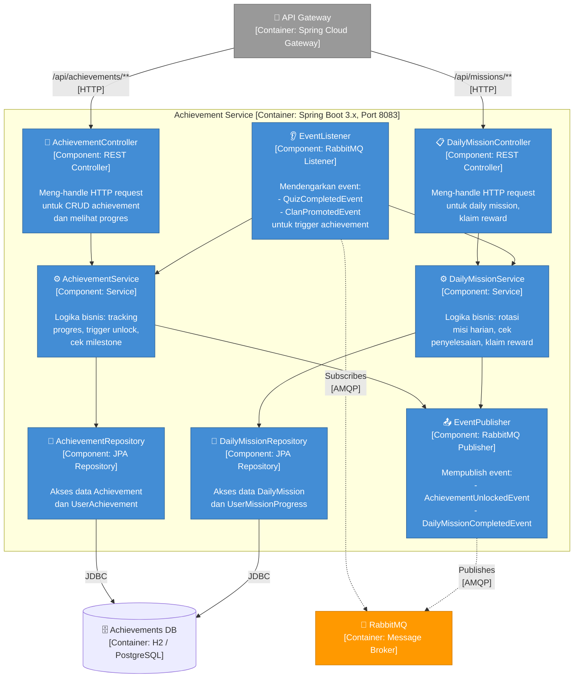
```mermaid
flowchart TD
    GW["🚪 API Gateway\n[Container: Spring Cloud Gateway]"]
    MQ["📨 RabbitMQ\n[Container: Message Broker]"]
    DB[("🗄️ Achievements DB\n[Container: H2 / PostgreSQL]")]

    subgraph ACHIEV["Achievement Service [Container: Spring Boot 3.x, Port 8083]"]
        direction TB

        AC["🎯 AchievementController\n[Component: REST Controller]\n\nMeng-handle HTTP request\nuntuk CRUD achievement\ndan melihat progres"]

        MC["📋 DailyMissionController\n[Component: REST Controller]\n\nMeng-handle HTTP request\nuntuk daily mission,\nklaim reward"]

        AS["⚙️ AchievementService\n[Component: Service]\n\nLogika bisnis: tracking\nprogres, trigger unlock,\ncek milestone"]

        MS["⚙️ DailyMissionService\n[Component: Service]\n\nLogika bisnis: rotasi\nmisi harian, cek\npenyelesaian, klaim reward"]

        AR["💾 AchievementRepository\n[Component: JPA Repository]\n\nAkses data Achievement\ndan UserAchievement"]

        MR["💾 DailyMissionRepository\n[Component: JPA Repository]\n\nAkses data DailyMission\ndan UserMissionProgress"]

        EL["👂 EventListener\n[Component: RabbitMQ Listener]\n\nMendengarkan event:\n- QuizCompletedEvent\n- ClanPromotedEvent\nuntuk trigger achievement"]

        EP["📤 EventPublisher\n[Component: RabbitMQ Publisher]\n\nMempublish event:\n- AchievementUnlockedEvent\n- DailyMissionCompletedEvent"]
    end

    GW -->|"/api/achievements/**\n[HTTP]"| AC
    GW -->|"/api/missions/**\n[HTTP]"| MC

    AC --> AS
    MC --> MS

    AS --> AR
    AS --> EP
    MS --> MR
    MS --> EP

    EL -.->|"Subscribes\n[AMQP]"| MQ
    EP -.->|"Publishes\n[AMQP]"| MQ
    EL --> AS
    EL --> MS

    AR -->|"JDBC"| DB
    MR -->|"JDBC"| DB

    style AC fill:#438DD5,stroke:#2E6295,color:#FFFFFF
    style MC fill:#438DD5,stroke:#2E6295,color:#FFFFFF
    style AS fill:#438DD5,stroke:#2E6295,color:#FFFFFF
    style MS fill:#438DD5,stroke:#2E6295,color:#FFFFFF
    style AR fill:#438DD5,stroke:#2E6295,color:#FFFFFF
    style MR fill:#438DD5,stroke:#2E6295,color:#FFFFFF
    style EL fill:#438DD5,stroke:#2E6295,color:#FFFFFF
    style EP fill:#438DD5,stroke:#2E6295,color:#FFFFFF
    style GW fill:#999999,stroke:#6B6B6B,color:#FFFFFF
    style MQ fill:#FF9900,stroke:#CC7A00,color:#FFFFFF
```

#### Code Diagram 1 — Achievement Domain Model

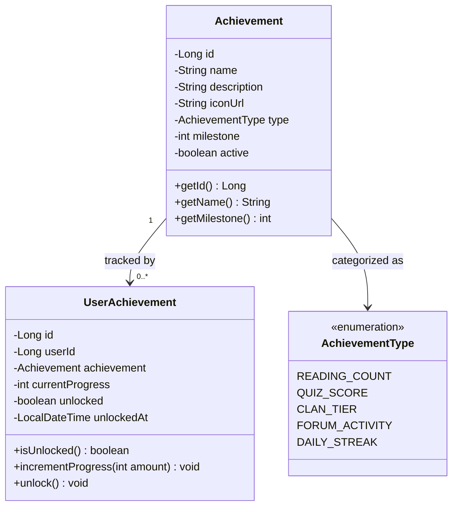
```mermaid
classDiagram
    class Achievement {
        -Long id
        -String name
        -String description
        -String iconUrl
        -AchievementType type
        -int milestone
        -boolean active
        +getId() Long
        +getName() String
        +getMilestone() int
    }

    class UserAchievement {
        -Long id
        -Long userId
        -Achievement achievement
        -int currentProgress
        -boolean unlocked
        -LocalDateTime unlockedAt
        +isUnlocked() boolean
        +incrementProgress(int amount) void
        +unlock() void
    }

    class AchievementType {
        <<enumeration>>
        READING_COUNT
        QUIZ_SCORE
        CLAN_TIER
        FORUM_ACTIVITY
        DAILY_STREAK
    }

    Achievement "1" --> "0..*" UserAchievement : tracked by
    Achievement --> AchievementType : categorized as
```

#### Code Diagram 2 — Daily Mission Domain Model

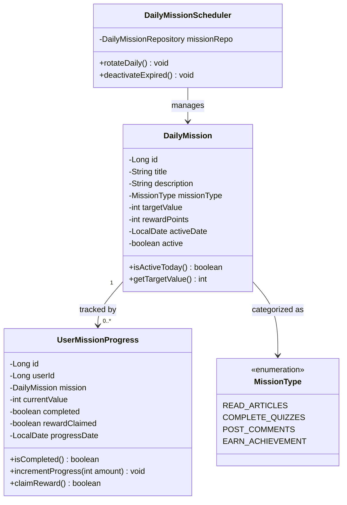
```mermaid
classDiagram
    class DailyMission {
        -Long id
        -String title
        -String description
        -MissionType missionType
        -int targetValue
        -int rewardPoints
        -LocalDate activeDate
        -boolean active
        +isActiveToday() boolean
        +getTargetValue() int
    }

    class UserMissionProgress {
        -Long id
        -Long userId
        -DailyMission mission
        -int currentValue
        -boolean completed
        -boolean rewardClaimed
        -LocalDate progressDate
        +isCompleted() boolean
        +incrementProgress(int amount) void
        +claimReward() boolean
    }

    class MissionType {
        <<enumeration>>
        READ_ARTICLES
        COMPLETE_QUIZZES
        POST_COMMENTS
        EARN_ACHIEVEMENT
    }

    class DailyMissionScheduler {
        -DailyMissionRepository missionRepo
        +rotateDaily() void
        +deactivateExpired() void
    }

    DailyMission "1" --> "0..*" UserMissionProgress : tracked by
    DailyMission --> MissionType : categorized as
    DailyMissionScheduler --> DailyMission : manages
```

#### Code Diagram 3 — Achievement Event Listener

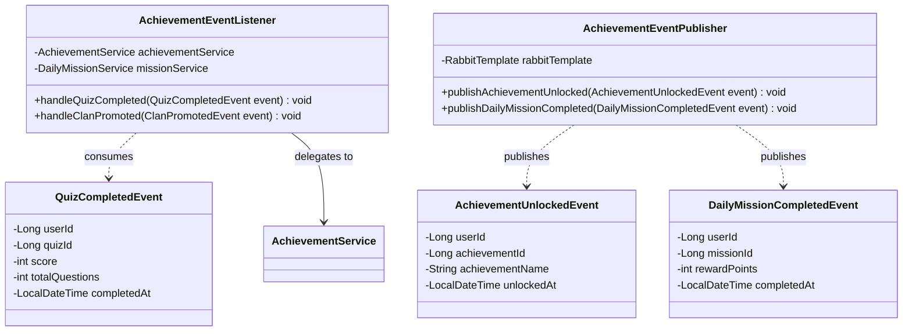
```mermaid
classDiagram
    class AchievementEventListener {
        -AchievementService achievementService
        -DailyMissionService missionService
        +handleQuizCompleted(QuizCompletedEvent event) void
        +handleClanPromoted(ClanPromotedEvent event) void
    }

    class AchievementEventPublisher {
        -RabbitTemplate rabbitTemplate
        +publishAchievementUnlocked(AchievementUnlockedEvent event) void
        +publishDailyMissionCompleted(DailyMissionCompletedEvent event) void
    }

    class QuizCompletedEvent {
        -Long userId
        -Long quizId
        -int score
        -int totalQuestions
        -LocalDateTime completedAt
    }

    class AchievementUnlockedEvent {
        -Long userId
        -Long achievementId
        -String achievementName
        -LocalDateTime unlockedAt
    }

    class DailyMissionCompletedEvent {
        -Long userId
        -Long missionId
        -int rewardPoints
        -LocalDateTime completedAt
    }

    AchievementEventListener ..> QuizCompletedEvent : consumes
    AchievementEventListener --> AchievementService : delegates to
    AchievementEventPublisher ..> AchievementUnlockedEvent : publishes
    AchievementEventPublisher ..> DailyMissionCompletedEvent : publishes
```

---

---
*Dibuat oleh Tim Yomu — Kelompok A15, Advanced Programming 2026*
*Referensi utama: Module 09 — Software Architectures (Ade Azurat, Fasilkom UI)*

---

### 👤 Christna Yosua Rotinsulu — Auth Service & API Gateway

Dalam pengembangan Yomu-App, saya bertanggung jawab penuh atas dua komponen kritikal yang menjaga integritas dan keamanan seluruh ekosistem: **API Gateway (`api-gateway`)** dan **Auth Service (`service-auth`)**. API Gateway berperan sebagai benteng terdepan (*first line of defense*) yang mengatur arus lalu lintas permintaan, sedangkan Auth Service adalah otak di balik manajemen identitas dan hak akses pengguna.

#### 🏗️ Container Diagram — Aliran Autentikasi & Keamanan

Diagram berikut menggambarkan bagaimana saya merancang interaksi sistem saat pengguna mencoba mengakses data sensitif. Permintaan dari *Frontend* tidak pernah langsung menyentuh *Microservice* internal; semuanya harus melewati filter ketat di API Gateway yang saya kembangkan.

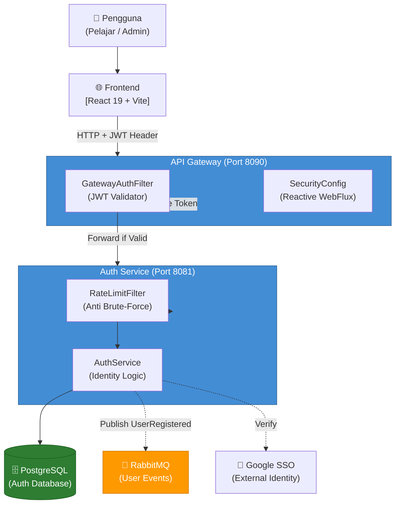
```mermaid
flowchart TD
    PELAJAR["👤 Pengguna\n(Pelajar / Admin)"]
    FE["🌐 Frontend\n[React 19 + Vite]"]

    subgraph GW["API Gateway (Port 8090)"]
        direction TB
        G_FILTER["GatewayAuthFilter\n(JWT Validator)"]
        G_SEC["SecurityConfig\n(Reactive WebFlux)"]
    end

    subgraph AUTH["Auth Service (Port 8081)"]
        direction TB
        A_RATE["RateLimitFilter\n(Anti Brute-Force)"]
        A_CORE["AuthService\n(Identity Logic)"]
    end
    
    DB_A[("🗄️ PostgreSQL\n(Auth Database)")]
    MQ["📨 RabbitMQ\n(User Events)"]
    GOOGLE["🔗 Google SSO\n(External Identity)"]

    PELAJAR --> FE
    FE -->|"HTTP + JWT Header"| GW
    GW -->|"Validate Token"| G_FILTER
    G_FILTER -->|"Forward if Valid"| AUTH
    AUTH --> A_RATE
    A_RATE --> A_CORE
    A_CORE --> DB_A
    A_CORE -.->|"Publish UserRegistered"| MQ
    A_CORE -.->|"Verify"| GOOGLE

    style GW fill:#438DD5,stroke:#2E6295,color:#FFFFFF
    style AUTH fill:#438DD5,stroke:#2E6295,color:#FFFFFF
    style DB_A fill:#2E7D32,stroke:#1B5E20,color:#FFFFFF
    style MQ fill:#FF9900,stroke:#CC7A00,color:#FFFFFF
```

#### 🧩 Component Diagram — Arsitektur Internal

Saya memecah tanggung jawab di setiap layanan menggunakan prinsip *Clean Architecture*. Di **API Gateway**, saya mengimplementasikan konfigurasi rute yang dinamis. Di **Auth Service**, saya menerapkan perlindungan berlapis, mulai dari filter keamanan hingga logika bisnis yang terisolasi.

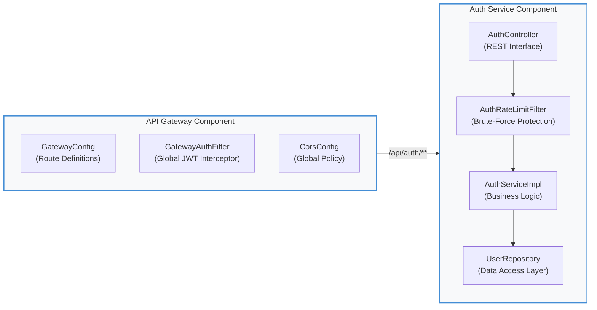
```mermaid
flowchart LR
    subgraph GATEWAY["API Gateway Component"]
        direction TB
        R1["GatewayConfig\n(Route Definitions)"]
        R2["GatewayAuthFilter\n(Global JWT Interceptor)"]
        R3["CorsConfig\n(Global Policy)"]
    end

    subgraph AUTH_COMP["Auth Service Component"]
        direction TB
        C1["AuthController\n(REST Interface)"]
        C2["AuthRateLimitFilter\n(Brute-Force Protection)"]
        C3["AuthServiceImpl\n(Business Logic)"]
        C4["UserRepository\n(Data Access Layer)"]
    end

    GATEWAY -->|"/api/auth/**"| AUTH_COMP
    C1 --> C2
    C2 --> C3
    C3 --> C4

    style GATEWAY fill:#f8f9fa,stroke:#438DD5,stroke-width:2px
    style AUTH_COMP fill:#f8f9fa,stroke:#438DD5,stroke-width:2px
```

#### 💻 Code Highlight & Logic Explanation

##### 1. Perlindungan Brute-Force di Auth Service
Saya menyadari bahwa keamanan akun pengguna sangat krusial. Oleh karena itu, saya mengimplementasikan `AuthRateLimitFilter` untuk membatasi jumlah permintaan login yang masuk dari alamat IP yang sama.

```java
// Contoh potongan kode AuthRateLimitFilter yang saya buat
String key = request.getRequestURI() + ":" + clientIp(request);
WindowCounter counter = counters.compute(key, (ignored, current) -> {
    long now = Instant.now().getEpochSecond();
    if (current == null || now - current.windowStartedAt() >= WINDOW_SECONDS) {
        return new WindowCounter(now, 1);
    }
    return new WindowCounter(current.windowStartedAt(), current.count() + 1);
});

if (counter.count() > MAX_REQUESTS_PER_WINDOW) {
    response.setStatus(HttpStatus.TOO_MANY_REQUESTS.value());
    return; // Request ditolak
}
```

##### 2. Gateway Authentication Filter
Di sisi Gateway, saya menciptakan `GatewayAuthFilter` yang mampu membedakan rute publik (seperti login/register) dan rute privat secara cerdas menggunakan `isPublicRequest` logic.

```java
// Cuplikan logika penanganan request publik yang saya rancang
private boolean isPublicRequest(ServerHttpRequest request) {
    String path = request.getURI().getPath();
    // Bypass autentikasi untuk endpoint tertentu
    if (path.equals("/api/auth/register") || path.equals("/api/auth/login")) {
        return true;
    }
    // Izinkan akses baca (GET) pada konten pembelajaran tanpa login
    return HttpMethod.GET.equals(request.getMethod()) && path.startsWith("/api/learning/bacaan");
}
```

#### 📊 Code Diagrams

##### Code Diagram 1: Auth Service Core Structure
Saya memisahkan antarmuka `AuthService` dengan implementasinya (`AuthServiceImpl`) untuk memudahkan pengujian unit (*Unit Testing*) dan menjaga fleksibilitas kode.

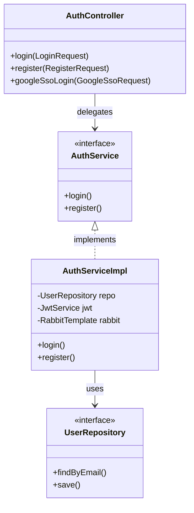
```mermaid
classDiagram
    class AuthController {
        +login(LoginRequest)
        +register(RegisterRequest)
        +googleSsoLogin(GoogleSsoRequest)
    }
    class AuthService {
        <<interface>>
        +login()
        +register()
    }
    class AuthServiceImpl {
        -UserRepository repo
        -JwtService jwt
        -RabbitTemplate rabbit
        +login()
        +register()
    }
    class UserRepository {
        <<interface>>
        +findByEmail()
        +save()
    }

    AuthController --> AuthService : delegates
    AuthService <|.. AuthServiceImpl : implements
    AuthServiceImpl --> UserRepository : uses
```

##### Code Diagram 2: Gateway Security Mechanism
Mekanisme ini menjamin bahwa setiap permintaan yang memerlukan otorisasi akan diverifikasi keabsahan tokennya sebelum diteruskan ke layanan tujuan.

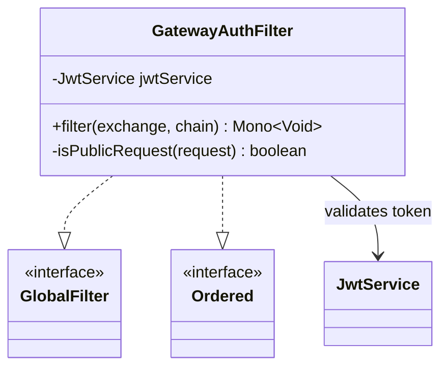
```mermaid
classDiagram
    class GatewayAuthFilter {
        -JwtService jwtService
        +filter(exchange, chain) Mono~Void~
        -isPublicRequest(request) boolean
    }
    class GlobalFilter { <<interface>> }
    class Ordered { <<interface>> }

    GatewayAuthFilter ..|> GlobalFilter
    GatewayAuthFilter ..|> Ordered
    GatewayAuthFilter --> JwtService : validates token
```

#### 🌟 Bonus: Structural Pattern Implementation (Auth Facade)

Untuk memenuhi standar arsitektur yang bersih, saya mengimplementasikan **Facade Pattern** melalui `AuthFacade`. Komponen ini bertugas sebagai pintu masuk tunggal bagi layanan internal lain yang membutuhkan data pengguna atau validasi token tanpa harus terpapar langsung pada kompleksitas `UserRepository` atau `AuthService`.

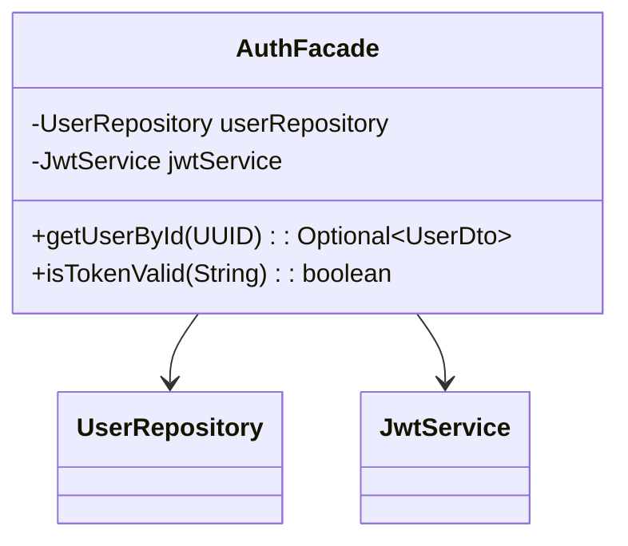
```mermaid
classDiagram
    class AuthFacade {
        -UserRepository userRepository
        -JwtService jwtService
        +getUserById(UUID): Optional~UserDto~
        +isTokenValid(String): boolean
    }
    AuthFacade --> UserRepository
    AuthFacade --> JwtService
```

Pola ini saya terapkan untuk memastikan bahwa perubahan pada internal *Auth Service* tidak akan merusak integritas komponen lain yang mengonsumsinya.

---
*Dibuat dengan ❤️ oleh Tim Yomu — Kelompok A15, Advanced Programming 2026*
*Referensi utama: Module 09 — Software Architectures (Ade Azurat, Fasilkom UI)*
