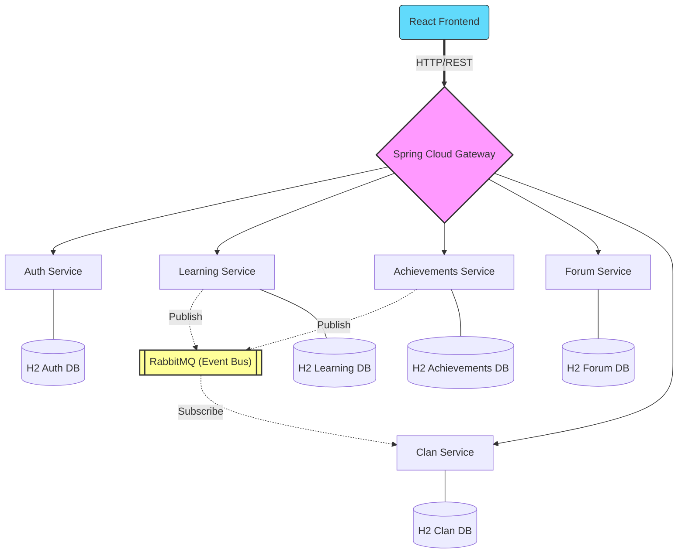

# 📖 Yomu App - Gamified Literacy Platform
### *Melatih Literasi dengan Pengalaman Belajar yang Menyenangkan*

Yomu adalah platform aplikasi pembelajaran berbasis gamifikasi yang dirancang untuk membantu masyarakat Indonesia membangun kebiasaan membaca saksama dan verifikasi informasi. Proyek ini menggunakan arsitektur **Microservices Polyrepo** yang modern, skalabel, dan tangguh.

---

## 🏗️ Arsitektur Sistem

Yomu mengadopsi arsitektur microservices yang terdesentralisasi, di mana setiap layanan memiliki tanggung jawab tunggal (Single Responsibility) dan basis data sendiri.

### 🧩 Diagram Arsitektur


<details>
<summary>📐 Lihat Versi Mermaid (Jika didukung oleh Viewer Anda)</summary>



</details>

---

## 🚀 Komponen Utama

### 1. 🌐 API Gateway (Port 8090)
Bertindak sebagai *Single Entry Point*. Menggunakan **Spring Cloud Gateway** untuk:
- **Routing**: Mengarahkan permintaan dari Frontend ke service yang tepat.
- **Authentication Filter**: Melakukan validasi awal JWT (Security Bypass dapat diaktifkan via environment).
- **Reactive Stack**: Dibangun di atas Spring WebFlux untuk performa tinggi.

### 2. 🔐 Auth Service (Port 8081)
Pusat keamanan aplikasi. Fitur utama:
- Registrasi & Login (JWT Based).
- Dukungan Google SSO.
- **Rate Limiting**: Melindungi endpoint sensitif dari brute force.
- RBAC (Role-Based Access Control).

### 3. 📚 Learning Service (Port 8082)
Inti dari konten edukasi:
- Manajemen Modul Bacaan.
- Sistem Kuis Interaktif.
- Publisher Event: Mengirimkan `QuizCompletedEvent` saat user menyelesaikan kuis.

### 4. 🏆 Achievements Service (Port 8083)
Mengelola sistem gamifikasi:
- Tracking Pencapaian (Badges/Medals).
- Misi Harian (Daily Missions).
- Publisher Event: Mengirimkan `AchievementUnlockedEvent` dan `DailyMissionCompletedEvent`.

### 5. 💬 Forum Service (Port 8084)
Ruang diskusi komunitas:
- Thread-based discussions.
- Nested Comments (Komentar bersarang).
- Repositori berbasis JDBC untuk efisiensi query diskusi.

### 6. 🛡️ Clan Service (Port 8085)
Sistem kompetisi antar pengguna:
- **Strategy Pattern**: Implementasi sistem skor yang berbeda untuk setiap Tier (Bronze, Silver, Gold, Diamond).
- **Event Listener**: Mengonsumsi event dari `Learning` dan `Achievements` untuk mengupdate peringkat user secara real-time.

### 📦 Shared Library (`shared-lib`)
Komponen yang digunakan secara bersamaan oleh semua service untuk menjaga konsistensi:
- **Security**: JWT Service & Filters.
- **Events**: Definisi objek event (POJO) untuk RabbitMQ.
- **Exception Handling**: Global exception handler & standard error responses.

---

## 🛠️ Technology Stack

| Layer | Technologies |
| :--- | :--- |
| **Frontend** | React 19, Vite, Tailwind CSS, Lucide Icons |
| **Backend** | Java 21, Spring Boot 3.x, Spring Cloud Gateway |
| **Messaging** | RabbitMQ (Topic Exchange) |
| **Persistence** | H2 Database (PostgreSQL Mode) |
| **Security** | Spring Security, JSON Web Token (JWT) |
| **DevOps** | Docker, Docker Compose |
| **Build Tool** | Gradle (Kotlin DSL) |

---

## 📡 Komunikasi Antar Service

### 🔄 Synchronous (REST)
Digunakan untuk komunikasi dari Frontend melalui API Gateway.
- Format: `JSON` over `HTTP`.
- Endpoint: `/api/auth/**`, `/api/learning/**`, dll.

### ⚡ Asynchronous (Event-Driven)
Menggunakan **RabbitMQ** dengan pola **Publish-Subscribe (Topic Exchange)**:
- **Exchange**: `yomu.events` (Topic)
- **Routing Keys**:
    - `yomu.quiz.completed`: Dipicu oleh Learning Service.
    - `yomu.achievement.unlocked`: Dipicu oleh Achievements Service.
    - `yomu.daily.mission.completed`: Dipicu oleh Achievements Service.

---

## 📦 Panduan Menjalankan Proyek

### 🐳 Menggunakan Docker Compose (Direkomendasikan)
Cara tercepat untuk menjalankan seluruh ekosistem Yomu:

1. Pastikan semua repositori microservice berada dalam satu folder root.
2. Jalankan perintah:
   ```bash
   docker compose up --build
   ```
3. Akses:
    - **Frontend**: `http://localhost:5173`
    - **API Gateway**: `http://localhost:8090`
    - **RabbitMQ Dashboard**: `http://localhost:15672` (guest/guest)

### 🛠️ Menjalankan Secara Manual
Jika ingin menjalankan service tertentu untuk pengembangan:
1. Pastikan RabbitMQ sudah berjalan.
2. Masuk ke folder service (misal `service-auth`):
   ```bash
   ./gradlew bootRun
   ```
3. Untuk Frontend:
   ```bash
   cd frontend && npm install && npm run dev
   ```

---

## 🛡️ Prinsip Desain & SOLID
Kami menerapkan prinsip rekayasa perangkat lunak yang ketat:
- **Single Responsibility (SRP)**: Setiap microservice menangani satu domain bisnis yang jelas.
- **Open/Closed (OCP)**: Sistem scoring di `service-clan` menggunakan Strategy Pattern, memungkinkan penambahan Tier baru tanpa mengubah logika inti.
- **Dependency Inversion (DIP)**: Penggunaan shared interfaces untuk event handling.
- **Loose Coupling**: Antar service tidak saling bergantung secara langsung (Sync), melainkan melalui Event Bus (Async).

---
*Dibuat dengan ❤️ oleh Tim Yomu*
