# Yomu App - Sistem Literasi Berbasis Gamifikasi (Microservices)

Yomu adalah platform aplikasi pembelajaran (gamifikasi) yang membantu masyarakat Indonesia dalam melatih kebiasaan verifikasi dan membaca saksama. Proyek ini diimplementasikan menggunakan arsitektur **Microservices** dengan pola **Monorepo** (Gradle Multi-project) di sisi Backend, dan arsitektur Features-based menggunakan React (Vite) di sisi Frontend.

## 🏗️ Perubahan Arsitektur & Implementasi Terbaru

1. **Migrasi Penuh ke Microservices**: Aplikasi yang sebelumnya monolitik atau setengah jalan telah dipecah secara rapi menjadi service independen:
    - `api-gateway` (Port 8080): Melakukan routing request dari frontend ke service terkait.
    - `service-auth` (Port 8081): Mengurus registrasi, login, dan validasi JWT.
    - `service-learning` (Port 8082): Menangani CRUD Bacaan dan pengerjaan Kuis.
    - `service-achievements` (Port 8083): Menangani sistem pencapaian (Achievements) dan Misi Harian.
    - `service-forum` (Port 8084): Diskusi publik bersarang (nested comments).
    - `service-clan` (Port 8085): Sistem liga dengan Strategy Pattern untuk scoring yang berbeda tiap Tier (Bronze, Silver, Gold, Diamond).
    - `shared-lib`: Menyimpan DTO, Security configurations (JWT Filters), dan Event objects.

2. **Pola Desain (Design Patterns) & SOLID**:
    - **Single Responsibility Principle (SRP)**: Setiap Service hanya mengurusi domainnya masing-masing.
    - **Open/Closed Principle (OCP) & Strategy Pattern**: Diterapkan secara nyata pada sistem _Scoring Liga_ di `service-clan` (`BronzeScoringStrategy`, `SilverScoringStrategy`, dst). Menambah Tier baru tidak akan merusak sistem yang ada.
    - **Event-Driven Communication**: Komunikasi antar microservice menggunakan sistem Event (`LearningCompletedEvent`, dsb).

3. **Peningkatan Frontend (Gamifikasi)**:
    - Mengimplementasikan desain antarmuka bergaya _gamified_ (seperti platform populer Duolingo).
    - Menggunakan tombol dengan aksen bayangan tebal, tipografi tegas (Nunito), dan kartu (cards) dengan interaksi dinamis.
    - Halaman **Learning/Modul Belajar** yang interaktif (transisi mode Membaca -> Kuis -> Selesai).
    - Papan Peringkat (**Leaderboard Liga**) yang dapat disaring berdasarkan Divisi/Tier.

## 🚀 Panduan Deployment (Menjalankan Proyek Lokal)

### Persyaratan Sistem

- Java 21 (JDK)
- Node.js (v18 atau lebih tinggi)
- Git

### Mengunduh Semua Repositori

Proyek ini sekarang terdiri dari beberapa repository terpisah. Untuk mempermudah pengunduhan semua repositori, tersedia skrip otomasi di root proyek:

- `clone-repositories.bat` — skrip untuk Windows (CMD/PowerShell).
- `clone-repositories.sh` — skrip untuk macOS / Linux (bash).

Contoh penggunaan (dry-run, hanya menampilkan tindakan):

```bash
./clone-repositories.sh --dry-run
```

Contoh penggunaan penuh dan menarik perubahan untuk repositori yang sudah ada:

```bash
./clone-repositories.sh /path/to/target --pull
clone-repositories.bat C:\path\to\target --pull
```

Skrip akan mengkloning repositori berikut ke folder dengan nama yang sama:

- `api-gateway`
- `frontend`
- `service-achievements`
- `service-auth`
- `service-clan`
- `service-forum`
- `service-learning`
- `shared-lib`

Jika Anda sudah berada di folder root proyek (`yomu-infra`), cukup jalankan skrip tanpa argumen.

### Opsi: Menjalankan Menggunakan Docker Compose (Recommended untuk Isolasi & Kemudahan)

Jika Anda ingin menjalankan seluruh arsitektur secara terisolasi dengan container, tersedia file `docker-compose.yml` di root proyek.

- Persyaratan: `Docker` + `Docker Compose` (atau Docker Desktop yang sudah include compose plugin).
- Pastikan semua repositori service sudah ada di folder root (lihat skrip `clone-repositories.*`) atau sesuaikan `docker-compose.yml` jika Anda menaruh source di lokasi lain.

Langkah singkat:

```bash
# Dari folder root repository (yomu-infra)
docker compose up --build
# atau jika menggunakan docker-compose lama:
docker-compose up --build
```

- Untuk frontend:

```bash
cd frontend
npm install
npm run dev
```

- Akses aplikasi di `http://localhost:5173` (Vite default port) dan API Gateway di `http://localhost:8080`.

Penjelasan singkat:

- Perintah ini akan membangun image untuk setiap service menggunakan masing-masing `Dockerfile` dan menjalankan container dalam satu network.
- Pastikan `gradlew` memiliki permission executable (sudah di-set dalam repo: `git update-index --chmod=+x gradlew`).
- Folder `docs/` tetap utuh dan tidak diubah oleh skrip-kloning atau proses ini.

### Menjalankan Layanan Secara Manual (Native Spring Boot)

Untuk debugging atau pengembangan lokal tiap service, jalankan setiap service dari foldernya masing-masing.

Contoh menjalankan `service-auth` dari PowerShell / bash:

```bash
cd service-auth
./gradlew bootRun   # Windows: gradlew.bat bootRun
```

Jalankan setiap service di terminal terpisah:

```bash
cd api-gateway && ./gradlew bootRun &
cd service-auth && ./gradlew bootRun &
cd service-learning && ./gradlew bootRun &
cd service-achievements && ./gradlew bootRun &
cd service-forum && ./gradlew bootRun &
cd service-clan && ./gradlew bootRun &
```

Keterangan:

- Gunakan `gradlew.bat` di Windows jika `./gradlew` tidak berjalan.
- Database default adalah H2 (file-based) yang disimpan di folder per-service jika dikonfigurasi — periksa `application.properties`/`application.yml` di masing-masing service untuk lokasi file H2.
- Untuk frontend:

```bash
cd frontend
npm install
npm run dev
```

- Akses aplikasi di `http://localhost:5173` (Vite default port) dan API Gateway di `http://localhost:8080`.

## 🔐 Keamanan

Sistem menggunakan **JSON Web Token (JWT)**. Setiap request dari frontend ke backend (melalui Gateway) akan divalidasi keabsahan tokennya oleh `JwtAuthenticationFilter` yang berada di dalam `shared-lib` dan diimpor oleh setiap service secara terpisah untuk memvalidasi otorisasi.

## MODULE 9 - GROUP DISCUSSION

## 🏗️ Arsitektur Sistem Saat Ini

Yomu mengadopsi arsitektur **Microservices Polyrepo** dengan komunikasi sinkron (REST via API Gateway) dan asinkron (Event-Driven via RabbitMQ). Berikut visualisasi arsitektur menggunakan **C4 Model** (ref: Module 09 — _Visualizing Software Architecture_).

---

### 📐 Context Diagram (C4 Level 1)

> **Scope**: Seluruh sistem Yomu.
> **Primary elements**: Yomu Platform sebagai satu kesatuan.
> **Supporting elements**: Aktor (Pelajar, Admin) dan sistem eksternal (Google OAuth, RabbitMQ).
> **Intended audience**: Semua orang, baik teknis maupun non-teknis.
>
> _(Ref: C4 Model — System Context Diagram, Module 09 hal. 115-116)_

Context Diagram menunjukkan **Yomu** sebagai satu kotak di tengah, dikelilingi oleh pengguna dan sistem eksternal yang berinteraksi dengannya. Detail teknis tidak penting di level ini — fokus pada _siapa_ yang menggunakan sistem dan _apa_ yang terhubung.

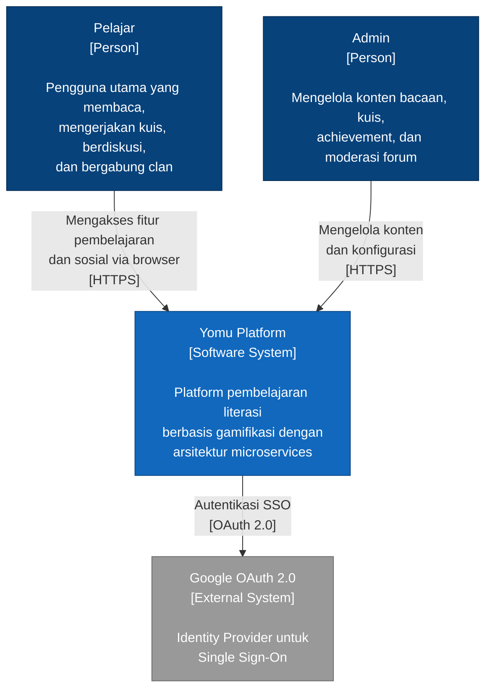

---

### 📐 Container Diagram (C4 Level 2)

> **Scope**: Sistem Yomu secara internal.
> **Primary elements**: Container (aplikasi, data store, message broker) di dalam Yomu.
> **Supporting elements**: Aktor dan sistem eksternal yang terhubung.
> **Intended audience**: Tim teknis — software architect, developer, ops.
>
> _(Ref: C4 Model — Container Diagram, Module 09 hal. 117-118)_
> _Catatan: "Container" di C4 bukan Docker container, melainkan unit yang berjalan terpisah (aplikasi, database, message broker, dsb.)_

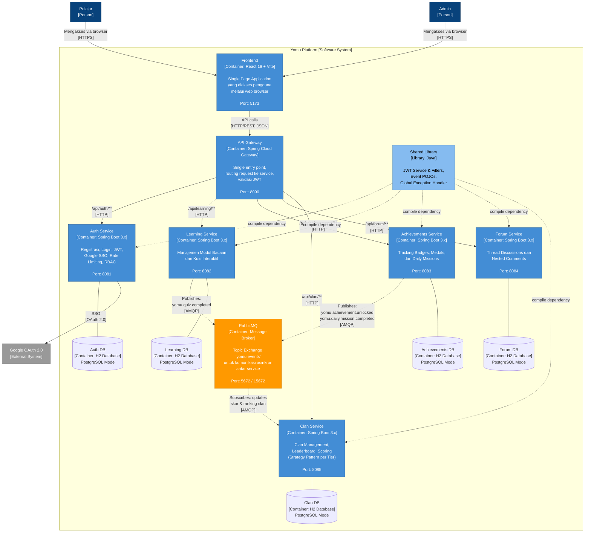

**Keterangan:**

- **Garis solid (→)**: Komunikasi sinkron — REST over HTTP
- **Garis putus-putus (-.->)**: Komunikasi asinkron — Event via RabbitMQ (AMQP), atau compile dependency
- Setiap service memiliki **database H2 terpisah** sesuai prinsip _Database-per-Service_
- **Shared Library** adalah _compile-time dependency_, bukan runtime service

---

### 📐 Deployment Diagram

> **Scope**: Lingkungan deployment (development/staging).
> **Primary elements**: Deployment nodes, container instances.
> **Supporting elements**: Infrastructure nodes (Docker network).
> **Intended audience**: Tim teknis — architect, developer, ops.
>
> _(Ref: C4 Model — Deployment Diagram, Module 09 hal. 122)_

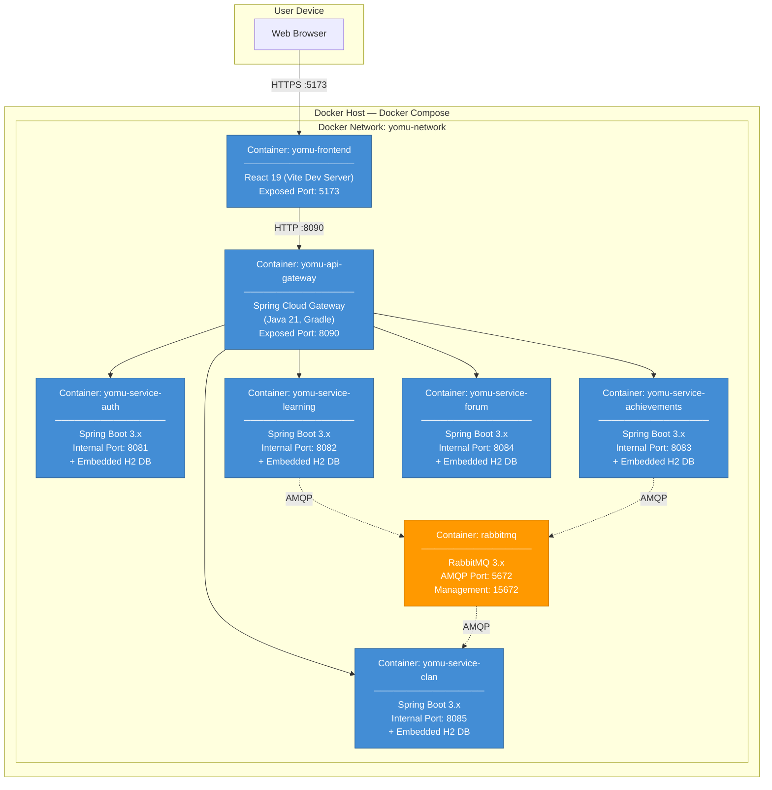

**Catatan Deployment:**

- Semua service berjalan dalam **satu Docker Compose** pada satu host
- Service backend **tidak di-expose** ke luar — hanya dapat diakses melalui API Gateway
- H2 database berjalan **embedded** di dalam proses setiap service (bukan container terpisah)
- Komunikasi antar container menggunakan **Docker internal network**

## 🔮 Arsitektur Masa Depan (Setelah Risk Storming)

### Skenario: Yomu Mengalami Kesuksesan Besar

Bayangkan Yomu telah berhasil diluncurkan dan mendapat adopsi massal dari sekolah-sekolah dan institusi pendidikan di seluruh Indonesia. Jumlah pengguna melonjak dari ratusan menjadi **ratusan ribu pengguna aktif harian**. Pada kondisi ini, kami menganalisis risiko arsitektur saat ini menggunakan teknik **Risk Storming** (ref: Module 09, Chapter 8 — _Analysing Architectural Risk_).

---

### 📊 Risk Matrix

Kami menggunakan **Architecture Risk Matrix** (ref: Module 09, Figure 20-1) dengan dua dimensi:

- **Overall Impact of Risk**: Low (1), Medium (2), High (3)
- **Likelihood of Risk Occurring**: Low (1), Medium (2), High (3)

Nilai risiko = **Impact × Likelihood**. Klasifikasi: 🟢 Low (1-2), 🟡 Medium (3-4), 🔴 High (6-9).

```
                    Likelihood of Risk Occurring
                    Low (1)     Medium (2)     High (3)
                 ┌──────────┬────────────┬────────────┐
    Low (1)      │  1 🟢    │   2 🟢     │   3 🟡     │
Impact           ├──────────┼────────────┼────────────┤
    Medium (2)   │  2 🟢    │   4 🟡     │   6 🔴     │
                 ├──────────┼────────────┼────────────┤
    High (3)     │  3 🟡    │   6 🔴     │   9 🔴     │
                 └──────────┴────────────┴────────────┘
```

---

### 🌪️ Risk Storming — Tahap 1: Identification (Individual, Non-Collaborative)

> _"Risk storming is a collaborative exercise used to determine architectural risk within a specific dimension."_
> — Module 09, hal. 99

Setiap anggota tim secara **individual** (tanpa diskusi) menganalisis arsitektur saat ini dan menempatkan "Post-it notes" virtual berwarna di area arsitektur yang dianggap berisiko. Dimensi risiko yang dianalisis: **availability, scalability, data integrity, dan security**.

Hasil identifikasi individual:

| Area Arsitektur                  | Anggota   | Dimensi        |   Impact   | Likelihood | Risk Score |   Level   |
| :------------------------------- | :-------- | :------------- | :--------: | :--------: | :--------: | :-------: |
| H2 Database (semua service)      | Tirta     | Data Integrity |  3 (High)  |  3 (High)  |   **9**    |  🔴 High  |
| H2 Database (semua service)      | Adella    | Availability   |  3 (High)  |  3 (High)  |   **9**    |  🔴 High  |
| H2 Database (semua service)      | Nathanael | Scalability    |  3 (High)  | 2 (Medium) |   **6**    |  🔴 High  |
| API Gateway (single instance)    | Yosua     | Availability   |  3 (High)  | 2 (Medium) |   **6**    |  🔴 High  |
| API Gateway (no circuit breaker) | Ali       | Availability   |  3 (High)  | 2 (Medium) |   **6**    |  🔴 High  |
| RabbitMQ (no DLQ)                | Tirta     | Data Integrity | 2 (Medium) | 2 (Medium) |   **4**    | 🟡 Medium |
| RabbitMQ (no DLQ)                | Yosua     | Availability   | 2 (Medium) | 2 (Medium) |   **4**    | 🟡 Medium |
| Frontend-Backend CORS            | Nathanael | Security       | 2 (Medium) |  3 (High)  |   **6**    |  🔴 High  |
| No Monitoring/Health Check       | Ali       | Availability   | 2 (Medium) |  3 (High)  |   **6**    |  🔴 High  |
| Non-idempotent Event Handlers    | Adella    | Data Integrity | 2 (Medium) | 2 (Medium) |   **4**    | 🟡 Medium |
| Shared Library coupling          | Nathanael | Scalability    |  1 (Low)   | 2 (Medium) |   **2**    |  🟢 Low   |

---

### 🤝 Risk Storming — Tahap 2: Consensus (Collaborative)

> _"The goal of this activity is to analyze the risk areas as a team and gain consensus in terms of the risk qualification."_
> — Module 09, hal. 102

Seluruh anggota tim berkumpul dan menempelkan "Post-it notes" mereka pada diagram arsitektur. Berikut hasil konsensus setelah diskusi:

**1. H2 Database — Semua sepakat: 🔴 HIGH RISK (9)**
Tiga anggota secara independen mengidentifikasi H2 sebagai area risiko tertinggi. H2 adalah database in-memory/embedded yang **kehilangan seluruh data saat restart**. Dalam skenario ratusan ribu pengguna, data achievement, progress belajar, dan histori clan yang hilang akan berdampak fatal. Semua anggota sepakat bahwa baik impact maupun likelihood sama-sama tinggi karena Docker container secara natural akan restart saat update atau scaling.

**2. API Gateway (Single Point of Failure) — Konsensus: 🔴 HIGH RISK (6)**
Dua anggota mengidentifikasi API Gateway sebagai risiko tinggi. Yosua menjelaskan bahwa jika API Gateway down, **seluruh sistem tidak dapat diakses** (impact = 3). Ali menambahkan bahwa tanpa circuit breaker, satu service yang lambat/down bisa menyebabkan _cascading failure_ yang menjatuhkan gateway. Setelah diskusi, semua sepakat likelihood = 2 (medium) karena Spring Cloud Gateway cukup stabil, tapi impact-nya sangat tinggi.

**3. Frontend-Backend CORS — Konsensus: 🔴 HIGH RISK (6)**
Nathanael mengidentifikasi masalah ini berdasarkan pengalaman langsung tim (terlihat dari chat bahwa frontend tidak bisa berkomunikasi dengan backend). Setelah diskusi, tim sepakat ini lebih merupakan masalah konfigurasi yang bisa diperbaiki di level gateway — bukan risiko arsitektural fundamental. Namun, **jika tidak ditangani dengan konfigurasi terpusat**, masalah ini akan terus berulang saat service baru ditambahkan.

**4. Tidak Ada Monitoring — Konsensus: 🔴 HIGH RISK (6)**
Ali menjelaskan bahwa tanpa health check dan monitoring, tim **baru menyadari ada masalah ketika pengguna sudah terdampak**. Dalam arsitektur microservices dengan 6+ service, ketiadaan observability membuat debugging sangat sulit. Semua sepakat.

**5. RabbitMQ tanpa DLQ — Konsensus: 🟡 MEDIUM RISK (4)**
Dua anggota mengidentifikasi ini secara independen. Tanpa Dead Letter Queue, event yang gagal diproses (misalnya `QuizCompletedEvent` yang gagal diproses oleh Clan Service) akan **hilang tanpa jejak**. Tim sepakat dampaknya medium karena data utama tidak hilang (hanya derived data seperti skor clan yang tidak terupdate).

**6. Non-idempotent Event Handlers — Konsensus: 🟡 MEDIUM RISK (4)**
Adella menjelaskan bahwa jika terjadi duplikasi pesan (umum di sistem distributed), event bisa diproses lebih dari sekali — menyebabkan achievement ter-trigger ganda atau skor clan dihitung dua kali. Tim sepakat ini medium karena likelihood-nya bergantung pada konfigurasi RabbitMQ.

**7. Shared Library Coupling — Konsensus: 🟢 LOW RISK (2)**
Hanya satu anggota yang mengidentifikasi ini. Setelah diskusi, tim sepakat bahwa shared library hanya berisi contracts (DTO, event POJO) yang jarang berubah, sehingga risiko coupling rendah.

---

### 🛠️ Risk Storming — Tahap 3: Mitigation (Collaborative)

> _"Mitigating risk within an architecture usually involves changes or enhancements to certain areas that otherwise might have been deemed perfect."_
> — Module 09, hal. 104

Berdasarkan konsensus, tim merancang mitigasi untuk setiap risiko:

| Risk Area               | Score | Mitigasi                                                                                                                                                                                                  | Cost/Effort |
| :---------------------- | :---: | :-------------------------------------------------------------------------------------------------------------------------------------------------------------------------------------------------------- | :---------: |
| H2 Database             | 9 🔴  | **Migrasi ke PostgreSQL** — satu instance PostgreSQL per service, berjalan sebagai Docker container terpisah. H2 sudah berjalan dalam PostgreSQL compatibility mode sehingga migrasi relatif smooth.      |   Medium    |
| API Gateway SPOF        | 6 🔴  | **Tambah Circuit Breaker (Resilience4j)** di gateway level. Jika sebuah service tidak merespons dalam batas waktu, circuit breaker membuka sirkuit dan mengembalikan fallback response.                   |     Low     |
| CORS Issue              | 6 🔴  | **Pusatkan konfigurasi CORS di API Gateway**. Semua allowed origins, methods, headers dikonfigurasi di satu tempat (gateway), bukan tersebar di setiap service.                                           |     Low     |
| No Monitoring           | 6 🔴  | **Tambah Spring Actuator + Prometheus + Grafana**. Setiap service mengekspos `/actuator/health` dan `/actuator/prometheus`. Prometheus meng-scrape metrics, Grafana memvisualisasikan dan mengirim alert. |   Medium    |
| RabbitMQ no DLQ         | 4 🟡  | **Tambah Dead Letter Queue + Retry Policy**. Event yang gagal diproses masuk DLQ untuk di-inspect dan di-retry (otomatis atau manual).                                                                    |     Low     |
| Non-idempotent Handlers | 4 🟡  | **Implementasi idempotent consumers**. Setiap event diberi unique ID; consumer menyimpan log event ID yang sudah diproses untuk mencegah double processing.                                               |     Low     |

---

### 📐 Context Diagram Baru (Setelah Mitigasi)

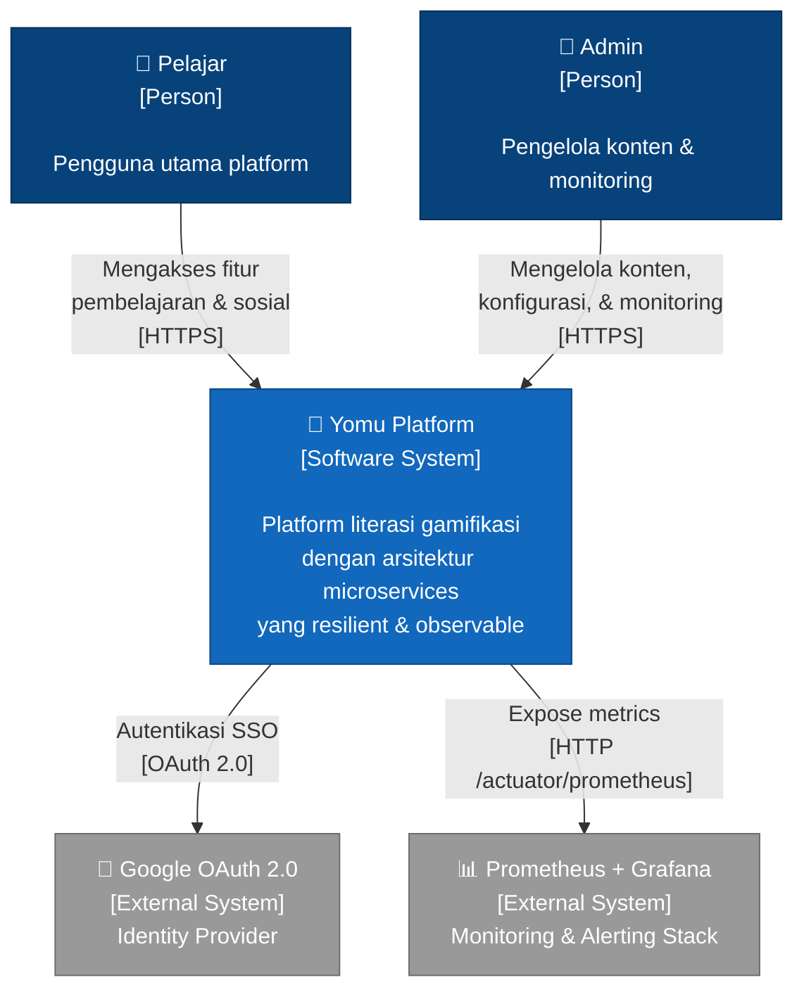

---

### 📐 Container Diagram Baru (Setelah Mitigasi)

Perubahan ditandai dengan label **[NEW]** atau **[UPGRADED]**.

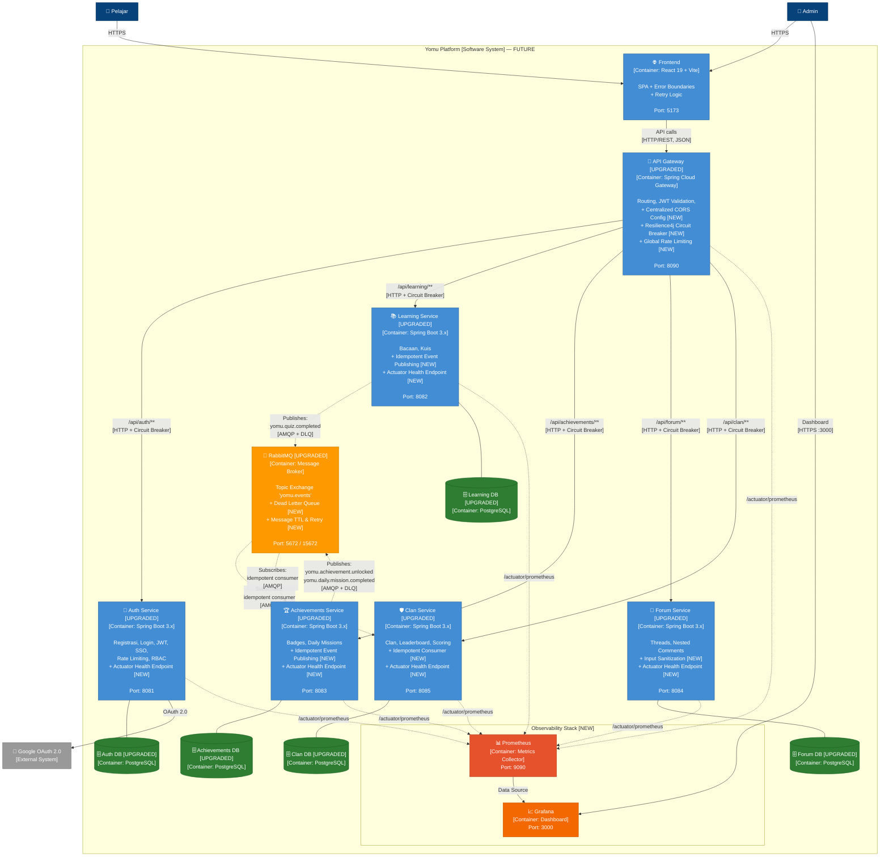

**Ringkasan Perubahan Arsitektur:**

| Komponen       | Sebelum (Current)       | Sesudah (Future)                         | Risk Score |
| :------------- | :---------------------- | :--------------------------------------- | :--------: |
| Database       | H2 In-Memory (embedded) | PostgreSQL (dedicated container)         |   9 → 2    |
| API Gateway    | Routing + JWT saja      | + Circuit Breaker + CORS + Rate Limiting |   6 → 2    |
| Monitoring     | Tidak ada               | Prometheus + Grafana + Actuator          |   6 → 1    |
| Message Queue  | RabbitMQ basic          | + Dead Letter Queue + Retry Policy       |   4 → 1    |
| Event Handling | Basic pub/sub           | Idempotent consumers + event dedup       |   4 → 1    |

## 📝 Penjelasan Risk Storming & Justifikasi Modifikasi Arsitektur

### Mengapa Risk Storming Diterapkan?

Risk Storming diterapkan karena, sebagaimana dinyatakan dalam Module 09 (ref: Chapter 8, hal. 99), **"No architect can single-handedly determine the overall risk of a system."** Alasan utamanya ada dua: pertama, seorang arsitektur mungkin melewatkan atau tidak melihat suatu area risiko; kedua, sangat jarang ada satu orang yang memiliki pengetahuan penuh terhadap seluruh bagian sistem. Dalam konteks tim Yomu yang terdiri dari 5 anggota dengan masing-masing bertanggung jawab atas satu modul microservice, setiap anggota memiliki pemahaman mendalam terhadap service-nya sendiri namun mungkin tidak memahami risiko interaksi antar service secara keseluruhan. Dengan Risk Storming, kami memanfaatkan perspektif kolektif seluruh anggota tim untuk mendapatkan gambaran risiko yang lebih lengkap dan akurat daripada analisis yang dilakukan oleh satu orang saja.

### Proses Risk Storming yang Diterapkan

Proses Risk Storming kami mengikuti tiga tahapan yang diajarkan dalam Module 09 (ref: hal. 99-105). **Tahap pertama — Identification** — adalah aktivitas **individual dan non-kolaboratif**. Setiap anggota tim secara mandiri menganalisis diagram arsitektur (Container Diagram dari Commit 1) dan mengklasifikasikan risiko menggunakan Risk Matrix (Impact × Likelihood) ke dalam kategori Low (1-2), Medium (3-4), atau High (6-9). Tahap non-kolaboratif ini **esensial** agar peserta tidak saling mempengaruhi atau mengalihkan perhatian dari area tertentu. Hasilnya, kami menemukan bahwa tiga anggota secara independen mengidentifikasi H2 Database sebagai risiko tertinggi (score 9), yang memvalidasi bahwa ini adalah area yang benar-benar kritis — bukan opini satu orang. Yang menarik, masalah seperti CORS dan ketiadaan monitoring hanya diidentifikasi oleh anggota yang pernah mengalami langsung masalah tersebut, menunjukkan betapa pentingnya keragaman perspektif dalam risk storming.

**Tahap kedua — Consensus** — adalah aktivitas **kolaboratif** di mana seluruh anggota tim berkumpul, masing-masing menempelkan "Post-it notes" virtual mereka pada diagram arsitektur, dan mendiskusikan perbedaan penilaian risiko. Tahap ini menghasilkan beberapa insight penting yang tidak muncul di tahap individual. Misalnya, analogi dengan contoh dalam Module 09 (ref: hal. 103) — di mana seorang peserta menilai Redis cache sebagai risiko tinggi karena ia tidak mengenal teknologi tersebut — kami menemukan bahwa anggota yang mengidentifikasi masalah CORS sebagai high risk melakukannya berdasarkan pengalaman langsung gagal menghubungkan frontend ke backend (terlihat dari log chat grup kami). Tanpa proses konsensus, anggota lain yang tidak mengalami masalah ini mungkin menganggapnya tidak penting. Setelah diskusi, semua anggota sepakat bahwa CORS memang perlu ditangani secara arsitektural (dipusatkan di API Gateway), bukan ad-hoc di setiap service.

**Tahap ketiga — Mitigation** — adalah tahap terpenting di mana tim secara kolaboratif merancang perubahan arsitektur untuk mengurangi atau menghilangkan risiko yang telah diidentifikasi. Sebagaimana dinyatakan dalam Module 09 (ref: hal. 104), mitigasi risiko biasanya melibatkan perubahan atau peningkatan pada area arsitektur yang sebelumnya dianggap sudah sempurna, dan perubahan ini biasanya menimbulkan biaya tambahan. Tim kami menerapkan prinsip ini dengan merancang mitigasi yang proporsional terhadap tingkat risiko: untuk risiko tertinggi (H2 Database, score 9), kami merencanakan migrasi ke PostgreSQL yang memerlukan effort medium namun menyelesaikan masalah data integrity secara fundamental; untuk risiko medium (RabbitMQ tanpa DLQ, non-idempotent handlers), kami merancang solusi dengan effort rendah seperti konfigurasi Dead Letter Queue dan penambahan event ID tracking. Pendekatan ini mencerminkan trade-off antara biaya mitigasi dan tingkat risiko, serupa dengan negosiasi antara arsitek dan stakeholder yang digambarkan dalam Module 09 (ref: hal. 105) — kami tidak mencoba menyelesaikan semua risiko sekaligus, tetapi memprioritaskan berdasarkan risk score dan feasibility implementasi.

---

## 🧑‍💻 Individual Work — Tirta Rendy Siahaan (Achievement Service)

> **Component Diagram** (C4 Level 3) — Scope: Achievement Service container. Menunjukkan komponen internal beserta tanggung jawab dan teknologinya. Semua komponen berjalan dalam satu process space.
>
> **Code Diagram** (C4 Level 4) — Scope: masing-masing komponen. Menunjukkan class, interface, record, dan enum yang membentuk komponen tersebut.
>
> _(Ref: Module 09, hal. 119-120)_

---

### 📐 Component Diagram — Achievement Service (Port 8083)

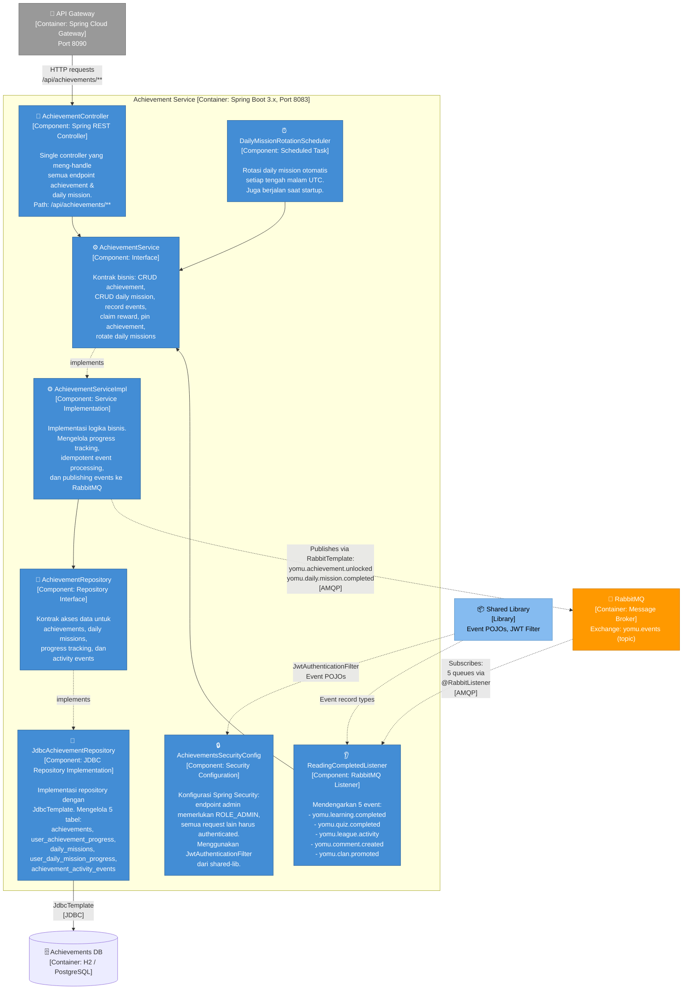

---

### 📐 Code Diagram 1 — Domain Model (Records & Enum)

Menunjukkan elemen kode di dalam komponen model: semua menggunakan Java `record` (immutable data class) dan satu `enum`.

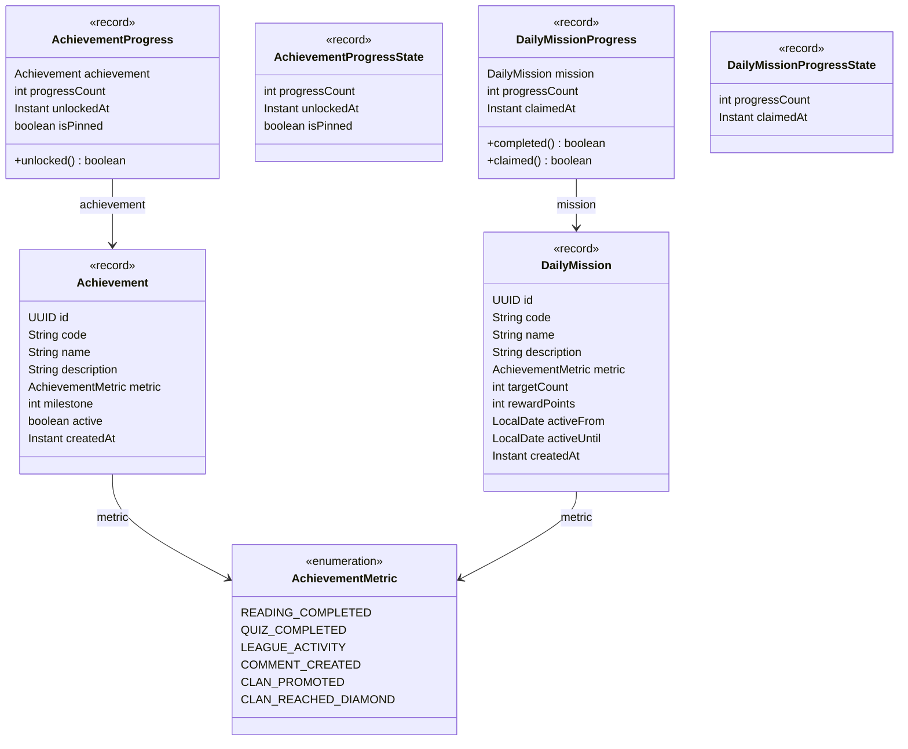

---

### 📐 Code Diagram 2 — Service Layer (Interface + Implementation)

Menunjukkan kontrak `AchievementService` dan implementasinya `AchievementServiceImpl`, beserta dependency-nya.

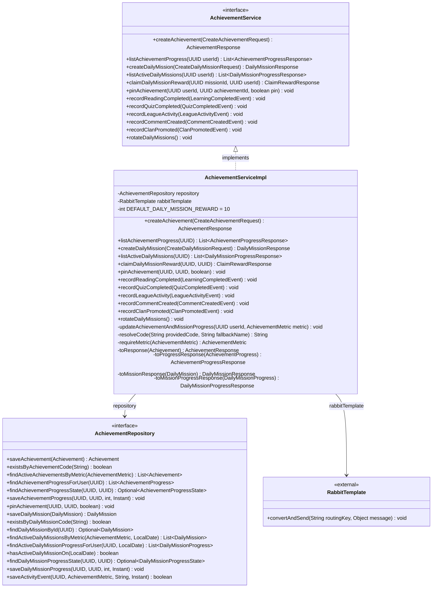

---

### 📐 Code Diagram 3 — Event Listener, Scheduler & Shared Events

Menunjukkan `ReadingCompletedListener` yang mengkonsumsi event dari service lain, `DailyMissionRotationScheduler` yang menjalankan rotasi otomatis, serta event objects dari shared-lib.

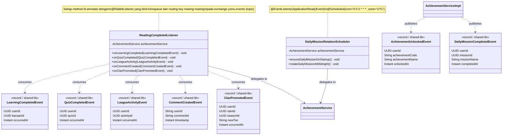

## 🧑‍💻 Individual Work — Nathanael Leander Herdanatra (Forum Service)

> **Component Diagram** (C4 Level 3) — Scope: Forum Service container. Menunjukkan komponen internal beserta tanggung jawab dan teknologinya. Semua komponen berjalan dalam satu process space.
>
> **Code Diagram** (C4 Level 4) — Scope: masing-masing komponen. Menunjukkan class, interface, record, dan entity yang membentuk komponen tersebut.
>
> _(Ref: Module 09, hal. 119-120)_

---

### 📐 Component Diagram — Forum Service (Port 8084)

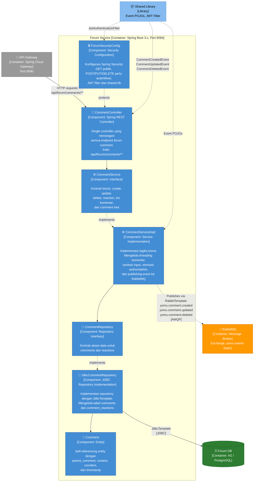

---

### 📐 Code Diagram 1 — Domain Model & DTOs

Menunjukkan model data forum yang dipakai untuk komentar bersarang, reaction, dan response API.

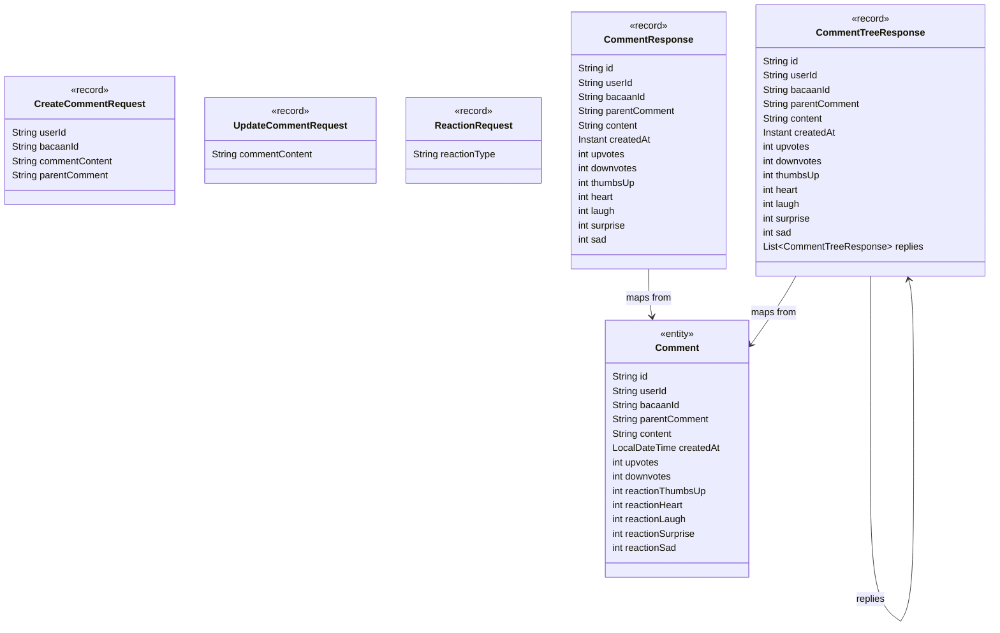

---

### 📐 Code Diagram 2 — Service Layer

Menunjukkan kontrak `CommentService` dan implementasinya `CommentServiceImpl`, beserta dependency utamanya.

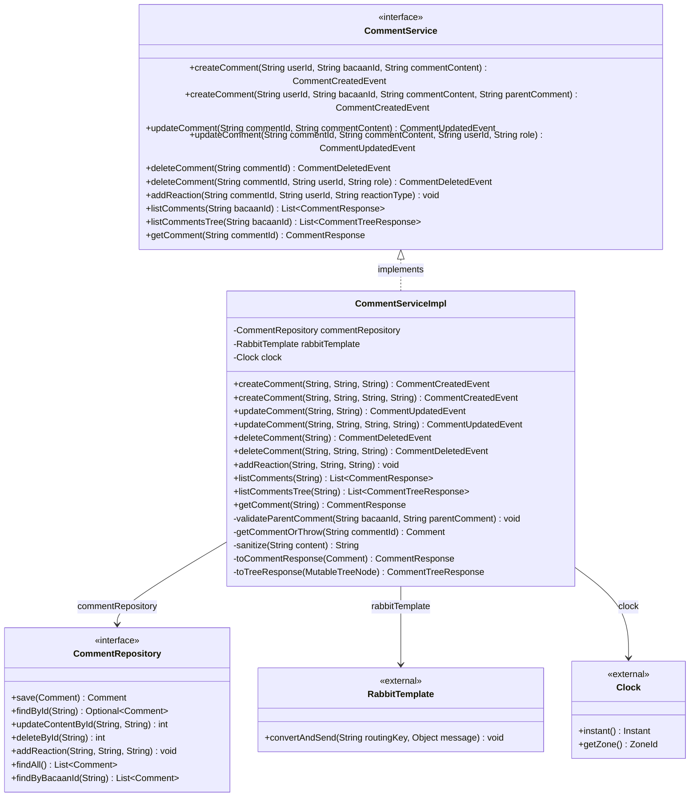

---

### 📐 Code Diagram 3 — Controller, Repository & Security

Menunjukkan alur request REST, otorisasi berbasis JWT, dan implementasi repository JDBC.


---

_Dibuat oleh Tim Aplikasi Yomu — Kelompok A15, Advanced Programming 2026_
_Referensi utama: Module 09 — Software Architectures (Ade Azurat, Fasilkom UI)_
