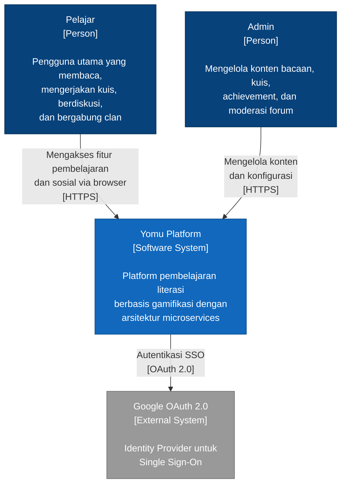
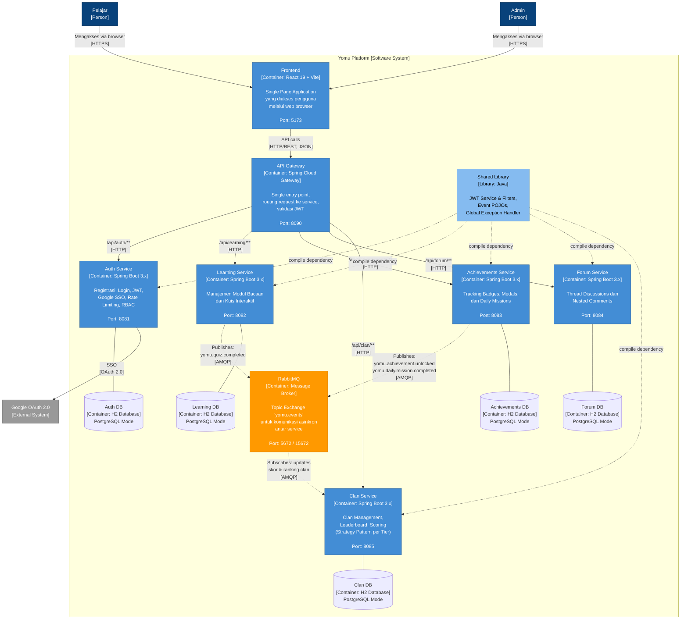
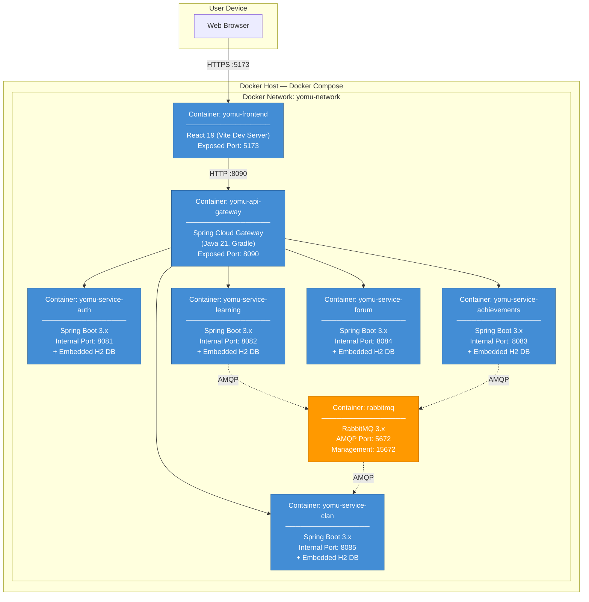

# Yomu App - Sistem Literasi Berbasis Gamifikasi (Microservices)

Yomu adalah platform aplikasi pembelajaran (gamifikasi) yang membantu masyarakat Indonesia dalam melatih kebiasaan verifikasi dan membaca saksama. Proyek ini diimplementasikan menggunakan arsitektur **Microservices** dengan pola **Monorepo** (Gradle Multi-project) di sisi Backend, dan arsitektur Features-based menggunakan React (Vite) di sisi Frontend.

## 🏗️ Perubahan Arsitektur & Implementasi Terbaru

1. **Migrasi Penuh ke Microservices**: Aplikasi yang sebelumnya monolitik atau setengah jalan telah dipecah secara rapi menjadi service independen:
    - `api-gateway` (Port 8080): Melakukan routing request dari frontend ke service terkait.
    - `service-auth` (Port 8081): Mengurus registrasi, login, dan validasi JWT.
    - `service-learning` (Port 8082): Menangani CRUD Bacaan dan pengerjaan Kuis.
    - `service-achievements` (Port 8083): Menangani sistem pencapaian (Achievements) dan Misi Harian.
    - `service-forum` (Port 8084): Diskusi publik bersarang (nested comments).
    - `service-clan` (Port 8085): Sistem liga dengan Strategy Pattern untuk scoring yang berbeda tiap Tier (Bronze, Silver, Gold, Diamond).
    - `shared-lib`: Menyimpan DTO, Security configurations (JWT Filters), dan Event objects.

2. **Pola Desain (Design Patterns) & SOLID**:
    - **Single Responsibility Principle (SRP)**: Setiap Service hanya mengurusi domainnya masing-masing.
    - **Open/Closed Principle (OCP) & Strategy Pattern**: Diterapkan secara nyata pada sistem _Scoring Liga_ di `service-clan` (`BronzeScoringStrategy`, `SilverScoringStrategy`, dst). Menambah Tier baru tidak akan merusak sistem yang ada.
    - **Event-Driven Communication**: Komunikasi antar microservice menggunakan sistem Event (`LearningCompletedEvent`, dsb).

3. **Peningkatan Frontend (Gamifikasi)**:
    - Mengimplementasikan desain antarmuka bergaya _gamified_ (seperti platform populer Duolingo).
    - Menggunakan tombol dengan aksen bayangan tebal, tipografi tegas (Nunito), dan kartu (cards) dengan interaksi dinamis.
    - Halaman **Learning/Modul Belajar** yang interaktif (transisi mode Membaca -> Kuis -> Selesai).
    - Papan Peringkat (**Leaderboard Liga**) yang dapat disaring berdasarkan Divisi/Tier.

## 🚀 Panduan Deployment (Menjalankan Proyek Lokal)

### Persyaratan Sistem

- Java 21 (JDK)
- Node.js (v18 atau lebih tinggi)
- Git

### Mengunduh Semua Repositori

Proyek ini sekarang terdiri dari beberapa repository terpisah. Untuk mempermudah pengunduhan semua repositori, tersedia skrip otomasi di root proyek:

- `clone-repositories.bat` — skrip untuk Windows (CMD/PowerShell).
- `clone-repositories.sh` — skrip untuk macOS / Linux (bash).

Contoh penggunaan (dry-run, hanya menampilkan tindakan):

```bash
./clone-repositories.sh --dry-run
```

Contoh penggunaan penuh dan menarik perubahan untuk repositori yang sudah ada:

```bash
./clone-repositories.sh /path/to/target --pull
clone-repositories.bat C:\path\to\target --pull
```

Skrip akan mengkloning repositori berikut ke folder dengan nama yang sama:

- `api-gateway`
- `frontend`
- `service-achievements`
- `service-auth`
- `service-clan`
- `service-forum`
- `service-learning`
- `shared-lib`

Jika Anda sudah berada di folder root proyek (`yomu-infra`), cukup jalankan skrip tanpa argumen.

### Opsi: Menjalankan Menggunakan Docker Compose (Recommended untuk Isolasi & Kemudahan)

Jika Anda ingin menjalankan seluruh arsitektur secara terisolasi dengan container, tersedia file `docker-compose.yml` di root proyek.

- Persyaratan: `Docker` + `Docker Compose` (atau Docker Desktop yang sudah include compose plugin).
- Pastikan semua repositori service sudah ada di folder root (lihat skrip `clone-repositories.*`) atau sesuaikan `docker-compose.yml` jika Anda menaruh source di lokasi lain.

Langkah singkat:

```bash
# Dari folder root repository (yomu-infra)
docker compose up --build
# atau jika menggunakan docker-compose lama:
docker-compose up --build
```

- Untuk frontend:

```bash
cd frontend
npm install
npm run dev
```

- Akses aplikasi di `http://localhost:5173` (Vite default port) dan API Gateway di `http://localhost:8080`.

Penjelasan singkat:

- Perintah ini akan membangun image untuk setiap service menggunakan masing-masing `Dockerfile` dan menjalankan container dalam satu network.
- Pastikan `gradlew` memiliki permission executable (sudah di-set dalam repo: `git update-index --chmod=+x gradlew`).
- Folder `docs/` tetap utuh dan tidak diubah oleh skrip-kloning atau proses ini.

### Menjalankan Layanan Secara Manual (Native Spring Boot)

Untuk debugging atau pengembangan lokal tiap service, jalankan setiap service dari foldernya masing-masing.

Contoh menjalankan `service-auth` dari PowerShell / bash:

```bash
cd service-auth
./gradlew bootRun   # Windows: gradlew.bat bootRun
```

Jalankan setiap service di terminal terpisah:

```bash
cd api-gateway && ./gradlew bootRun &
cd service-auth && ./gradlew bootRun &
cd service-learning && ./gradlew bootRun &
cd service-achievements && ./gradlew bootRun &
cd service-forum && ./gradlew bootRun &
cd service-clan && ./gradlew bootRun &
```

Keterangan:

- Gunakan `gradlew.bat` di Windows jika `./gradlew` tidak berjalan.
- Database default adalah H2 (file-based) yang disimpan di folder per-service jika dikonfigurasi — periksa `application.properties`/`application.yml` di masing-masing service untuk lokasi file H2.
- Untuk frontend:

```bash
cd frontend
npm install
npm run dev
```

- Akses aplikasi di `http://localhost:5173` (Vite default port) dan API Gateway di `http://localhost:8080`.

## 🔐 Keamanan

Sistem menggunakan **JSON Web Token (JWT)**. Setiap request dari frontend ke backend (melalui Gateway) akan divalidasi keabsahan tokennya oleh `JwtAuthenticationFilter` yang berada di dalam `shared-lib` dan diimpor oleh setiap service secara terpisah untuk memvalidasi otorisasi.


## MODULE 9 - GROUP DISCUSSION
## 🏗️ Arsitektur Sistem Saat Ini

Yomu mengadopsi arsitektur **Microservices Polyrepo** dengan komunikasi sinkron (REST via API Gateway) dan asinkron (Event-Driven via RabbitMQ). Berikut visualisasi arsitektur menggunakan **C4 Model** (ref: Module 09 — *Visualizing Software Architecture*).

---

### 📐 Context Diagram (C4 Level 1)

> **Scope**: Seluruh sistem Yomu.
> **Primary elements**: Yomu Platform sebagai satu kesatuan.
> **Supporting elements**: Aktor (Pelajar, Admin) dan sistem eksternal (Google OAuth, RabbitMQ).
> **Intended audience**: Semua orang, baik teknis maupun non-teknis.
>
> *(Ref: C4 Model — System Context Diagram, Module 09 hal. 115-116)*

Context Diagram menunjukkan **Yomu** sebagai satu kotak di tengah, dikelilingi oleh pengguna dan sistem eksternal yang berinteraksi dengannya. Detail teknis tidak penting di level ini — fokus pada *siapa* yang menggunakan sistem dan *apa* yang terhubung.



---

### 📐 Container Diagram (C4 Level 2)

> **Scope**: Sistem Yomu secara internal.
> **Primary elements**: Container (aplikasi, data store, message broker) di dalam Yomu.
> **Supporting elements**: Aktor dan sistem eksternal yang terhubung.
> **Intended audience**: Tim teknis — software architect, developer, ops.
>
> *(Ref: C4 Model — Container Diagram, Module 09 hal. 117-118)*
> *Catatan: "Container" di C4 bukan Docker container, melainkan unit yang berjalan terpisah (aplikasi, database, message broker, dsb.)*



**Keterangan:**
- **Garis solid (→)**: Komunikasi sinkron — REST over HTTP
- **Garis putus-putus (-.->)**: Komunikasi asinkron — Event via RabbitMQ (AMQP), atau compile dependency
- Setiap service memiliki **database H2 terpisah** sesuai prinsip *Database-per-Service*
- **Shared Library** adalah *compile-time dependency*, bukan runtime service

---

### 📐 Deployment Diagram

> **Scope**: Lingkungan deployment (development/staging).
> **Primary elements**: Deployment nodes, container instances.
> **Supporting elements**: Infrastructure nodes (Docker network).
> **Intended audience**: Tim teknis — architect, developer, ops.
>
> *(Ref: C4 Model — Deployment Diagram, Module 09 hal. 122)*



**Catatan Deployment:**
- Semua service berjalan dalam **satu Docker Compose** pada satu host
- Service backend **tidak di-expose** ke luar — hanya dapat diakses melalui API Gateway
- H2 database berjalan **embedded** di dalam proses setiap service (bukan container terpisah)
- Komunikasi antar container menggunakan **Docker internal network**